# Jak przeprowadzić grupowanie/partycjonowanie hierarchiczne?

Metoda k-średnich i k-mediodów wyznaczała podział zbioru obiektów na $$k$$ rozłącznych grup. Wybór $$k$$ jest istotny a wyniki dla $$k$$ i $$k+1$$ mogą być bardzo różne.

Innym podejściem do analizy grup jest budowa grup w sposób hierarchiczny, tak by nowe grupy brały się z podziały już wybranych grup. Taki sposób konstrukcji grup prowadzi do hierarchicznej reprezentacji grup, która z reguły jest przedstawiana graficznie za pomocą drzewa.

Hierarchię grup można budować na różne sposoby, trzy najbardziej naturalne to:

- podejście ,,z dołu do góry'' hierarchii (aglomeracyjne, ang. *bottom up*, *agglomerative*), rozpoczyna się od pojedynczych obserwacji a następnie łączy się je w coraz większe grupy,
- podejście ,,z góry do dołu'' (ang. *top down*, *divisive*), rozpoczyna się od jednej grupy zawierającej wszystkie obiekty i dzieli się ją na podgrupy,
- podejście rozpoczynające od ,,środka'' - określonej liczby grup, a następnie postępowanie w obie strony, dzielenie tych grup na mniejsze i łączenie startowych grup w większe.

Najczęściej stosowaną strategią jest strategia z dołu do góry i to tę opiszemy poniżej szerzej.

Algorytm budowania hierarchicznej struktury grup jest następujący:

1. Rozpocznij od zbioru jednoelementowych grup - każdy obiekt jest osobną grupą.
2. Znajdź dwie najbliższe grupy, połącz je w jedną grupę.
3. Wyznacz odległości pomiędzy nową grupą a wszystkimi pozostałymi.
4. Powtarzaj kroki 2-3 dopóki nie pozostanie tylko jedna grupa.

Kluczowe są w tym algorytmie dwa kroki. 

- Pierwszy - wymaga on określenia macierzy odległości pomiędzy wszystkimi parami obiektów. Do wyznaczania tej macierzy odległości można użyć dowonej odległości. Wybór odległości jest bardzo ważny więc warto poświęcić mu więcej uwagi.
- Trzeci - wymaga on określenia reguły wyznaczania odległości pomiędzy nową grupą a pozostałymi.

## Metoda łączenia grup, ang. *linkage*

W jaki sposób wyznaczyć odległość pomiędzy grupą $$B$$ a nowo utworzoną grupą $$A$$ (otrzymaną przez połączenie grup $$C$$ i $$D$$)?

Częste wybory to:

* pełne łączenie (ang. *complete*) 
$$
d(A, B) = \max \{\, d(a,b) : a \in A,\, b \in B \}
$$
* pojedyncze łączenie (ang. *single*) 
$$
d(A, B) = \min \{\, d(a,b) : a \in A,\, b \in B \}
$$
* średnie łączenie (ang. *average*) 
$$
d(A, B) = \frac{1}{|A| |B|} \sum_{a \in A }\sum_{ b \in B} d(a,b)
$$
* łączenie Warda (od nazwiska konstruktora: Joe Warda, ang. *the minimum variance criterion*), pamiętajmy, że $$A= C \cup D$$,
$$
d(A, B) = \frac{|C| + |B|}{|C| + |D| + |B|} d(C, B) + \frac{|D| + |B|}{|C| + |D| + |B|} d(D, B) - 
\frac{|B|}{|C| + |D| + |B|} d(C, D).
$$
Ta metoda jest często wykorzystywana w oparciu o kwadrat odległości Euklidesowej, co prowadzi do tworzenia grup minimalizujących wewnątrzgrupową wariancję. Często te grupy mają bardziej zrównoważone wielkości (pożądana cecha), co z kolei powoduje, że ta metoda jest często wykorzystywana.

## Przykład

Podobnie jak dla algorytmu k-średnich i k-medoidów poniższą analizę grup przeprowadzimy na wybranych 57 modelach aut, opierając się na zbiorze danych `auta2012` z pakietu `PogromcyDanych`. Policzyliśmy wcześniej na podstawie dwuletnich ofert, średnią cenę, przebieg, pojemność silnika, liczbę koni mechanicznych i frakcję aut z silnikiem diesla. 

Przedstawione poniżej wyniki będą oparte o odległość Euklidesową dla standaryzowanych wartości pierwiastka z ceny i mocy silnika.


```r
auta <- archivist::aread("pbiecek/Przewodnik/arepo/bf2846de03bc8434d234b08fd2e31694")
auta$nazwa <- rownames(auta)
auta$Cena_norm <- scale(sqrt(auta$Cena))
auta$KM_norm <- scale(sqrt(auta$KM))
odleglosci <- dist(auta[,c("Cena_norm", "KM_norm")], method = "manhattan")
as.matrix(odleglosci)[1:5,1:5]
```

```
##           Audi A3   Audi A4  Audi A6  Audi A8  Audi Q7
## Audi A3 0.0000000 0.7184849 1.888609 6.550862 6.980737
## Audi A4 0.7184849 0.0000000 1.170124 5.832377 6.262252
## Audi A6 1.8886091 1.1701242 0.000000 4.662253 5.092128
## Audi A8 6.5508616 5.8323767 4.662253 0.000000 2.415564
## Audi Q7 6.9807367 6.2622518 5.092128 2.415564 0.000000
```

Przedstawmy analizę hierarchii w oparciu o metodę łączenia Warda.
Wykonamy ją funkcją `agnes()` z pakietu `cluster`.


```r
library(cluster)
grupy <- agnes(odleglosci, method = "ward")
```

Wynikiem jest obiekt klasy `agnes`, który można przedstawić graficznie w postaci dendrogramu. Wykorzystamy w tym celu funkcję `fviz_dend()` z pakietu `factoextra`, która ma kilka zalet w stosunku do standardowej funkcji `plot()`, mianowicie umożliwia zaznaczenie graficzne wybranej liczby grup (poniżej 4).

Z dendrogramu możemy odczytać jak podobne są poszczególne obserwacje / grupy do innych obserwacji / grup.


```r
library(factoextra)
fviz_dend(grupy, k = 4, rect = TRUE, main = "Metoda Ward")
```

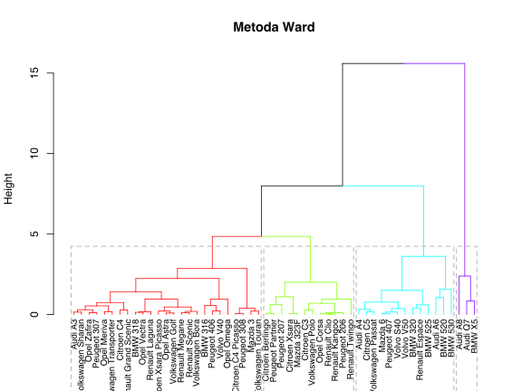

A jak wyglądałyby te dendrogramy dla innych metod łączenia?


```r
grupy_complete <- agnes(odleglosci, method = "complete")
fviz_dend(grupy_complete, k = 4, rect = TRUE, main = "Metoda complete")
```

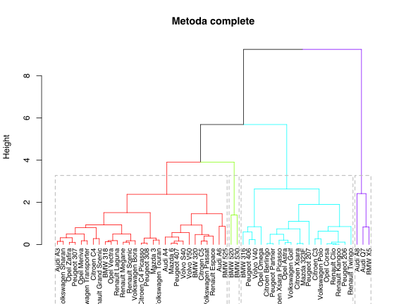

```r
grupy_single <- agnes(odleglosci, method = "single")
fviz_dend(grupy_single, k = 4, rect = TRUE, main = "Metoda single")
```


```r
grupy_average <- agnes(odleglosci, method = "average")
fviz_dend(grupy_average, k = 4, rect = TRUE, main = "Metoda average")
```

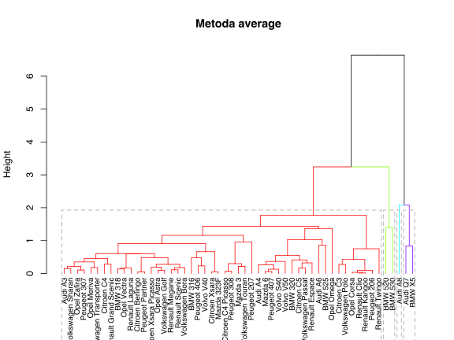

Jak widzimy wyglądają bardzo różnie. Grupy znalezione metodą Warda mają zbliżone wielkości co czasem jest zaletą. 

Funkcja `agnes()` wyznacza dendrogram, gdybyśmy chcieli z niego wydobyć informację jak wygląda przyporządkowanie do grup na określonym poziomie drzewa, możemy je wyłuskać stosując funkcję `cutree()`. 


```r
# określona liczba grup
cutree(grupy, k = 4)
```

```
##  [1] 1 2 2 3 3 1 1 2 2 2 2 3 4 4 1 1 2 4 1 1 4 2 1 4 1 1 1 1 4 4 1 1 1 2 4
## [36] 4 2 1 4 1 1 1 4 1 1 2 4 1 1 1 2 1 2
```

Jak wyglądają te cztery grupy na wykresie?


```r
auta$grupa = factor(cutree(grupy, k = 4))

ggplot(auta, aes(Cena, KM, label=nazwa, color=grupa)) +
  geom_point(size=3) + theme_bw() +
  coord_trans("sqrt", "sqrt")
```

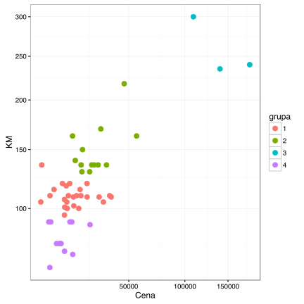

Na jakiej wysokości podzielić drzewo? 

Do wyboru liczby grup (i dla analizy hierarchicznej i dla k-średnich, k-medoidów) wykorzystać możemy statystykę *gap-statistic*.


```r
grupy_eclust <- eclust(auta[,c("Cena_norm", "KM_norm")], "hclust") 
```

```
## Clustering k = 1,2,..., K.max (= 10): .. done
## Bootstrapping, b = 1,2,..., B (= 100)  [one "." per sample]:
## .................................................. 50 
## .................................................. 100
```

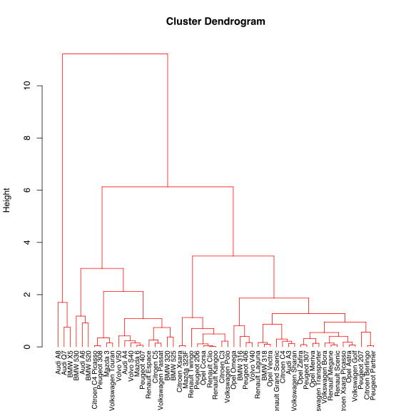

```r
fviz_gap_stat(grupy_eclust$gap_stat)
```

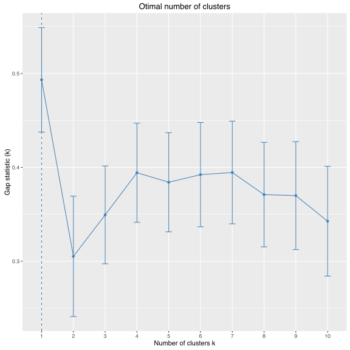

I jak wyglądają te cztery grupy?


```r
grupy_eclust <- eclust(auta[,c("Cena_norm", "KM_norm")], "hclust", k = 4) 
```

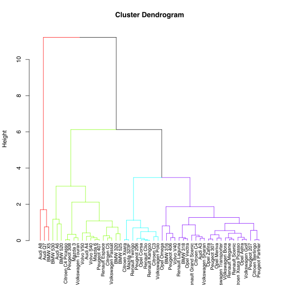

```r
fviz_cluster(grupy_eclust)
```

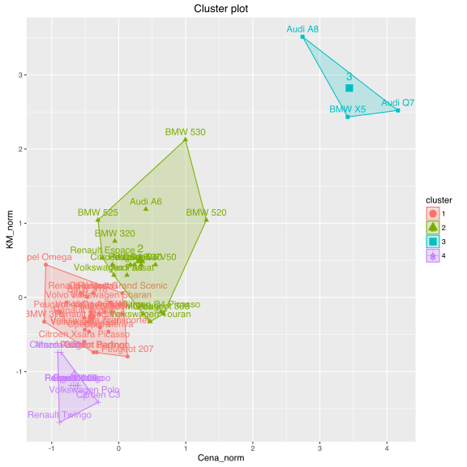

## Nie tylko drzewo

Używając pakietu `ape` można wykorzystać przeciążoną funkcję `plot()` dla obiektu klasy `phylo`, aby na różne sposoby przedstawiać dendrogramy.


```r
library(RColorBrewer)
library(ape)
cols <- brewer.pal(4,"Set1")
hc <- as.phylo(as.hclust(grupy))

par(mar=c(1,1,2,1), xpd=NA)
plot(hc, type = "fan", cex = 0.8,
     tip.color = cols[auta$grupa])
```

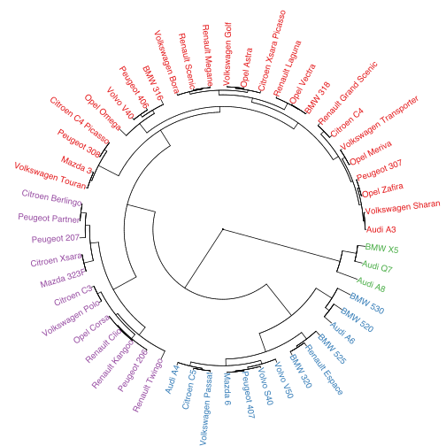

```r
plot(as.phylo(hc), type = "unrooted", cex = 0.8,
     tip.color = cols[auta$grupa])
```

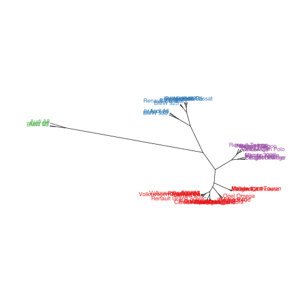

```r
plot(as.phylo(hc), type = "radial", cex = 0.8,
     tip.color = cols[auta$grupa])
```

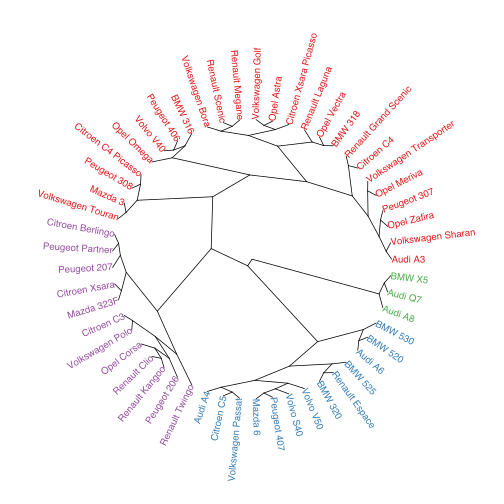

```r
plot(as.phylo(hc), type = "cladogram", cex = 0.8,
     tip.color = cols[auta$grupa])
```

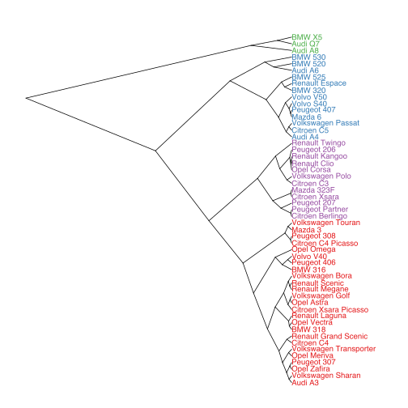

## I co dalej?

* Aby wykonać grupowanie hierarchiczne strategią z góry do dołu, można wykorzystać funkcję `diana()`  z pakietu `cluster` (nazwa pochodzi od *DIvisive ANAlysis Clustering*).
