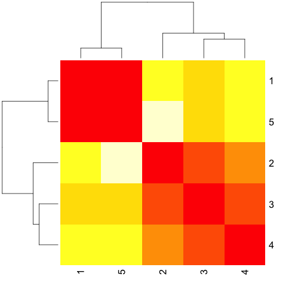

# Jak wyznaczać odległość pomiędzy obserwacjami?

Analiza skupisk jest oparta o odległości pomiędzy obserwacjami. 
Poprawne określenie odległości jest *być albo nie być* dla poprawności wyników.

W kolejnych podrozdziałach opiszemy różne algorytmy identyfikacji skupisk, ale nie ma znaczenia której metody używamy jeżeli źle określimy odległości.

Weźmy dwie obserwacje, $$x=(x_1, ..., x_n)$$ i $$y=(y_1, ..., y_n)$$.

Typowe definicje funkcji odległości pomiędzy nimi to:

## Typowe wybory dla zmiennych ilościowych

### Odległość Euklidesowa

Standardowa odległość w $$R^n$$

$$
d(x, y) = \sqrt{\sum_i (x_i - y_i)^2}.
$$

### Odległość maksimum

Maksymalna odległość po współrzędnych.

$$
d(x, y) = \max_i{|x_i - y_i|}.
$$

### Odległość Manhattan (taksówkowa)

Suma odległości po współrzędnych

$$
d(x, y) = \sum_i{|x_i - y_i|}.
$$

### Odległość Canberra

Ważona wersja odległości Manhattan, stosowana dla danych o zliczeniach (np. o rozkładzie zbliżonym do Poissona), uporządkowanych rankingach itp.

$$
d(x, y) = \sum_i{\frac{|x_i - y_i|}{|x_i| + |y_i|}}
$$

## Typowe wybory dla zmiennych jakościowych

### Odległość Hamminga

Liczba różnych współrzędnych. Często wykorzystywana dla ciągów cyfr lub liter, ale też dla binarnych wektorów.

$$
d(x, y) = \#\{i: x_i \neq y_i\}
$$

### Odległość Jaccarda

Dla wektorów binarnych, najprostsza interpretacja to: wielkość przecięcia podzielona na wielkość części sumy.
Często używana przez ekologów, gdyby bada się jak często dwa gatunki współwystępują, sensownie jest porównywać jak często występują razem do miejsc gdzie występuje przynajmniej jeden z nich

$$
d(x, y) = \frac{\#\{(i: x_i == 1) \wedge (y_i == 1)\}}{\#\{(i: x_i == 1) \vee (y_i == 1)\}}.
$$


## Nietypowe wybory

Jeżeli analizujemy wektor zmiennych o zbliżonych charakterystykach to możemy wybrać którąś z powyższych metryk.
Ale:

* Jeżeli elementy wektora są w znacząco różnych zakresach zmienności to często rozsądnym pomysłem jest unormowanie każdej ze współrzędnych osobno (np. długość w metrach i milimetrach). Unormować można tak by średnia była równa 0 i sd 1 lub by zakres zmienności wynosił [0,1] lub w inny sposób (np. przez rangi).

* Jeżeli elementy $$x$$ i $$y$$ składają się z różnych zmiennych, np. jakościowych (kraj pochodzenia) i ilościowych (wiek) to możemy na poszczególnych współrzędnych wyznaczać cząstkowe macierze odległości a następnie je składać.

* Często nie jest oczywiste jak liczyć odległość. Przypuśćmy że porównujemy głosowania posłów (za, przeciw, wstrzymał się, nie było go) - odległość pomiędzy głosowaniami można różnie określać. Lub przypuśćmy że porównujemy korpusy tekstów. Co będzie dobrą miarą podobieństwa napisów? A gdy porównujemy obrazy? Często nie ma sensu porównywanie bezpośrednio obrazów, ale najpierw wyznacza się cechy które już można porównywać w bardziej klasyczny sposób.


## A jak to zrobić w R?

Najprostszy sposób by policzyć odległość w R jest przez użycie funkcji `dist()`. Są w niej zaimplementowane powyżej opisane odległości.


```r
kwiatkow5 <- iris[1:5,1:4]

dist(kwiatkow5)
```

```
##           1         2         3         4
## 2 0.5385165                              
## 3 0.5099020 0.3000000                    
## 4 0.6480741 0.3316625 0.2449490          
## 5 0.1414214 0.6082763 0.5099020 0.6480741
```

```r
dist(kwiatkow5, method = "manhattan")
```

```
##     1   2   3   4
## 2 0.7            
## 3 0.8 0.5        
## 4 1.0 0.5 0.4    
## 5 0.2 0.7 0.8 1.0
```

```r
as.matrix(dist(kwiatkow5, method = "max"))
```

```
##     1   2   3   4   5
## 1 0.0 0.5 0.4 0.5 0.1
## 2 0.5 0.0 0.2 0.3 0.6
## 3 0.4 0.2 0.0 0.2 0.4
## 4 0.5 0.3 0.2 0.0 0.5
## 5 0.1 0.6 0.4 0.5 0.0
```

Łatwość jej użycia niesie ryzyko stosowania jej bez głębszej refleksji jakie odległości mają sens. 
Powtórzmy więc **w analizie skupisk kluczowy jest wybór odległości**.

## Pokaż ją!

Macierz odległości (o ile nie jest duża) można przedstawiać graficznie z użyciem tzw. mapy ciepła. Więcej o tym jak jest konstruowana w kolejnych rozdziałach.


```r
d <- as.matrix(dist(kwiatkow5, method = "max"))

heatmap(d, symm = TRUE)
```




