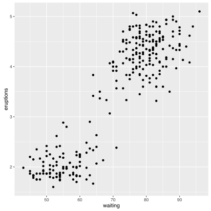
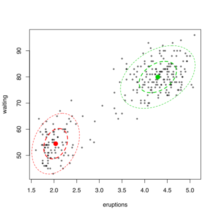
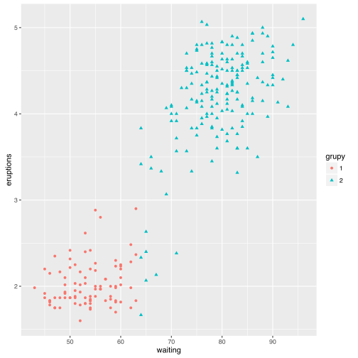
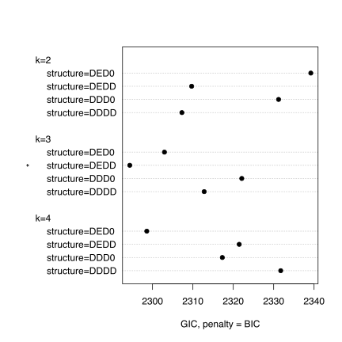

# Jak szukać partycji w oparciu o mieszaniny rozkładów?

Omawiane dotąd metody (grupowanie hierarchiczne, k-średnich, k-medoidów) nie bazowały na żadnym probabilistycznym modelu. Ot, dzieliły obserwacje na grupy obiektów bliskich sobie.

W pewnych zastosowaniach praktyczne jest założenie, że obiekty, które obserwujemy pochodzą z mieszaniny rozkładów. Rozłożenie tej mieszaniny na części i zidentyfikowanie wszystkich składowych pozwala nam lepiej zrozumieć naturę obserwowanego zjawiska.

Poniżej skupimy się na mieszaninie rozkładów normalnych, ale w podobny sposób można rozkładać rozkłady również na inne składowe. Trudniej jedynie opisać strukturę zależności.

Przyjmijmy, że mamy $$k$$ rozkładów normalnych o gęstości $$f(x, \theta_i)$$, dla $$i = 1, ..., k$$. Rozkłady mogą różnić się średnią lub macierzą kowariancji $$\theta_i = (\mu_i, \Sigma_i)$$. Rozkłady te są zmieszane z prawdopodobieństwami $$\pi_i$$, brzegowa gęstość wynosi więc

$$
f(x) = \sum_{i=1}^k \pi_i f(x, \theta_i).
$$

Standardowo, parametry takiej mieszaniny estymuje się w oparciu o metodę największej wiarygodności. Maksimum funkcji wiarogodności znajduje się algorytmem *expectation–maximization* (w skrócie EM, Więcej o tym modelu i algorytmie EM przeczytać można w *The R Package bgmm: Mixture Modeling with Uncertain Knowledge* https://www.jstatsoft.org/article/view/v047i03).

## Przykład

Standardowym przykładem ilustrującym mieszaninę rozkładów normlanych są dane o czasach trwania erupcji i czasach pomiędzy erupcjami gejzera Old Faithful w parku Yellowstone. Już sama wstępna eksploracja tych danych pokazuje zasadność założenia o istnieniu dwóch lub większej liczy grup.
 

```r
head(faithful)
```

```
##   eruptions waiting grupy
## 1     3.600      79     2
## 2     1.800      54     1
## 3     3.333      74     2
## 4     2.283      62     1
## 5     4.533      85     2
## 6     2.883      55     1
```

```r
library(ggplot2)
ggplot(faithful, aes(waiting, eruptions)) + 
  geom_point()
```



Wykorzystajmy funkcję `unsupervised()` z pakietu `bgmm` do oszacowania parametrów mieszaniny rozkładów normalnych. Załóżmy dwie składowe.

Funkcja `plot()` narysuje elipsy określające kształt gęstości rozkładów normalnych. Wynikiem jest lista, której elementy `pi`, `mu` i `cvar` przedstawiają wyestymowane parametry.


```r
library(bgmm)
erupcje2 <- unsupervised(X = as.matrix(faithful[,1:2]), k = 2)
plot(erupcje2)
```



```r
erupcje2$pi
```

```
## [1] 0.6441139 0.3558861
```

```r
# składowa 1
# średnia i macierz wariancji
erupcje2$mu[1,]
```

```
## [1]  4.28969 79.96846
```

```r
erupcje2$cvar[1,,]
```

```
##           eruptions    waiting
## eruptions 0.1699323  0.9401497
## waiting   0.9401497 36.0410392
```

```r
# składowa 2
# średnia i macierz wariancji
erupcje2$mu[2,]
```

```
## [1]  2.036421 54.478841
```

```r
erupcje2$cvar[2,,]
```

```
##            eruptions    waiting
## eruptions 0.06919325  0.4354348
## waiting   0.43543482 33.6991083
```

Mając model probabilistyczny, dla każdej obserwacji można określić prawdopodobieństwo przynależności do każdej ze składowych, więc można też wyznaczyć składową MAP (ang. *maximum a posteriori*).


```r
faithful$grupy <- factor(predict(erupcje2, faithful)$class.X)
```

```
## Error in FUN(newX[, i], ...): non-numeric argument to binary operator
```

```r
ggplot(faithful, aes(waiting, eruptions, color=grupy, shape=grupy)) + 
  geom_point()
```



## Nieznana struktura, nieznana liczba składowych

Zauważmy, że dla $$p$$ wymiarowych obserwacji, jedna składowa gaussowska opisana jest przez $$p$$ liczb opisujących średnią i $$p(p+1)/2$$ opisujących macierz kowariancji. Cały model z $$k$$ składowymi opisany jest przez $$k p(p+3)/2 + k - 1$$ parametrów. Liczba parametrów szybko rośnie z wymiarem danych, przez co potrzeba jest dużo obserwacji aby je wszystkie dobrze estymować. Jeżeli obserwacji nie ma zbyt dużo, to dobrym rozwiązaniem może być założenie pewnych ograniczeń na postać macierzy kowariancji $$\Sigma_i$$. Jeżeli założymy, że rozkłady mają taką samą wariancję na każdej składowej, lub nie są skorelowane - znacząco obniżymy liczbę parametrów. 

Co gdy nie wiemy jaką wybrać liczbę składowych lub jakie wprowadzić ograniczenia na parametry rozkładu? 

W przypadku modeli probabilistycznych użytecznym kryterium może być kryterium Bayesowskie BIC, zdefiniowane jako

$$
BIC(M) = -2 * \log likelihood(M) + |M| * log(n)
$$

gdzie $$n$$ to liczba obserwacji, $|M|$ to rozmiar modelu - liczba parametrów opisujących model a $$\log likelihood(M)$$ to funkcja log wiarogodności. 

Funkcja `unsupervisedList()` pozwala na dopasowanie do danych zbioru modeli o różnej liczbie składowych i różnej strukturze, a następnie używając funkcji `plot()` można ete modele porównać organoleptycznie


```r
erupcje <- unsupervisedList(X = as.matrix(faithful[,1:2]), kList = 2:4, 
                      mean = "D", between = c("D", "E"),
                      within = "D", cov = c("D", "0"))
plot(erupcje)
```


Lub porównać w oparciu o kryterium BIC. Im niższa wartość kryterium tym lepiej dopasowany model. W tym przypadku najlepszy model według kryterium BIC to ten z trzema składowymi oraz o równych wariancjach i braku kowariancji.


```r
plotGIC(erupcje, penalty = "BIC")
```



```
##                     k=2      k=3      k=4
## structure=DDDD 2307.275 2312.795 2331.745
## structure=DDD0 2331.210 2322.102 2317.286
## structure=DEDD 2309.689 2294.367 2321.467
## structure=DED0 2339.197 2302.955 2298.583
```

## I co dalej?

* Dobrym pakietem do identyfikacji składowych mieszanin gaussowskich to pakiet `mclust` omówiony szczegółowo na stronie http://www.stat.washington.edu/mclust/
* Pełny zbiór pakietów do grupowania opartego o mieszaninę rozkładów jest przedstawiony na stronie https://cran.r-project.org/web/views/Cluster.html

