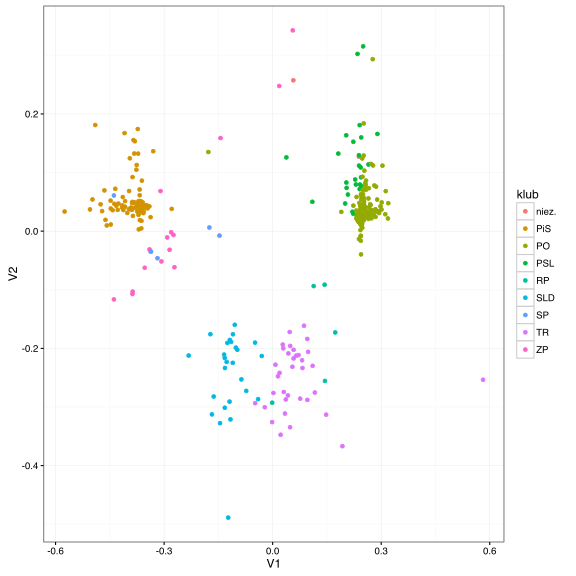
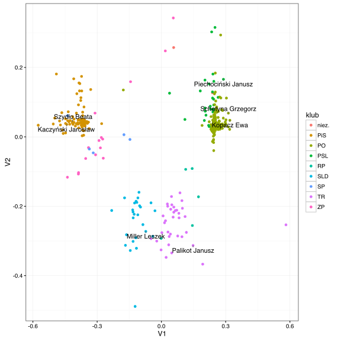

# Jak zrobić skalowanie na przestrzeń o niskim wymiarze?

Problem, który będziemy rozwiązywać w tym rozdziale jest następujący:

Mamy symetryczną macierz $$D = [d_{i,j}]$$, będącą macierzą podobieństw pomiędzy $$n$$ obiektami. Na podstawie tej macierzy szukamy $$p$$ wymiarowej reprezentacji w przestrzeni $$\mathcal R^p$$, takiej by podobieństwa pomiędzy obiektami były zachowane.

Ten problem można rozwiązać na wiele sposobów, poniżej przedstawimy najbardziej klasyczne podejścia zachęcając jednocześnie czytelnika do szukania innych.

Problem skalowania wielowymiarowego ma wiele zastosowań zarówno w eksploracji danych, wizualizacji danych czy tzw. identyfikacji struktur w danych. W ogólnym przypadku możemy obiekty reprezentować na $$p$$ wymiarowej przestrzeni z dowolną metryką, ale w przykładach skupimy się na reprezentacji dwu-wymiarowej z odległością Euklidesową.


## Skalowanie metryczne

Oznaczmy przez $$x_i \in \mathcal R^p$$ współrzędne reprezentacji obiektu $$i$$ w nowej, zredukowanej przestrzeni.

Problem szukania $$p$$ wymiarowej reprezentacji można zamienić na problem optymalizacji funkcji opisującej błąd odwzorowania. Wprowadźmy następującą funkcję zniekształcenia (tzw. funkcję ang. *stress*).

$$
stress_1 = \left( \sum_{i,j} (d_{i,j} - ||x_i - x_j||)^2 \right)^{\frac 12}
$$

Opisuje ona różnice pomiędzy zadanymi odległościami, a odległościami w nowej przestrzeni. Minimalizacja funkcji $$stress_1$$ sprowadza się do znalezienia optymalnych wartości dla współrzędnych $$x_i$$. 

Z punktu widzenia optymalizacji, możemy również minimalizować poniższą funkcję, która ma jednak taką zaletę, że wartości nie zależą już od wybranej jednostki. Zauważmy też, że dla optymalizacji nie ma również znaczenia pierwiastek. 

$$
stress_2 = \left( \frac{ \sum_{i,j} (d_{i,j} - ||x_i - x_j||)^2 }{ \sum_{i,j} d^2_{i,j} } \right)^{\frac 12}
$$


W ogólnym przypadku minimalizacja funkcji $$stress_1$$ nie jest łatwa i wykorzystuje się do niej algorytmy iteracyjne oparte na gradientach. Ogólny schemat takiego algorytmu jest następujący.

1. Wyznacz początkowa konfigurację (może być losowa, lub oparta o skalowanie klasyczne),
2. Wyznacz macierz odległości pomiędzy obiektami w bieżącej konfiguracji $$\delta{i,j} = ||x_i - x_j||$$,
3. Wykonaj regresję odległości $$\delta_{i,j}$$ na oryginalne odległości $$d_{i,j}$$,
$$
d_{i,j} = \alpha + \beta \delta_{i,j},
$$
to nie musi być liniowa regresja, ale coś co sprowadzi $$\delta_{i,j}$$ do skali $$d_{i,j}$$,
4. Wyznacz bieżącą wartość funkcji $$stress$$
$$
stress = \left( \frac{ \sum_{i,j} (d_{i,j} - \hat\delta_{i,j})^2 }{ \sum_{i,j} d^2_{i,j} } \right)^{\frac 12},
$$
5. Na bazie gradientu funkcji $$stress$$ uaktualnij współrzędne reprezentacji $$x_i$$. 

Powyższy algorytm ma wiele wariantów, różniących się np. adaptacyjnym wyborem długości kroku w punkcie 5 lub dodaniem wag. Schemat jest jednak podobny.


## Jak przeprowadzić skalowanie metryczne w R?

Funkcja `sammon()` z pakietu `MASS` wyznacza klasyczne skalowanie metyczne (nazwa pochodzi od pracy J. Sammona 1969).

Poniższy przykład wczytuje dane o głosach posłów z VII kadencji Sejmu RP na ponad 5600 głosowań. Opierając się na macierzy podobieństw wektorów głosów wyznaczmy dwu-wymiarową reprezentacje posłów. Pozycja zależy wyłącznie od tego w jaki sposób głosowano. Ale jak widzimy, posłowie tych samych klubów głosują często podobnie do siebie.


```r
library(ggplot2)
library(ggrepel)
library(MASS)
library(cluster)

glosowania <- archivist::aread("pbiecek/Przewodnik/arepo/3eab62451d26be6d14fe99dda69675ca")
podobienstwa <- daisy(glosowania[,-(1:2)])

projekcja <- as.data.frame( sammon(podobienstwa, k = 2)$points )
```

```
## Initial stress        : 0.09130
## stress after  10 iters: 0.07400, magic = 0.018
## stress after  20 iters: 0.06447, magic = 0.009
## stress after  30 iters: 0.05641, magic = 0.020
## stress after  40 iters: 0.05158, magic = 0.009
## stress after  43 iters: 0.04861
```

```r
projekcja$klub <- glosowania[,2]
projekcja$imie <- glosowania[,1]

ggplot(projekcja, aes(V1, V2, label=imie)) + 
  geom_point(aes(color=klub)) +theme_bw()
```



Zaznaczmy na tym wykresie pozycje liderów klubów.


```r
ggplot(projekcja, aes(V1, V2, label=imie)) + 
  geom_point(aes(color=klub)) +
  geom_text_repel(data=projekcja[c(268, 348, 139, 259, 168, 309, 223),]) +theme_bw()
```




## Skalowanie nie-metryczne

W ogólnym przypadku macierz podobieństw $$D$$ może być wyznaczana w dowolny sposób. Mogą być to subiektywnie wyznaczane podobieństwa, oparte o subiektywne rankingi, pomiary odległości pomiędzy napisami, sekwencjami DNA, strukturami przestrzennymi białek, zdjęciami, dowolnymi obiektami.

W wielu sytuacjach podobieństwa mają na celu wyłącznie uporządkowanie obiektów ale nie mają samodzielnej interpretacji. Przykładowo, jeżeli porównujemy owoce, można określić że jabłko jest bardziej podobne do gruszki niż do jagody. Takie względe podobieństwo możemy zapisać liczbami, ale wartość tych liczb nie musi mieć znaczenia, znaczenie będzie miało wyłącznie uporządkowanie. 

Skalowanie nie-metryczne pozwala na znalezienie reprezentacji, która odwzorowuje kolejność odległości pomiędzy parami obiektów a nie odległość pomiędzy obiektami. 

Wprowadźmy następującą funkcję zniekształcenia (tzw. funkcję ang. *stress*).

$$
stress = \left( \frac{\sum_{i,j} (f(d_{i,j}) - ||x_i - x_j||)^2}{\sum_{i,j}  ||x_i - x_j||^2} \right)^{\frac 12}
$$

We wzorze powyżęj $$f()$$ oznacza monotoniczną rosnącą funkcję przekształcającą odległości pomiędy obiektami ale zachowującą ich kolejność. Ta funkcja jest również optymalizowana w procesie minimalizacji współczynnika $$stress$$.

Ogólny schemat algorytmu skalowania nie-metrycznego jest następujący.

1. Wyznacz początkowa konfigurację (może być losowa, lub oparta o skalowanie klasyczne),
2. Wyznacz macierz odległości pomiędzy obiektami w bieżącej konfiguracji $$\delta{i,j} = ||x_i - x_j||$$,
3. Wykonaj regresję porządkową odległości $$\delta_{i,j}$$ na oryginalne odległości $$d_{i,j}$$,
$$
d_{i,j} = f( \delta_{i,j} ).
$$
Zamiast przeprowadzać regresję porządkową (ang. *isotonic regression*) można też wyestymować $$f()$$, na bazie tej regresji wyznacz $$\hat d_{i,j}$$,
4. Wyznacz bieżącą wartość funkcji $$stress$$
$$
stress = \left( \frac{ \sum_{i,j} (d_{i,j} - \hat\delta_{i,j})^2 }{ \sum_{i,j} d^2_{i,j} } \right)^{\frac 12},
$$
5. Na bazie gradientu funkcji $$stress$$ uaktualnij współrzędne reprezentacji $$x_i$$. 


## Jak przeprowadzić skalowanie nie-metryczne w R?

Funkcja `isoMDS()` z pakietu `MASS` wyznacza skalowanie niemetyczne.


```r
projekcja <- as.data.frame( isoMDS(podobienstwa, k = 2)$points )
```

```
## initial  value 11.618214 
## iter   5 value 6.680174
## iter  10 value 5.892581
## iter  15 value 5.805270
## final  value 5.776026 
## converged
```

```r
projekcja$klub <- glosowania[,2]
projekcja$imie <- glosowania[,1]

ggplot(projekcja, aes(V1, V2, label=imie)) + 
  geom_point(aes(color=klub)) +theme_bw()
```


Zaznaczmy na tym wykresie pozycje liderów klubów.


```r
ggplot(projekcja, aes(V1, V2, label=imie)) + 
  geom_point(aes(color=klub)) +
  geom_text_repel(data=projekcja[c(268, 348, 139, 259, 168, 309, 223),]) +theme_bw()
```


