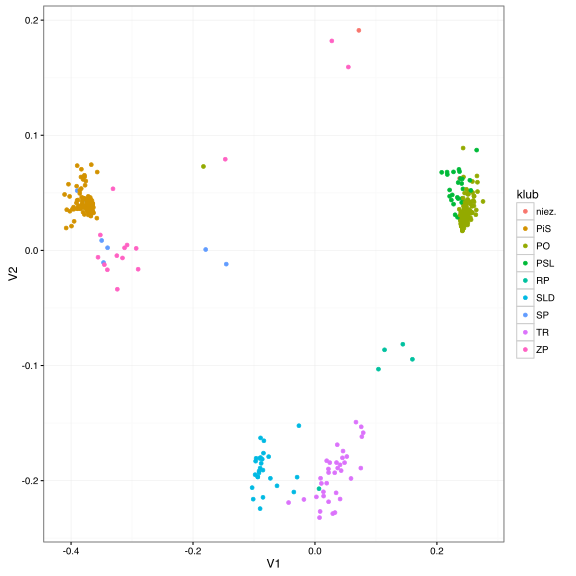
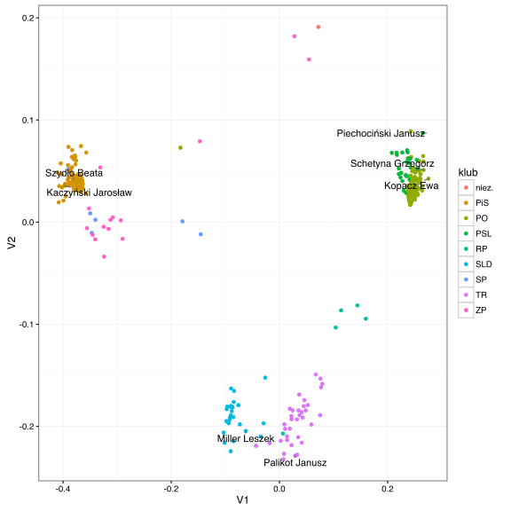

# Klasyczne skalowanie metryczne

Klasyczne skalowanie metryczne zakłada, że macierz odległości $$D$$ powstała na bazie odległości euklidesowej.
To skalowanie odpowiada metodzie PCA, z tą różnicą, że puntem wyjścia jest macierz euklidesowych odległości.

Algorytm skalowania jest następujący (jednokrokowy)

1. Wyznacz macierz kwadratów odległości $$D^2 = [d^2_{ij}]$$,
2. Wycentruj macierz $$D^2$$, wyznacz 
$$
B = -\frac 12 J D^2 J,
$$
gdzie macierz centrująca to $$J = I - 1 1^T/n$$,
3. Wyznacz wartości własne $$\lambda$$ i wektory własne $$V$$ macierzy $$B$$.
4. Wyznacz współrzędne obiektów jako 
$$
X = V_p diag(\lambda^{1/2}_p),
$$
gdzie $$V_p$$ to macierz z $$p$$ pierwszymi wektorami własnymi, a wektor $$\lambda_p$$ to p-największych wartości własnych.

Założeniem tej metody jest to, że macierz $$D$$ oparta jest o odległość euklidesową. Ale nawet gdy to założenie nie jest spełnione, skalowanie klasyczne jest wykorzystywane by wybrać początkową konfigurację dla innych algorytmów skalowania metrycznego lub nie metrycznego.


## Jak przeprowadzić skalowanie klasyczne w R?

Funkcja `cmdscale()` z pakietu `MASS` wyznacza klasyczne skalowanie metryczne (nazwa pochodzi od *classical metric scalling*).

Poniższy przykład wczytuje dane o głosach posłów z VII kadencji Sejmu RP na ponad 5600 głosowań. Opierając się na macierzy podobieństw wektorów głosów wyznaczmy dwu-wymiarową reprezentacje posłów. Pozycja zależy wyłącznie od tego w jaki sposób głosowano. Ale jak widzimy, posłowie tych samych klubów głosują często podobnie do siebie.


```r
library(ggplot2)
library(ggrepel)
library(MASS)
library(cluster)

glosowania <- archivist::aread("pbiecek/Przewodnik/arepo/3eab62451d26be6d14fe99dda69675ca")
podobienstwa <- daisy(glosowania[,-(1:2)])

projekcja <- as.data.frame( cmdscale(podobienstwa, k = 2) )
projekcja$klub <- glosowania[,2]
projekcja$imie <- glosowania[,1]

ggplot(projekcja, aes(V1, V2, label=imie)) + 
  geom_point(aes(color=klub)) +theme_bw()
```



Zaznaczmy na tym wykresie pozycje liderów klubów.


```r
ggplot(projekcja, aes(V1, V2, label=imie)) + 
  geom_point(aes(color=klub)) +
  geom_text_repel(data=projekcja[c(268, 348, 139, 259, 168, 309, 223),]) +theme_bw()
```



## Inne materiały

* K. Mardia *Some properties of classical multi-dimensional scaling* https://www1.maths.leeds.ac.uk/~sta6kvm/reprints/CommunStatTheo1978.pdf

