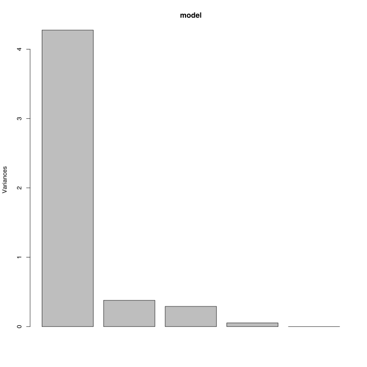

# Metoda składowych głównych (ang. PCA, *Principal Component Analysis*)

Dotychczas omówione metody bazowały na macierzy odległości / niepodobieństwa $$D$$ i z niej odtwarzały nowe współrzędne obiektów. 

W tym rozdziale omówimy prostszy przypadek, w którym mamy dane $$X$$ w przestrzeni $$q$$ wymiarowej i chcemy je liniowo rzutować do przestrzeni $$p$$ wymiarowej, w ten sposób by zachować jak najlepiej kwadrat odległości euklidesowej pomiędzy obiektami.

Poniżej traktujemy $$X$$ jako macierz o $$n$$ wierszach i $$q$$ kolumnach, kolejne kolumny to zmienne opisujące obiekty.

## Skalowanie i centrowanie

Zawsze gdy pracujemy z odległościami powinniśmy upewnić się, że każdy wymiar / każda zmienna jest w tych samych jednostkach. Tylko dzięki temu, możemy zapewnić, że odległość jest równomiernie związana z każdą zmienną.

Jeżeli zmienne są w różnych jednostkach, lub dotyczą różnych współczynników, wtedy zalecanym postępowaniem jest wycentrowanie i przeskalowanie każdej zmiennej / każdego wymiaru by mieć średnią 0 i odchylenie standardowe 1.


## Największa wariacja - metoda wartości własnych

Metoda PCA, którą poniżej omówimy, ma na celu jak najwierniejsze odwzorowanie kwadratu odległości euklidesowej.
Średnia kwadratu odległości euklidesowej punktów od średniej z punktów odpowiada wariancji. Problem rzutowania, które zachowuje kwadraty odległości euklidesowych jest więc równoważny problemowi rzutowania, które maksymalizuje wariancje w danych po rzutowaniu.

Jak szukać rzutu maksymalizującego wariancję? 


Zacznijmy od rzutu jednowymiarowego. Szukamy jednowymiarowej przestrzeni, takiej, że rzut na nią ma jak największą wariancję.
Przyjmijmy, że wektor $$u$$ jest wektorem bazowym tej nowej jednowymiarowej podprzestrzeni. Długość rzutu wektora $$x$$ na tę podprzestrzeń to $$u^Tx$$. 

Rzut zachowuje punkt zerowy, a więc Wariancja to suma kwadratów rzutów, czyli
$$
Var(X^Tu) = \frac 1n  \sum_{i=1}^n (x_i^T u)^2,
$$
i można ją przedstawić jako 
$$
Var(X^Tu) = u^T\left(\sum_i x_i x_i^T\right)u.
$$

Zauważmy, że $$\sum_i x_i x_i^T$$ to macierz kowariancji danych (wciąż $$X$$jest wycentrowany). Przy dodatkowym ograniczeniu, że $$||u||=1$$ metodą mnożników Lagrange możemy znaleźć $$u$$.

Funkcja Lagrange przyjmie postać
$$
\left(\sum_i x_i x_i^T\right)u - \lambda u.
$$

W tym przypadku rozwiązaniem jest wektor własny odpowiadającym pierwszej wartości własnej.

Podobnie postępuje się dla kolejnych wymiarów i otrzymuje się jako rozwiązania kolejne wartości własne.

## Wartości osobliwe - Singular value decomposition

Rozłóżmy macierz $$X$$ (zakładamy, że jej kolumny są wycentrowane i wystandaryzowane) na
$$
X = U \Sigma W^T,
$$
gdzie $$\Sigma$$ jest macierzą diagonalną, macierze $$U$$ i $$W$$ są ortonormalne (a więc $$U^TU = I$$). Taki rozkład macierzy nazywamy rozkładem na wartości osobliwe.

Zauważmy, że
$$
X^T X = W^T \Sigma^2 W,
$$
a więc wartości osobliwe odpowiadają kwadratom wartości własnych.

Możemy więc rzut na niższą przestrzeń wyznaczyć też ze wzoru (wybieramy jedynie pierwsze wektory własne)
$$
M = XW = U \Sigma.
$$


## Przykład w R

Na potrzeby poniższych analiz wykorzystamy dane o filmach z 2015 roku z bazy Hollywood Insider.


```r
library(archivist)
filmy <- archivist::aread("pbiecek/Przewodnik/arepo/10aab376f2bc0001cbd1db1802e9fb53")
filmy2015 <- na.omit(filmy[filmy$year == "2015", c(1, 4:8)])
head(filmy2015)
```

```
##                           film Rotten.Tomatoes.% Metacritic.%
## 1                     Brooklyn                98           87
## 2      Avengers: Age of Ultron                74           66
## 3                      Spectre                64           60
## 4            The Good Dinosaur                77           66
## 5     Star Wars: Force Awakens                94           81
## 6 Tomorrowland: A World Beyond                50           60
##   Average.critics.% Rotten.Tomatoes.Audience.% Metacritic.Audience.%
## 1              92.5                         89                    81
## 2              70.0                         85                    70
## 3              62.0                         65                    67
## 4              71.5                         71                    73
## 5              87.5                         91                    70
## 6              55.0                         52                    64
```

Analizę PCA można wykonać funkcją `princomp()` wykorzystującą wartości własne lub funkcją `prcomp()` wykorzystującą rozkład SVD. Ta druga metoda jest lepsza z uwagi na właściwości numeryczne.


```r
rownames(filmy2015) <- make.names(filmy2015[,1], unique = TRUE)
model <- prcomp(scale(filmy2015[,-1]))
model
```

```
## Standard deviations:
## [1] 2.068011e+00 6.157329e-01 5.397793e-01 2.298712e-01 4.776194e-16
## 
## Rotation:
##                                   PC1        PC2        PC3         PC4
## Rotten.Tomatoes.%          -0.4721180  0.2013879 -0.1528392 -0.68186146
## Metacritic.%               -0.4604284  0.3864903 -0.1874138  0.70823225
## Average.critics.%          -0.4741460  0.2775318 -0.1686866 -0.14097269
## Rotten.Tomatoes.Audience.% -0.4035777 -0.8422931 -0.3408851  0.10707354
## Metacritic.Audience.%      -0.4212136 -0.1535795  0.8926693  0.04619501
##                                      PC5
## Rotten.Tomatoes.%          -4.982496e-01
## Metacritic.%               -3.192399e-01
## Average.critics.%           8.061223e-01
## Rotten.Tomatoes.Audience.% -5.030698e-17
## Metacritic.Audience.%      -8.326673e-17
```

Z modelu można wyłuskać dane po rzutowaniu.


```r
PCA12 <- model$x[,1:2]
head(PCA12)
```

```
##                                     PC1        PC2
## Brooklyn                     -3.2417470  0.2121708
## Avengers..Age.of.Ultron      -1.5103770 -0.3797345
## Spectre                      -0.5508384  0.2148260
## The.Good.Dinosaur            -1.3811634  0.2281014
## Star.Wars..Force.Awakens     -2.6814663  0.0202641
## Tomorrowland..A.World.Beyond  0.1619536  0.6190086
```

Funkcja `plot()` pokazuje procent wyjaśnionej zmienności. Ale więcej pokaże biplot, wykonany z użyciem funkcji `autoplot{ggfortify}`.


```r
plot(model)
```


```r
library(ggfortify)
autoplot(model, shape = FALSE, label.size = 2, loadings = TRUE, loadings.label = TRUE, loadings.label.size = 5) + theme_bw()
```




