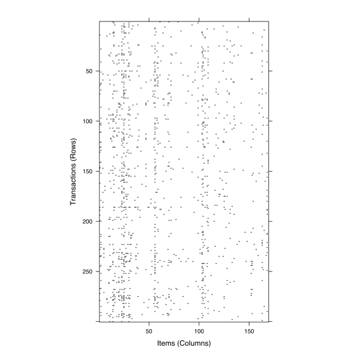
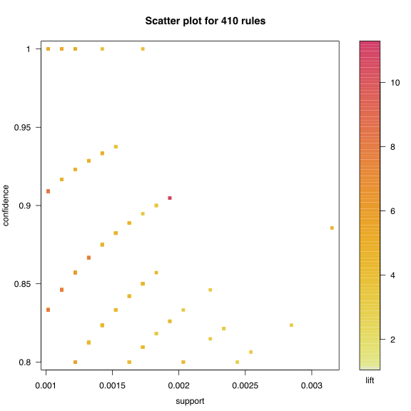
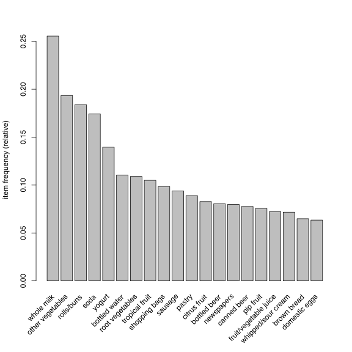
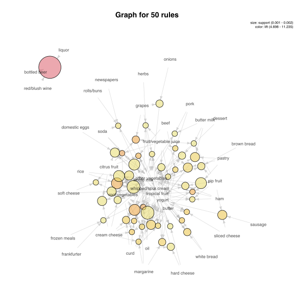

# Reguły asocjacyjne / reguły skojarzeniowe

Identyfikacja reguły asocjacyjnych pozwala na poznanie struktury danych. Dosyć specyficznych danych, tzw. danych transakcyjnych. 

Pierwotna motywacja dotyczyła analizy danych zakupowych, tzw. analizy koszykowej. Zastosowań jest znacznie więcej, ale dla wygody będziemy się posługiwali terminologią koszykową.
Przyjmijmy, że dane dotyczą transakcji, każda transakcja dotyczy zbioru produktów. Na ich podstawie chcemy wyznaczyć produkty często kupowane razem. 

Po co? Jeżeli analiza koszykowa pokaże, że zakup produktu X pociąga za sobą zakup produktu Y (np. zakup kiełbasek na grilla pociąga za sobą zakup ketchupu), to sprzedawca mógłby obniżyć cenę kiełbasek (dobra reklama, wiele osób przychodzi do sklepu) a podnieść cenę ketchupu (dzięki czemu koszyk zakupowy jest droższy).

Analiza koszykowa ma też zastosowania w innych zagadnieniach. Produktem może być przeczytana książka, aktywny gen (które geny się aktywują), obejrzany film, wyszukana strona internetowa itp.


## Składnia reguł

Oznaczmy przez $$P$$ zbiór produktów 
$$
P = \{P_1, P_2, ..., P_n\}.
$$

Regułą decyzyjną nazwiemy parę o strukturze 
$$
L \to R,
$$
gdzie obie strony to podzbiory zbioru produktów $$L, R \subseteq P$$ (zazwyczaj niewielkie podzbiory).

Typowa interpretacja takiej reguły to: klienci kupujący produkty $$L$$ kupują też produkty $$R$$.


## Miara oceny reguł

Par postaci $$L \to R$$ można wygenerować bardzo wiele. Aby wybrać z nich te użyteczne, wprowadza się kilka miar oceny reguły decyzyjnej.

Trzy najpopularniejsze to:

* Support (*wsparcie*), wyznacza się dla zbioru. Określa do jakiej części transakcji stosuje się dany zbiór. To iloraz liczby transakcji zawierających produkty ze zbioru do liczby wszystkich transakcji
$$
supp(L) = n_L / n.
$$
* Confidence (*wiarygodność/ufność*), czyli procent transakcji zgodnych z regułą (zawierających produkty z obu stron) do transakcji zgodnych z lewą stroną reguły (zawierających produkty z prawej strony)
$$
conf(L \to R) = supp(L + R) / supp(L).
$$
* Lift (*podniesienie*), czyli ilukrotnie częściej w transakcjach występuje lewa i prawa strona w stosunku do częstości spodziewanej, gdyby obie strony występowały niezależnie
$$
lift(L \to R) = \frac{supp(L + R)}{supp(L) supp(R)}.
$$

Są też inne współczynniki, ale te trzy są najczęściej używane.

Dobra reguła to taka, która ma duże wsparcie (dotyczy wysokiej liczby transakcji) i wiarygodność (prawa strona zachodzi często).

W praktyce często zakłada się minimalne wartości na oba te współczynniki i szuka się wszystkich reguł o wartościach wparcie/wiarygodność wyższych niż założone minimum.


## Jak szukać reguł?

Problem wydaje się prosty. Wystarczy rozważyć wszystkie możliwe reguły, policzyć dla nich Support/Confidence i wybrać te o wysokich wartościach obu współczynników.
Ale wszystkich możliwych reguł jest zazwyczaj za dużo by móc je generować dla nawet małych zbiorów produktów (wszystkich podzbiorów $$k$$ projektów jest $$2^k-1$$).


W praktycznych zastosowaniach w pierwszej kolejności wyznacza się najpierw zbiór częstych zbiorów, czyli takich aby $$supp(L) > \min_s$$.

W drugim kroku, na podstawie tego zbioru częstego rozważa się jego podzbiory o wysokich współczynnikach $$conf()$$ aby zrobić z nich reguły.


## Jak szukać częstych zbiorów - algorytm apriori

Najpopularniejszym algorytmem wyznaczania zbiorów częstych jest algorytm *apriori* (Agarwal i Srikant, 1994). 
Polega on na bardzo prostej obserwacji: wsparcie zbioru nie może się zwiększyć po dodaniu do zbioru nowego elementu.

1. Znajdź wszystkie jednoelementowe zbiory $$X$$, takie które $$supp(X) \geq min_s$$,
2. Na podstawie zbiorów o wielkości $$k$$ wygeneruj zbiory o wielkości $$k+1$$ przez dodanie po jednym produkcie. Pozostaw tylko te, zbiory których wsparcie jest większe niż $$min_s$$.
3. Powtarzaj krok 2.


Następnie dla każdego częstego zbioru wygeneruj wszystkie możliwe jednoelementowe prawe strony i wyznacz ich ufność. Pozostaw tylko te, dla których ufność $$\geq min_c$$.

## Wady takiego podejścia

Ustalenie minimalnego wsparcia bardzo przydaje się do konstrukcji reguł. Jednak w zastosowaniach często nawet bardzo rzadkie reguły mogłyby być interesujące (np. mogą dotyczyć drogich produktów premium).

Wsparcie spada szybo z rosnącą wielkością reguł, a więc stały próg na wsparcie preferuje krótkie reguły.

Zaufanie nie bierze pod uwagę częstości występowania prawej strony reguły (ale *lift* już tak).

Można używać testu $$\chi^2$$ do oceny jakości reguł, ale opierać się on będzie o mało liczną tabelę, a do testowania jest wiele hipotez. 


## Przykład zastosowań

Do zastosowań wykorzystamy zbiór danych `Groceries` z pakietu `arules`. Jest to zbiór danych klasy `transactions` z 9835 transakcjami, dotyczą one produktów z 169 kategorii.


```r
library("arules")
```

```
## Loading required package: Matrix
```

```
## Warning: package 'Matrix' was built under R version 3.2.4
```

```
## 
## Attaching package: 'arules'
```

```
## The following objects are masked from 'package:base':
## 
##     %in%, abbreviate, write
```

```r
data("Groceries")
Groceries
```

```
## transactions in sparse format with
##  9835 transactions (rows) and
##  169 items (columns)
```

```r
head(Groceries@itemInfo)
```

```
##              labels  level2           level1
## 1       frankfurter sausage meet and sausage
## 2           sausage sausage meet and sausage
## 3        liver loaf sausage meet and sausage
## 4               ham sausage meet and sausage
## 5              meat sausage meet and sausage
## 6 finished products sausage meet and sausage
```

```r
dim(Groceries@data)
```

```
## [1]  169 9835
```

Dane o produktach w transakcjach są przechowywane w postaci rzadkiej macierzy zer i jedynek.
Można ją wyświetlić lub narysować.


```r
Groceries@data[1:5,1:30]
```

```
## 5 x 30 sparse Matrix of class "ngCMatrix"
##                                                                 
## [1,] . . . . . . . . . . . . . | . . . . . . . . . . . . . . . .
## [2,] . . . . . . . . . . . . . . . . . . . . . . . . . . . | . .
## [3,] . . . . . . . . . . . . . . . . . . . . . . . . . . . . . .
## [4,] . . . . . . . . . . . . . . . . . . . . . . . . . . . . . .
## [5,] . . . . . . . . . . . . . . . . . . . . . . . . . . . . . .
```

```r
image(head(Groceries,300))
```



Aby wyznaczyć reguły asocjacyjne, można wykorzystać funkcję `apriori()`. Dodatkowe argumenty, przekazane przez parametr `parameter` pozwala określić progi na wyszukiwane reguły.


```r
rules <- apriori(Groceries, parameter = list(support = .001))
```

```
## Apriori
## 
## Parameter specification:
##  confidence minval smax arem  aval originalSupport support minlen maxlen
##         0.8    0.1    1 none FALSE            TRUE   0.001      1     10
##  target   ext
##   rules FALSE
## 
## Algorithmic control:
##  filter tree heap memopt load sort verbose
##     0.1 TRUE TRUE  FALSE TRUE    2    TRUE
## 
## Absolute minimum support count: 9 
## 
## set item appearances ...[0 item(s)] done [0.00s].
## set transactions ...[169 item(s), 9835 transaction(s)] done [0.00s].
## sorting and recoding items ... [157 item(s)] done [0.00s].
## creating transaction tree ... done [0.00s].
## checking subsets of size 1 2 3 4 5 6 done [0.01s].
## writing ... [410 rule(s)] done [0.00s].
## creating S4 object  ... done [0.00s].
```

```r
rules
```

```
## set of 410 rules
```

```r
inspect(head(sort(rules, by = "lift"), 3))
```

```
##   lhs                        rhs                   support confidence     lift
## 1 {liquor,                                                                    
##    red/blush wine}        => {bottled beer}    0.001931876  0.9047619 11.23527
## 2 {citrus fruit,                                                              
##    other vegetables,                                                          
##    soda,                                                                      
##    fruit/vegetable juice} => {root vegetables} 0.001016777  0.9090909  8.34040
## 3 {tropical fruit,                                                            
##    other vegetables,                                                          
##    whole milk,                                                                
##    yogurt,                                                                    
##    oil}                   => {root vegetables} 0.001016777  0.9090909  8.34040
```

Reguły można prezentować graficznie. Służy do tego pakiet `arulesViz`. 


```r
library(arulesViz)
plot(rules)
```



```r
itemFrequencyPlot(Groceries, topN =20)
```



```r
plot(head(sort(rules, by="lift"), 50),  method="graph", control=list(cex=.7))
```



```r
# tylko częste zbiory

rules <- apriori(Groceries, parameter = list(target = "frequent",
  supp=0.001, minlen = 2, maxlen=4))
```

```
## Apriori
## 
## Parameter specification:
##  confidence minval smax arem  aval originalSupport support minlen maxlen
##          NA    0.1    1 none FALSE            TRUE   0.001      2      4
##             target   ext
##  frequent itemsets FALSE
## 
## Algorithmic control:
##  filter tree heap memopt load sort verbose
##     0.1 TRUE TRUE  FALSE TRUE    2    TRUE
## 
## Absolute minimum support count: 9 
## 
## set item appearances ...[0 item(s)] done [0.00s].
## set transactions ...[169 item(s), 9835 transaction(s)] done [0.00s].
## sorting and recoding items ... [157 item(s)] done [0.00s].
## creating transaction tree ... done [0.00s].
## checking subsets of size 1 2 3 4 done [0.01s].
## writing ... [12949 set(s)] done [0.00s].
## creating S4 object  ... done [0.00s].
```


