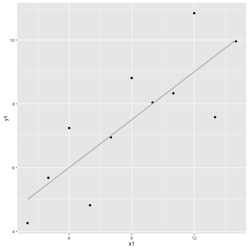
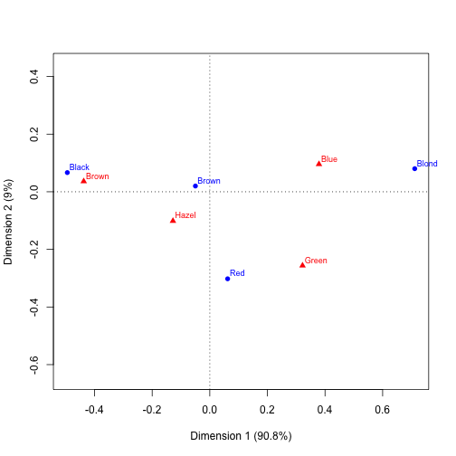

# Jak badać rozkład dwóch zmiennych?

## Jak badać łączny rozkład dwóch zmiennych ilościowych?

Do analizy zależności dwóch zmiennych ilościowych najczęściej  stosuje się współczynniki korelacji liniowej (Pearsona) i monotonicznej (Spearmana).

Jednak **zawsze** o ile czas i miejsce na to pozwala należy uzupełnić taką analizę analizą graficzną (kiedy może nie pozwalać? Jeżeli badać chcemy korelacje dla 1000 zmiennych, każdej z każdą nie narysujemy). 

Pokażmy przykłady kiedy i jak poradzą sobie te współczynniki.
Wykorzystamy do tego kwartet Francisa Anscombe'a.


```r
library(ggplot2)
attach(anscombe)

cor(x1, y1)
```

```
## [1] 0.8164205
```

```r
cor(x1, y1, method="spearman")
```

```
## [1] 0.8181818
```

```r
ggplot(anscombe, aes(x1, y1)) + geom_point() + geom_smooth(method="lm", color="grey", se=FALSE)
```




```r
cor(x2, y2)
```

```
## [1] 0.8162365
```

```r
cor(x2, y2, method="spearman")
```

```
## [1] 0.6909091
```

```r
ggplot(anscombe, aes(x2, y2)) + geom_point() + geom_smooth(method="lm", color="grey", se=FALSE)
```


```r
cor(x3, y3)
```

```
## [1] 0.8162867
```

```r
cor(x3, y3, method="spearman")
```

```
## [1] 0.9909091
```

```r
ggplot(anscombe, aes(x3, y3)) + geom_point() + geom_smooth(method="lm", color="grey", se=FALSE)
```


```r
cor(x4, y4)
```

```
## [1] 0.8165214
```

```r
cor(x4, y4, method="spearman")
```

```
## [1] 0.5
```

```r
ggplot(anscombe, aes(x4, y4)) + geom_point() + geom_smooth(method="lm", color="grey", se=FALSE)
```


## Jak badać łaczny rozkład dwóch zmiennych jakościowych?

Łączny rozkład pary zmiennych jest często przedstawiony za pomocą tablicy kontyngencji, macierzy liczb.

Jednak nawet małe macierze jest często trudno zrozumieć. Analiza korespondencji jest techniką, która może to umożliwić / ułatwić.

### Tabela kontyngencji

Rozważmy macierz zliczeń dla pary zmiennych, oznaczmy ją przez $$M$$

| Y \ X | $$x_1$$ | $$x_2$$ |   | $$x_c$$ |
|---|---|---|---|---|
| $$y_1$$ | $$n_{11}$$ | $$n_{12}$$ | ... | $$n_{1c}$$ |
| ...  |  ... |   |   | ...  |
| $$y_r$$ | $$n_{r1}$$ | $$n_{r2}$$ | ... | $$n_{rc}$$ |


Aby zbadać współwystępowanie poziomów wygodniej jest pracować na macierzy znormalizowanej, oznaczy ją przez $$S$$

$$
S = (1^T_r M 1_c)^{-1}M,
$$

gdzie $$1_c$$ oznacza kolumnowy wektor jedynek o długości $$c$$.

W kolejnym kroku wyznaczmy brzegowe częstości, oznaczmy je jako wektory $$w$$

$$
w_r = (1^T_r M 1_c)^{-1}M1_c
$$

$$
w_c = (1^T_r M 1_c)^{-1}1^T_{r}M
$$

Możemy teraz wyznaczyć różnicę pomiędzy obserwowaną macierzą częstości a oczekiwaną przy założeniu niezależności.

$$
W = S - w_r w_c
$$

### Dekompozycja

Z macierzy $$W$$ można odczytać, które komórki występują częściej niż wynikałoby to z przypadku. Jednak wciąż tych liczb jest tak dużo, że trudno je wszystkie zauważyć.

W celu prezentacji całej macierzy stosuje się uogólnioną dekompozycje SVD na trzy macierze

$$
W = U \Sigma V^T,
$$
takie, że $$U$$ i $$V$$ są ortonormlane względem wektorów $$w_r$$ i $$w_c$$ a $$\Sigma$$ jest macierzą diagonalną. Czyli

$$
U^T diag(w_r) U = V^T diag(w_c) V = I.
$$

Czasem wyprowadza się ten rozkład jako zwykłe SVD z normalizowanej macierzy $$(O-E)/sqrt(E)$$.

Diagonalna macierz $$\Sigma$$ określa wkład kolejnych wektorów w wyjaśnienie macierzy $$W$$.

Jeżeli elementy w odpowiadających sobie kolumnach macierzy $$U$$ i $$V$$ mają ten sam znak to przełożą się one na wartość dodatnią w odpowiadającej im komórce macierzy $$W$$. 

Na wykresie zazwyczaj przedstawia się ładunki odpowiadające dwóm największym wartościom z macierzy $$\Sigma$$. Im bliżej siebie i dalej od początku układu współrzędnych są poszczególne wartości tym częstsze ich współwystępowanie.


### Przykład

Przeprowadźmy graficzną analizę korespondencji dla danych o kolorach oczu i włosów.


```r
library(ca)

(tab <- HairEyeColor[,,1])
```

```
##        Eye
## Hair    Brown Blue Hazel Green
##   Black    32   11    10     3
##   Brown    53   50    25    15
##   Red      10   10     7     7
##   Blond     3   30     5     8
```

```r
anacor <- ca(tab)

plot(anacor)
```



```r
summary(anacor)
```

```
## 
## Principal inertias (eigenvalues):
## 
##  dim    value      %   cum%   scree plot               
##  1      0.134288  90.8  90.8  ***********************  
##  2      0.013275   9.0  99.7  **                       
##  3      0.000395   0.3 100.0                           
##         -------- -----                                 
##  Total: 0.147958 100.0                                 
## 
## 
## Rows:
##     name   mass  qlt  inr    k=1 cor ctr    k=2 cor ctr  
## 1 | Blck |  201  997  339 | -495 979 366 |   67  18  67 |
## 2 | Brwn |  513  890   11 |  -50 767  10 |   20 123  15 |
## 3 |  Red |  122  999   78 |   62  40   3 | -302 958 838 |
## 4 | Blnd |  165  999  572 |  711 987 621 |   80  13  80 |
## 
## Columns:
##     name   mass  qlt  inr    k=1 cor ctr    k=2 cor ctr  
## 1 | Brwn |  351  999  458 | -438 993 501 |   36   7  35 |
## 2 | Blue |  362 1000  374 |  379 940 387 |   96  60 250 |
## 3 | Hazl |  168  943   32 | -128 579  21 | -101 364 130 |
## 4 | Gren |  118  996  136 |  322 610  91 | -256 386 585 |
```


## Zadania

Symulacyjnie zbadaj moce testów Spearmana i Pearsona jako funkcje wielkości próby.
Porównaj wyniki dla różnych rozkładów korelowanych zmiennych.


