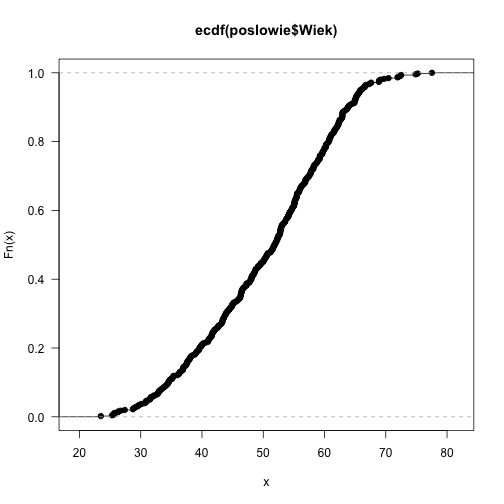
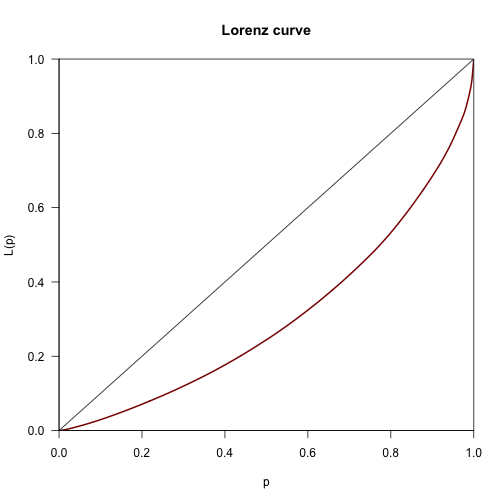

# Jak badać rozkład jednej zmiennej?

W tym rozdziale przedstawimy podstawowe narzędzia analizy rozkładu zmiennych ilościowych i jakościowych.
Wykorzystamy do tego bazę danych dotyczących posłów z 8 kadencji Sejmu.
Dane pobierane są bezpośrednio z Internetu z serwisu GitHub.


```r
poslowie <- archivist::aread("pbiecek/Przewodnik/arepo/07088eb35cc2c9d2a2a856a36b3253ad")

head(poslowie)
```

```
##   Glosow                   Klub  Wyksztalcenie                      Zawod
## 1  10500 Prawo i Sprawiedliwość         wyższe              poseł na Sejm
## 2  18514 Prawo i Sprawiedliwość         wyższe           parlamentarzysta
## 3   7275  Platforma Obywatelska         wyższe         agroprzedsiębiorca
## 4  15668               Kukiz'15         wyższe specjalista ds. medialnych
## 5  12021 Prawo i Sprawiedliwość         wyższe           poseł na Sejm RP
## 6   7935               Kukiz'15 średnie ogólne                dziennikarz
##          ImieNazwisko DataUrodzenia MiejsceUrodzenia  Wiek
## 1     Adam Abramowicz    1961-03-10   Biała Podlaska 55.01
## 2    Andrzej Adamczyk    1959-01-04      Krzeszowice 57.19
## 3    Zbigniew Ajchler    1955-11-21        Szamotuły 60.32
## 4 Adam Andruszkiewicz    1990-06-30          Grajewo 25.69
## 5     Waldemar Andzel    1971-09-17          Czeladź 44.48
## 6          Piotr Apel    1984-02-08         Warszawa 32.08
```

## Zmienna ilościowa

W zbiorze danych `poslowie` mamy kilka zmiennych ilościowych. 

Czy potrafisz je wskazać? 

Z pewnością należą do nich `Wiek` i `Glosow`. 

### Średnia

Jaki jest średni wiek posłów?

$$
\bar x = \sum_{i=1}^n x_i / n.
$$


```r
mean(poslowie$Wiek)
```

```
## [1] 50.36813
```

### Średnia winsorowska

A średnia obcięta, wyznaczona na podstawie 60\% środkowych obserwacji?


```r
mean(poslowie$Wiek, trim=0.2)
```

```
## [1] 51.01785
```

### Mediana

Mediana bliska średniej, czyżby brak skośności?


```r
median(poslowie$Wiek)
```

```
## [1] 51.87
```

### Odchylenie standardowe

Odchylenie standardowe zmiennej wiek.

$$
\hat \sigma = \sqrt{\sum_{i=1}^n (x_i - \bar x)^2 / (n-1)}
$$


```r
sd(poslowie$Wiek)
```

```
## [1] 11.03323
```

### Rozstęp

Jaka jest najmniejsza i największa wartość przyjmowana przez zmienną Wiek?


```r
range(poslowie$Wiek)
```

```
## [1] 23.50 77.53
```

### Rozstęp kartylowy

Ile wynosi rozstęp kwartylowy (różnica pomiędzy 3. a 1. kwartylem)?


```r
IQR(poslowie$Wiek)
```

```
## [1] 17.195
```

### Skośność

Przyjmując $$m_r = \sum_i (x_i - mu)^r / n$$

Typ: 1

$$
g_1 = m_3 / m_2^{3/2}
$$

Typ: 2 (domyślny w SAS i SPSS),

$$
G_1 = g_1 \sqrt{n(n-1)} / (n-2).
$$

Typ: 3 (domyślny w R)

$$
b_1 = m_3 / s^3 = g_1 \left((n-1)/n\right)^{3/2}.
$$

Wszystkie trzy estymatory są nieobciążone dla modelu normalnego.


```r
skewness(poslowie$Wiek)
```

```
## [1] -0.2292414
```


### Kurtoza / miara spłaszczenia

Aby ją wyznaczyć potrzebujemy pakietu `e1071`.

Kurtozę można liczyć na kilka sposobów. 

Typ: 1

$$
g_2 = m_4 / m_2^2 - 3.
$$

Typ: 2 (domyślny w SAS i SPSS), nieobciążony estymator kurtozy dla r. normalnego.

$$
G_2 = ((n+1) g_2 + 6) * (n-1) / ((n-2)(n-3))
$$

Typ: 3 (domyślny w R)

$$
b_2 = m_4 / s^4 - 3 = (g_2 + 3) (1 - 1/n)^2 - 3.
$$

Więcej o porównaniu tych estymatorów *D. N. Joanes and C. A. Gill (1998), Comparing measures of sample skewness and kurtosis. The Statistician, 47, 183–189.*


```r
library(e1071)
kurtosis(poslowie$Wiek)
```

```
## [1] -0.7078222
```


### Kwantyle

Wybrane kwantyle zmiennej wiek.

W pakiecie R zaimplementowanych jest 9 różnych metod liczenia kwantyli, zobacz argument type.


```r
quantile(poslowie$Wiek, c(0.1, 0.25, 0.5, 0.75, 0.9))
```

```
##    10%    25%    50%    75%    90% 
## 34.586 42.025 51.870 59.220 63.864
```

### Odchylenie medianowe

Odchylenie medianowe

$$
mad = 1.4826 * median(abs(x - median(x)))
$$

Stała $$1.4826 \approx 1/ \Phi^(-1)(3/4)$$ jest wybrana by wartość oczekiwana była równa odchyleniu standardowemu dla modelu normalnego.


```r
mad(poslowie$Wiek)
```

```
## [1] 12.39454
```

### Najważniejsze statystyki


```r
summary(poslowie$Wiek)
```

```
##    Min. 1st Qu.  Median    Mean 3rd Qu.    Max. 
##   23.50   42.02   51.87   50.37   59.22   77.53
```

### Wykres pudełkowy


```r
boxplot(poslowie$Wiek, col="grey", horizontal = TRUE)
```


### Histogram

Histogram jest bez wątpienia najpopularniejszą statystyką graficzną przedstawiającą rozkład jednej zmiennej. 
Przedstawia liczby wartości zmiennej w poszczególnych przedziałach (te przedziały nazywane są również klasami lub kubełkami). Deklaracja tej funkcji (pomijając argumenty graficzne) jest następująca:

```
hist(x, breaks = "Sturges", freq = NULL, probability = !freq,
     right = TRUE, plot = TRUE, labels = FALSE, ...)
```

Argument `x` określa wektor wartości, dla których histogram ma być wyznaczony, argument `breaks` określa podział zakresu zmienności wektora `x` na przedziały, argument `freq` określa, czy przy rysowaniu histogramu mają być zaznaczane frakcje, czy liczebności elementów w przedziałach. Argument `right` określa, czy przedziały mają być traktowane jako domknięte prawostronnie, czy lewostronnie, argument `plot` określa, czy histogram ma być rysowany, czy tylko wyznaczany ma być opis histogramu, argument `labels` pozwala na wskazanie wektora napisów, które będą naniesione na słupki odpowiadające kolejnym przedziałom.

Jeżeli nie podamy liczby przedziałów, to zostanie ona dobrana w zależności od liczby obserwacji oraz zmienności danej zmiennej. Do określania liczby i szerokości przedziałów służy argument `breaks`. Jeżeli podamy za wartość tego argumentu liczbę, to będzie ona potraktowana jako sugestia oczekiwanej liczby automatycznie wyznaczonych przedziałów (tylko sugestia ponieważ funkcja `hist()` może liczbę nieznacznie zwiększyć lub zmniejszyć). Jeżeli podany będzie wektor liczb, to będzie on uznany za wektor punktów rozdzielających przedziały (przedziały nie muszą mieć równych szerokości). Jeżeli argumentem będzie napis, to zostanie on zinterpretowany jako nazwa algorytmu do wyznaczenia liczby przedziałów (możliwe wartości to `"Sturges"`, `"Scott"`, `"FD"` i `"Freedman-Diaconis"`. 


```r
hist(poslowie$Wiek, col="grey")
```



Domyślnie, funkcja `hist()` na osi poziomej zaznacza liczebności obserwacji w poszczególnych klasach. Jeżeli chcemy wyznaczyć proporcje, to należy funkcji `hist()` podać argument `freq=FALSE` lub (równoważnie) `probability=TRUE`.

### Dystrybuanta empiryczna

Inną przydatną statystyką do opisu rozkładu wektora obserwacji jest dystrybuanta empiryczna. 
Do wyznaczania dystrybuanty empirycznej służy funkcja `ecdf()`, której wynikiem jest funkcja wyznaczająca dystrybuantę empiryczną. 


```r
plot(ecdf(poslowie$Wiek), las=1)
```


### Jądrowy estymator gęstości

Idea jądrowego estymatora gęstości polega na wyznaczeniu oceny gęstości w danym punkcie na podstawie koncentracji obserwacji w okolicy tego punktu. Obserwacje położone bliżej interesującego punktu wpływają na oceny gęstości z większą wagą niż obserwacje bardziej oddalone. Szablon tych wag określony jest przez parametr nazywany jądrem. Za to, które obserwacje są uznawane za bliskie odpowiada parametr nazywany szerokością okna, szerokością pasma lub też stopniem wygładzenia. 

Deklaracja funkcji `density()` jest następująca:

```
density(x, bw = "nrd0", adjust = 1, kernel, weights = NULL, 
		    window = kernel, n = 512, from, to, ...)
```

Argument `x` określa wektor wartości, dla których chcemy wyznaczyć ocenę gęstości. 
Argumenty `from` i `to` określają początek i koniec przedziału, w którym wyznaczona ma być gęstość, argument \verb|n| określa liczbę punktów, w których wartość gęstości ma być wyznaczona (gęstość wyliczana jest dla regularnej siatki punktów). Parametry `kernel` i `bw` służą do określenia rodzaju jądra i szerokości okna. Wynikiem funkcji `density()` jest obiekt klasy `density`, którego składowe przechowują wartości ocen gęstości we wskazanych punktach. Obiekty tej klasy można przedstawiać graficznie przeciążoną funkcją `plot()`.

Domyślnie, ocena gęstości wyznaczana jest z użyciem jądra gaussowskiego. Przeglądając plik pomocy dla funkcji `density()` zainteresowany czytelnik odkryje jak wykorzystywać inne jądra i czym one się różnią. 

Szerokość pasma (szerokość okna) można ustalić ręcznie lub wskazać regułę wyboru szerokości okna, która automatycznie wybierze najodpowiedniejszą szerokość. W pakiecie `stats` zaimplementowanych jest pięć różnych metod automatycznego wyboru szerokości pasma. 

Domyślnie stosowana jest ,,reguła kciuka'' (stosowana gdy `bw="nrd0"`) zaproponowana przez Silvermana. Zgodnie z tą regułą szerokość okna `h` wyznaczana jest ze wzoru

$$
h_{bw.nrd0} = 0.9 \min(\hat \sigma, IQR/1.34) n^{-1/5},
$$

gdzie $$\hat \sigma$$ to ocena odchylenia standardowego, IQR to rozstęp kwartylowy z próby a $n$ to liczba obserwacji. Magiczna stała $1.34$ bierze się stąd, że dla rozkładu normalnego $$IQR/1.34 \approx \sigma$$. 

Inną popularną regułą kciuka jest reguła Scott'a, stosowana gdy `bw="nrd"`

$$
h_{bw.nrd} = 1.06 \hat \sigma n^{-1/5}.
$$

Można wybrać też inne reguły wyboru szerokości pasma, np. oparte o metodę walidacji krzyżowej (ang. *cross validation*), nieobciążoną dla argumentu `bw="ucv"` i  bciążoną dla argumentu `bw="bcv"`, lub estymator typu `plug-in` Sheathera Jonesa (dla argumentu `bw="SJ"`). 
W większości przypadków najlepsze wyniki dla oceny szerokości pasma otrzymuje się wykorzystując metodę Sheathera Jonesa.


```r
plot(density(poslowie$Wiek, bw=1), las=1)
```


```r
plot(density(poslowie$Wiek, bw=3), las=1)
```


### Współczynnik Giniego

Krzywa Lorenza pokazuje jaki procent obserwacji ,,posiada'' skumulowany procent wartości.

Dla wieku nie miałoby to sensu, ale możemy ten współczynnik wyznaczyć dla liczby zebranych głosów.


```r
library(ineq)

ineq(poslowie$Glosow, type="Gini")
```

```
## [1] 0.3917223
```

```r
plot(Lc(poslowie$Glosow),col="darkred",lwd=2)
```



## Zmienna jakościowa

W zbiorze danych `poslowie` mamy kilka zmiennych jakościowych 

Z pewnością należą do nich `Klub`, `Wyksztalcenie`, `Zawod` itp. 

### Tabele liczebności


```r
table(poslowie$Wyksztalcenie)
```

```
## 
##                 średnie ogólne średnie policelane/pomaturalne 
##                             16                             12 
##               średnie zawodowe                         wyższe 
##                             10                            414 
##            zasadnicze zawodowe 
##                              2
```

```r
prop.table(table(poslowie$Wyksztalcenie))
```

```
## 
##                 średnie ogólne średnie policelane/pomaturalne 
##                    0.035242291                    0.026431718 
##               średnie zawodowe                         wyższe 
##                    0.022026432                    0.911894273 
##            zasadnicze zawodowe 
##                    0.004405286
```

### Wykres paskowy


```r
par(mar=c(2,10,2,1))
barplot(table(poslowie$Wyksztalcenie), horiz = TRUE, las=1)
```


