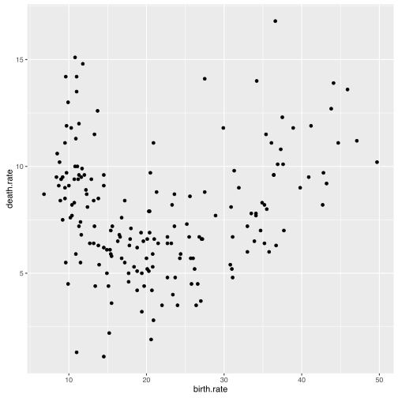
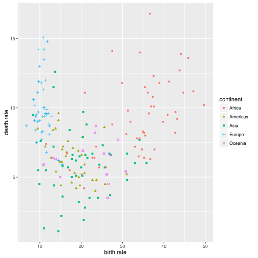
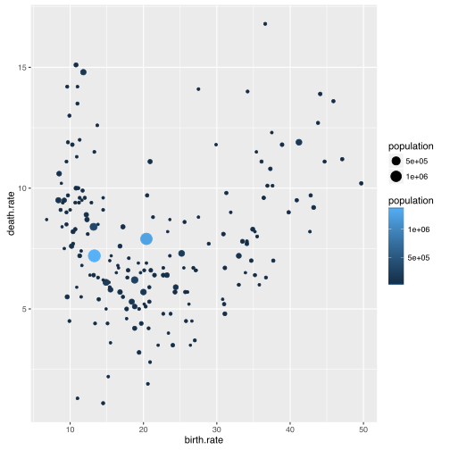
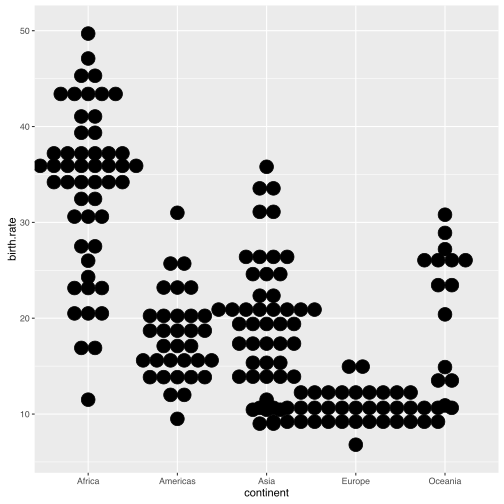
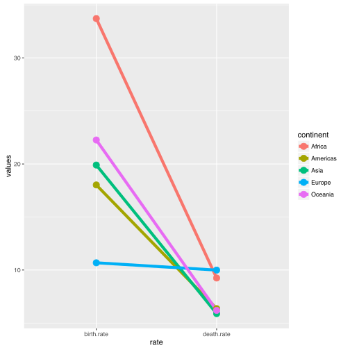
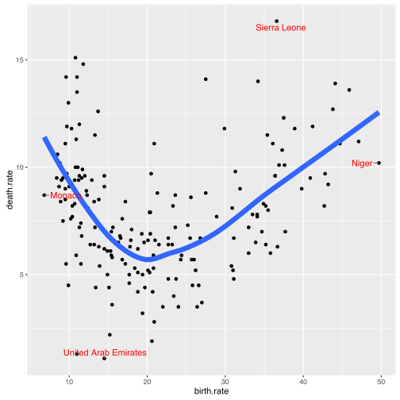

# Jak tworzyć wykresy z pakietem ggplot2?

Pakiet `ggplot2` jest jednym z najbardziej zaawansowanych narzędzi do tworzenia wykresów statystycznych. Zaawansowanie nie oznacza, że można szybko zrobić w nim wykres, ani też, że dostępnych jest wiele szablonów wykresów. Oznacza, że konstrukcja pakietu jest na tyle elastyczna, że można z nim wykonać praktycznie każdą grafikę statystyczną.

Tę elastyczność uzyskuje się opierając strukturę wykresu na sposobie w jaki myślimy i czytamy wykresy. Patrząc na wykres nie widzimy w nim zbioru odcinków i kółek, ale kolekcje obiektów na swój sposób podobnych lub różnych. Tworząc wykres nie powinniśmy więc myśleć o tym gdzie i jak narysować odcinek, ale o tym jak elementy wykresu mają reprezentować dane.

Gramatyka grafiki jest szerzej opisana [w tym eseju](http://biecek.pl/Eseje/indexGramatyka.html).

Poniższe przykłady oparte są o dwa zbiory danych. Zbiór `countries` ze współczynnikami dzietności / umieralności dla różnych krajów oraz zbiór `maturaExam` z wynikami matur poszcezgólnych uczniów.


```r
library(SmarterPoland)
head(countries)
```

```
##               country birth.rate death.rate population continent
## 1         Afghanistan       34.1        7.7      30552      Asia
## 2             Albania       12.9        9.4       3173    Europe
## 3             Algeria       24.3        5.7      39208    Africa
## 4             Andorra        8.9        8.4         79    Europe
## 5              Angola       44.1       13.9      21472    Africa
## 6 Antigua and Barbuda       16.5        6.8         90  Americas
```

```r
head(maturaExam)
```

```
##   id_ucznia punkty  przedmiot  rok
## 1         4     14 matematyka 2011
## 2         4     31  j. polski 2011
## 3         5     19 matematyka 2010
## 4         5     35  j. polski 2010
## 5         7     16 matematyka 2010
## 6         7     43  j. polski 2010
```

## Jak zrobić pierwszy wykres?

Minimalna definicja wykresu w pakiecie `ggplot2` składa się przynajmniej z trzech elementów. 

* Funkcja `ggplot()` tworzy zrąb wykresu. W tym miejscu deklaruje się parametry wspólne dla pozostałych elementów wykresu. Deklaracja może być pusta, ale zazwyczaj wskazuje się tutaj zbiór danych (poniżej `countries`) i mapowania (poniżej funkcja `aes()`).
* Funkcje `geom_`/`stat_` tworzą kolejne warstwy prezentacji danych, nazywane dalej geometriami. Poniżej wykorzystywana jest funkcja `geom_point()` tworząca warstwę z punktami. 
* Operator `+` łączy opisy kolejnych elementów wykresu.

Zbudujmy wykres, przedstawiający za pomocą punktów informacje o częstości narodzin i zgonów dla różnych krajów.


```r
library(ggplot2)

ggplot(countries, aes(x=birth.rate, y=death.rate)) + geom_point()
```



Gramatyka zaimplementowana w pakiecie `ggplot2` pozwala na budowę wykresów o strukturze przedstawionej na poniższej grafice. 
Składa się na z wielu elementów.
Omówimy je jeden po drugim.


## Jak określać mapowania?

Wykresy przedstawiają kolekcje obiektów, które są opisane przez atrybuty graficzne. Mapowania określają, które atrybuty wykresów kodują któ®e zmienne ze zbioru z danymi.

Mapowania są opisane wewnątrz funkcji `aes()` (od *aesthetic*). Są to pary postaci *atrybut graficzny* = *nazwa zmiennej*.

Dla każdego typu geometrii (warstwy wykresu) określone jest, jakie atrybuty graficzne mogą przedstawiać dane. Lista aktrybutów, któ®e można wykorzystać dla geometrii `geom_point` znajduje się pod adresem http://docs.ggplot2.org/current/geom_point.html. W tym przypadku obowiązkowe atrybuty to `x` i `y` - współrzędne punktów. Na poniższym wykresie określamy mapowania również dla atrybutu kolor (`color`) i kształt (`shape`). 


```r
ggplot(countries, aes(x=birth.rate, y=death.rate, color=continent, shape=continent)) +
  geom_point()
```



W tym przykłądzie, określając mapowanie *kształt* = *kontynent* żądamy by kształty punktów odpowiadały kontynentom. Nie określamy jednak jaki kształt ma określać który kontynent.  

Sposób mapowania wybiera biblioteka `gglot2` na podstawie typu zmiennej i liczby poziomów, które mają być przedstawione.

Przykładowo, na poprzednim wykresie przedstawialiśmy kontynent za pomocą kolorów. Kolory są tak dobierane by możliwie ułatwić rozróżnienie poszczególnych kontynentów. Nie ma jednak żadnego założonego porządku pomiędzy kontynentami.

Na poniższym przykładzie kolor mapujemy na zmienną ilościową - populacja. Tutaj jest już porządek i jest on odzwierciedlony przez skalę kolorów rozpinającą się od niebieskiego po czerń.


```r
ggplot(countries, aes(x=birth.rate, y=death.rate, color=population, size=population)) +
  geom_point()
```



## Jak określać geometrię?

Geometria określa kolekcje kształtów, które prezentują dane.
Mogą to być punkty (patrz `geom_point()`), linie, prostokąty, obszary, praktycznie dowolne kształty.

Lista dostępnych obecnie geometrii dostępna jest na stronie  http://docs.ggplot2.org/current/. Pakiet `ggplot2` ma również mechanizmy pozwalające na tworzenie dowolnych nowych geometrii, np. [przedstawianie danych za pomocą małych choinek](http://smarterpoland.pl/index.php/2015/12/geom_christmas_tree-a-new-geom-for-ggplot2-v2-0/).

Poniżej przedstawiamy przykłady geometrii `geom_dotplot` (ułożone na sobie punkty), `geom_violin` (skrzypce), `geom_line` (linie).


```r
ggplot(countries, aes(x = continent, y = birth.rate)) +
  geom_dotplot(binaxis = "y", stackdir = "center")
```



```r
ggplot(countries, aes(x = continent, y = birth.rate, color=continent, fill=continent)) +
  geom_violin()
```


```r
library(tidyr)
countries %>% 
  gather(rate, values, birth.rate, death.rate) %>%
  group_by(continent, rate) %>%
  summarise(values = mean(values, na.rm=TRUE)) %>%
  ggplot(aes(x = rate, y = values, group=continent, color=continent)) +
  geom_line(size=2) +
  geom_point(size=4) 
```



## Jak składać wykres z kilku warstw?

Tworzenie złożonych i bogatych w treść grafik jest w `ggplot2` możliwe dzięki składaniu warstw. 
Wszystkie warstwy istnieją we wspólnych ramach układu współrzędnych wykresu, przez to można łatwiej porównywać obiekty pomiędzy warstwami 
Daje to duże możliwości budowy wielowarstwowych grafik o uzupełniających się treściach.

Dodanie kolejnej warstwy odbywa się przez dodanie operatorem `+` kolejnej geometrii.
Poniżej znajduje się przykład wykresu z trzema warstwami. Są to kolejno warstwa z punktami, krzywą trendu i nazwami wybranych krajów.

Warstwy te uzupełniają się. W głównym planie jest linia z trendem, punkty pełnią rolę uzupełniającą na drugim planie. Napisami zaznaczono najbardziej skrajne kraje.


```r
library(ggrepel)
ggplot(countries, aes(x=birth.rate, y=death.rate, label=country)) +
  geom_point() + 
  geom_smooth(se=FALSE, size=3) + 
  geom_text_repel(data=countries[c(108,120,176,148),], color="red")
```



## Jak określać statystyki?


## Jak tworzyć panele?


## Jak modyfikować położenie elementów?


## Jak modyfikować skale?


## Jak modyfikować układ współrzędnych?


## Jak modyfikować styl wykresu?


