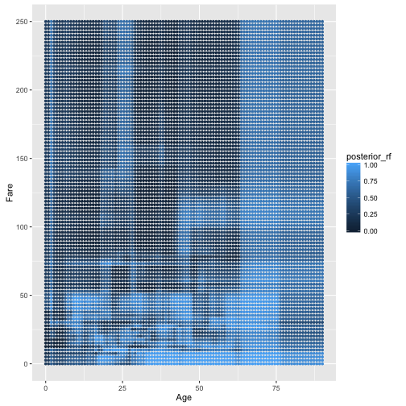
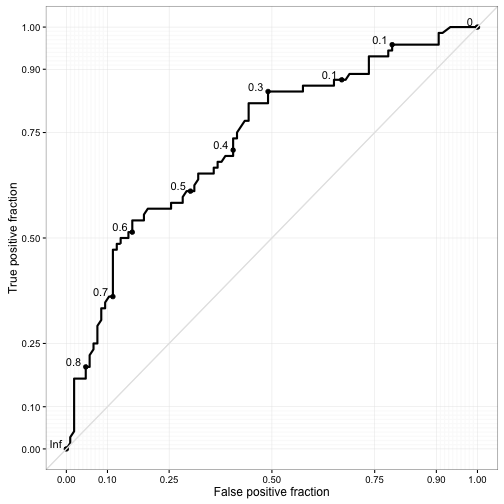
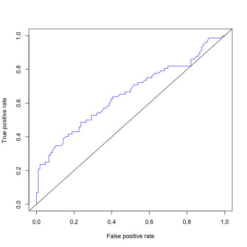
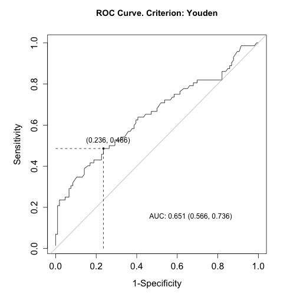

# ROC, AUC i inne

Mając klasyfikator, często potrzebujemy narzędzia, które pozwoli ocenić jego jakość.

Przyjrzyjmy się lasom losowym dla dwóch zmiennych. To są obszary decyzyjne.


```r
library("Przewodnik")
titanic2 <- na.omit(titanic)

library("randomForest")
rf <- randomForest(Survived~Age+Fare, data=titanic2)

grid <- expand.grid(Age=seq(0,90, length.out=200),
                    Fare=seq(0,250, length.out=200))
pred_rf <- predict(rf, grid, type="prob")[,1]
grid$posterior_rf <- pred_rf

ggplot(grid, aes(Age, Fare, color=posterior_rf)) + 
  geom_point(size=1)
```



Funkcją `varImpPlot` możemy pokazać ranking ważności zmiennych. 


```r
rf <- randomForest(Survived~., data=titanic2)
importance(rf)
```

```
##          MeanDecreaseGini
## Pclass          34.396544
## Sex             88.341231
## Age             58.222577
## Fare            61.271870
## Embarked         7.947573
```

```r
varImpPlot(rf)
```


Lasy losowe jako wynik zwracają wartości scorów z przedziału 0-1. 

Aby ocenić jakość takich scorów często stosuje się krzywą ROC (Receiver operating characteristic), przedstawiającą zmianę dwóch współczynników, jako funkcję przyjętego punktu odcięcia.

* czułość (sensitivity) - true positive rate
$$
TPR = \frac{TP}{P} = \frac{Pr\{y = +, \hat y = +\}}{Pr\{\hat y = +\}}
$$

* specyficzność (specificity) - true negative rate
$$
SPEC = \frac{TN}{N} = \frac{Pr\{y = -, \hat y = -\}}{Pr\{\hat y = -\}}
$$

* accuracy - skuteczność
$$
ACC = \frac{TN+TP}{n}
$$

* Youden J = czułość + specyficzność - 1.


```r
library("caret")
inds <- createDataPartition(titanic2$Survived, p = 0.75)
titanic2_train <- titanic2[inds[[1]],]
titanic2_test  <- titanic2[-inds[[1]],]

rf <- randomForest(Survived~Age+Fare, data=titanic2_train)

library("plotROC")
pred_rf <- predict(rf, titanic2_test, type="prob")[,2]

roc.estimate <- calculate_roc(pred_rf, titanic2_test$Survived)
single.rocplot <- ggroc(roc.estimate)
plot_journal_roc(single.rocplot)
```



```r
library("ROCR")
pred <- prediction( pred_rf, titanic2_test$Survived)
perf <- performance(pred,"tpr","fpr")
plot(perf,col="blue")
abline(0,1)
```



Aby ocenić jakość klasyfikatora można wykorzystać całą krzywą ROC lub pole pod nią - AUC.

Jeżeli chcemy wybrać optymalny punkt podziału, wygodnie jest skorzystać z pakietu `OptimalCutpoints` i funkcji `optimal.cutpoints` wybierającej optymalny punkt podziału.


```r
library("OptimalCutpoints")
pref_df <- data.frame(pred = pred_rf, truth = titanic2_test$Survived)
oc <- optimal.cutpoints(X = "pred", status = "truth", methods="Youden", data=pref_df, tag.healthy = "0")
summary(oc)
```

```
## 
## Call:
## optimal.cutpoints.default(X = "pred", status = "truth", tag.healthy = "0", 
##     methods = "Youden", data = pref_df)
## 
## Area under the ROC curve (AUC):  0.732 (0.656, 0.807) 
## 
## CRITERION: Youden
## Number of optimal cutoffs: 1
## 
##                     Estimate
## cutoff             0.5900000
## Se                 0.5416667
## Sp                 0.8396226
## PPV                0.6964286
## NPV                0.7295082
## DLR.Positive       3.3774510
## DLR.Negative       0.5458801
## FP                17.0000000
## FN                33.0000000
## Optimal criterion  0.3812893
```

```r
plot(oc, which=1)
```



