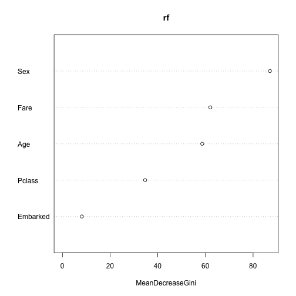

# Jak badać zależności pomiędzy parą zmiennych?

Testów weryfikujących strukturę zależności pomiędzy parą zmiennych jest co niemiara. 
W języku polskim całkiem bogata kolekcja testów jest przedstawiona w książce Ryszarda Magiery [,,Modele i metody statystyki Matematycznej''](https://www.google.pl/search?newwindow=1&q=modele+i+metody+statystyki+matematycznej&oq=modele+i+metody+statystyki+matematycznej).

Zamiast jednak opisywać wszystkie testy statystyczne (co jest niemożliwe) poniżej skupimy się na przedstawieniu tych najbardziej popularnych, tworzących swego rodzaju szkielet, który można rozbudowywać w różnych kierunkach.

## Jak weryfikować niezależność dwóch zmiennych jakościowych?

**Problem:** Mamy dwie zmienne jakościowe (np. kolor oczu i kolor włosów), ciekawi jesteśmy czy jest pomiędzy nimi zależność.

**Model**: Przyjmijmy, że obserwujemy dwuwymiarową zmienną losową $$(X,Y)$$. $$X$$ przyjmuje wartości ze zbioru $$(x_1, ..., x_r)$$ a $$Y$$ przyjmuje wartości ze zbioru $$(y_1, ..., y_s)$$. 

Brzegowy rozkład zmiennej X określmy jako $$P(X = x_i) = p_{i.}$$ a zmiennej $$Y$$ jako $$P(Y = Y_j) = p_{.j}$$.
Łączny rozkład zmiennych $$(X,Y)$$ określimy jako $$P(X=x_i, Y=y_j) = p_{ij}$$.

**Hipoteza**: Określmy hipotezę zerową (niezależności), dla każdego $$i,j$$

$$
H_0: p_{ij} = p_{i.}p_{.j}
$$

Hipoteza alternatywna jest taka, że dla dowolnego $$i,j$$ ta równość nie zachodzi.


**Statystyka testowa**:

Statystyka testowa jest oparta o tablicę kontyngencji (tablicę zliczeń).

| Y \ X | $$x_1$$ | $$x_2$$ |   | $$x_s$$ |
|---|---|---|---|---|
| $$y_1$$ | $$n_{11}$$ | $$n_{12}$$ | ... | $$n_{1s}$$ |
| ...  |  ... |   |   | ...  |
| $$y_r$$ | $$n_{r1}$$ | $$n_{r2}$$ | ... | $$n_{rs}$$ |


Tablica kontyngencji opisuje obserwowane w danych liczebności wystąpienia poszczególnych kombinacji wartości. Statystyka testowa porównuje te wartości z wartościami oczekiwanymi, przy założeniu prawdziwej hipotezy zerowej.

Ogólna postać statystyki testowej w teście $$\chi^2$$ to

$$
T = \sum_i \frac{(O_i - E_i)^2}{E_i}
$$

gdzie $$O_i$$ oznacza obserwowane liczebności, $$E_i$$ oczekiwane liczebności dla i-tej komórki. 

Ta generyczna postać statystyki testowej, w tym konkretnym przypadku przyjmuje postać (indeksy z kropkami to sumy po wierszach/kolumnach)

$$
T = \sum_{i=1}^r \sum_{j=1}^s \frac{(n_{ij} - n_{i.}n_{.j}/n)^2}{n_{i.}n_{.j}/n_{..}}
$$

Ta statystyka testowa ma asymptotyczny rozkład $$\chi^2_{(r-1)(s-1)}$$.

Za obszar odrzucenia przyjmuje się przedział postaci $$[c, \infty]$$.
Przykładowa gęstość rozkładu $$\chi^2_4$$ z zaznaczonym kwartylem rzędu $$0.95$$.


```r
library(ggplot2)
x <- seq(0,15,0.01)
(q <- qchisq(0.95, 4))
```

```
## [1] 9.487729
```

```r
df <- data.frame(x, d = dchisq(x,4), rejection = x>q )
ggplot(df, aes(x, y=d, fill=rejection)) + geom_area() + theme(legend.position="none") + scale_fill_manual(values=c("grey","red3"))
```



### Przykład

Rozważmy następującą tabelę liczebności. Opisuje ona występowanie różnych kolorów oczu / włosów.


```r
(tab <- HairEyeColor[,,1])
```

```
##        Eye
## Hair    Brown Blue Hazel Green
##   Black    32   11    10     3
##   Brown    53   50    25    15
##   Red      10   10     7     7
##   Blond     3   30     5     8
```

```r
# archivist::aread("pbiecek/Przewodnik/arepo/a3666b4084daa5db9251dc36e3286298")
```

Aby przeprowadzić test $$\chi^2$$ można wykorzystać funkcję `chisq.test()`. Wyznacza ona zarówno macierz oczekiwanych częstości, statystykę testową jak i wartość p.


```r
wynik <- chisq.test(tab)

wynik$p.value
```

```
## [1] 4.447279e-06
```

```r
wynik$statistic
```

```
## X-squared 
##  41.28029
```

```r
wynik$expected
```

```
##        Eye
## Hair       Brown     Blue     Hazel     Green
##   Black 19.67025 20.27240  9.433692  6.623656
##   Brown 50.22939 51.76703 24.089606 16.913978
##   Red   11.94265 12.30824  5.727599  4.021505
##   Blond 16.15771 16.65233  7.749104  5.440860
```

```r
wynik$observed
```

```
##        Eye
## Hair    Brown Blue Hazel Green
##   Black    32   11    10     3
##   Brown    53   50    25    15
##   Red      10   10     7     7
##   Blond     3   30     5     8
```

## Jak weryfikować niezależność dwóch zmiennych binarnych?

Specyficzną wersją testu na niezależność dwóch zmiennych jakościowych jest test dla dwóch zmiennych binarnych. 
Zamiast wykorzystywać w tym przypadku asymptotyczny rozkład statystyki testowej można badać dokładny rozkład statystyki testowej. Stąd też nazwa testu - dokładny test Fishera.

Statystyka testowa jest oparta o tablicę kontyngencji

| Y \ X | $$x_1$$ | $$x_2$$ |
|---|---|---|
| $$y_1$$ | $$n_{11}$$ | $$n_{12}$$ | 
| $$y_2$$ | $$n_{21}$$ | $$n_{22}$$ | 

o rozkładzie hipergeometrycznym.

Jeżeli badamy zależnośc pomiędzy parą zmiennych binarnych to zalecane jest użycie tego testu. Umożliwia on również weryfikowanie hipotez kierunkowych (a więc częstsze/rzadsze niż przypadkowe współwystępowanie $$x_2y_2$$).

### Przykład

Ograniczmy nadanie kolorów oczu do niebieskie/brązowe a włosów do czarne / blond.


```r
tab22 <- tab[c(1,4),c(1,2)]
  
fisher.test(tab22)
```

```
## 
## 	Fisher's Exact Test for Count Data
## 
## data:  tab22
## p-value = 7.391e-09
## alternative hypothesis: true odds ratio is not equal to 1
## 95 percent confidence interval:
##    6.673302 168.168624
## sample estimates:
## odds ratio 
##   27.39659
```

## Jak weryfikować niezależność dwóch zmiennych ilościowych?

Dla zmiennych ilościowych zależność może przybierać bardzo różną postać. Możemy obserwować zależność w kwadratach (czyli korelacje wartości skranych bez względu na ich znak), uwikłanie zmiennych, wiele możliwych odstępst od niezależności.

Z powodu łatwości interpretacji, najczęściej w pierwszym kroku interesują nas dwa rodzaje zależności: liniowa oraz monotoniczna. Do ich badania najczęściej wykorzystuje się testy na współczynnik korelacji Pearsona i Spearmana.

### Dwuwymiarowy rozkład normalny

**Model**: Przyjmijmy, że obserwujemy dwuwymiarową zmienną losową z dwuwymiarowego rozkładu normalnego $$(X,Y) \sim \mathcal N(\mu, \Sigma)$$. Gdzie $$\Sigma$$ to macierz kowariancji, element poza przekątną oznaczny przez $$\sigma_{12}$$.

**Hipoteza**: 

$$
H_0: \sigma_{12} = 0.
$$
$$
H_A: \sigma_{12} <> 0.
$$

**Statystyka testowa**:

Statystyka testowa oparta jest o współczynnik korelacji Pearsona

$$
\hat \rho = \frac{\sum_i (x_{i} - \bar x)(y_i - \bar y)}{\sqrt{\sum_i (x_{i} - \bar x)^2\sum_i (y_{i} - \bar y)^2}}
$$

Rozkład statystyki $$\hat \rho$$ jest określony na odcinku [-1,1]. Aby ułatwić jej analizę stosowane jest następujące przekształcenie

$$
T = \sqrt{n-2}\frac{\hat \rho}{\sqrt{1 - \hat \rho^2}}.
$$

Po takim przekształceniu statystyka $$T$$ ma rozkład $$t_{n-2}$$ i w oparciu o niego konstruowany jest obszar krytyczny. Dla dwustronnej hipotezy alternatywnej jest to obszar $$(-\infty, -c] \cup [c, \infty)$$.


```r
x <- seq(-5,5, .01)
(q <- qt(0.975, 5))
```

```
## [1] 2.570582
```

```r
df <- data.frame(x, d = dt(x,5), rejection = abs(x)>q )
ggplot(df, aes(x, y=d, fill=rejection)) + geom_bar(stat="identity") + theme(legend.position="none") + scale_fill_manual(values=c("grey","red3"))
```


Czasem weryfikowana jest też inna hipoteza zerowa. Jeżeli chceny zbadać, czy korelacja jest istotnie różna (np. istotnie większa) od określonej wartości $$\rho_0$$ to interesuje nas raczej hipoteza.

**Hipoteza**: 

$$
H_0: \sigma_{12} = \rho_0.
$$
$$
H_A: \sigma_{12} <> \rho_0.
$$

**Statystyka testowa**:

W tym przypadku stosuje się inną transformację, tzw. transformację Fishera.

$$
U = 1/2 \ln(\frac{1+\hat \rho}{1-\hat \rho}).
$$

Przy prawdziwej hipotezie zerowej ta statystyka ma asymptotycznie rozkład normalny $$\mathcal N (1/2\ln(\frac{1+\rho_0}{1-\rho_0}) + \rho_0/(2(n-1)), 1/(n-3))$$.

Znając rozkład możemy już w prosty sposób zbudować test statystyczny. Tę transformację można wykorzystać również do konstrukcji testu dla równości dwóch współczynników korelacji.


### Korelacja rang

Założenie o dwuwymiarowym rozkładzie normalnym jest silnie ograniczające. 
Co prawda test Pearsona stosuje się nawet jeżeli zmienna nie ma rozkładu normalnego, ale jedynie do niego zbliżony. Wciąż jednak tego typu test wykrywa jedynie liniowe zależnosci.

Dlatego często stosowanym testem dla zbioru hipotez jest test korelacji Spearmana. Jest ona w stanie identyfikować zależności monotoniczne. Ideę testu Spearmana można streścić w określeniu: badanie korelacji rang.

**Model**: Przyjmijmy, że obserwujemy dwuwymiarową zmienną losową $$(X,Y)$$ o rozkładzie ciągłym. 

Oznaczmy dodatkowo $$r_i = rank(X_i)$$, $$s_i = rank(Y_i)$$.

**Hipoteza**: 

$$
H_0: \rho(r_i, s_i) = 0.
$$
$$
H_A: \rho(r_i, s_i) <> 0.
$$

**Statystyka testowa**:

Statystyką testową jest korelacja Pearsona ale liczona dla rang, a nie oryginalnych obserwacji. Ponieważ średnia ranga to $$(n+1)/2$$ więc otrzymujemy

$$
\rho = \frac{\sum_i (r_{i} - (n+1)/2)(s_i - (n+1)/2)}{\sqrt{\sum_i (r_{i} - (n+1)/2)^2\sum_i (s_{i} - (n+1)/2)^2}}.
$$

Po prostych przekształceniach otrzymujemy

$$
\rho = 1 - \frac{6 \sum(r_i - s_i)^2}{n(n^2-1)}.
$$

Rozkład tej statystyki można tablicować dla małych $$n$$. Asymptotycznie ma ona rozkład normalny z wariancją $$1/(n-1)$$.
Ale w implementacji najczęściej stosuje się podobną transformację co w przypadku testu Pearsona, czyli

$$
T = \sqrt{n-2}\frac{\hat \rho}{\sqrt{1-\hat \rho^2}}.
$$

Asymptotycznie ta statystyka ma rozkład $$t_{n-2}$$.

### A co jeżeli interesuje mnie inna zależność?

Opisane powyżej testy badają dwa rodzaje zależności - liniowy i monotoniczny.

Jeżeli interesuje nas inna klasa zależności to możliwy wybór jest albo przez badanie funkcji łączących (tzw. kopule) albo przez badanie zmiennych jakościowych. Każdą zmienną ilosciową możemy zdyskretyzować, dzieląc ją na pewną liczbę podprzedziałów i analizując zależność pomiedzy przedziałami (testem $$\chi^2$$ lub analizą korespondencji).


### Przykład

Korzystając ze zbioru danych `koty_ptaki` sprawdzimy czy jest zależność pomiędzy długością kota a jego wagą.


```r
library(PogromcyDanych)
head(koty_ptaki[,1:3])
```

```
##   gatunek waga dlugosc
## 1  Tygrys  300     2.5
## 2     Lew  200     2.0
## 3  Jaguar  100     1.7
## 4    Puma   80     1.7
## 5 Leopard   70     1.4
## 6  Gepard   60     1.4
```

```r
ggplot(koty_ptaki, aes(waga, dlugosc)) + geom_point(size=3) + geom_smooth(method="lm", color="grey", se=FALSE)
```


Korelację Pearsona (liniową) badalibyśmy testem `cor.test()`


```r
cor.test(koty_ptaki$waga, koty_ptaki$dlugosc)
```

```
## 
## 	Pearson's product-moment correlation
## 
## data:  koty_ptaki$waga and koty_ptaki$dlugosc
## t = 6.4499, df = 11, p-value = 4.743e-05
## alternative hypothesis: true correlation is not equal to 0
## 95 percent confidence interval:
##  0.6633850 0.9666441
## sample estimates:
##       cor 
## 0.8893128
```

Korelację Spearmana (monotoniczną) badalibyśmy testem `cor.test()`. Współczynnik korelacji rang jest prawie równy 1.


```r
cor.test(koty_ptaki$waga, koty_ptaki$dlugosc, method="spearman")
```

```
## Warning in cor.test.default(koty_ptaki$waga, koty_ptaki$dlugosc, method =
## "spearman"): Cannot compute exact p-value with ties
```

```
## 
## 	Spearman's rank correlation rho
## 
## data:  koty_ptaki$waga and koty_ptaki$dlugosc
## S = 4.5155, p-value = 3.401e-10
## alternative hypothesis: true rho is not equal to 0
## sample estimates:
##       rho 
## 0.9875947
```

Po dyskretyzacji badalibyśmy np. następującą tabelę (widzimy silną zależność nawet bez testu).


```r
table(cut(koty_ptaki$waga, c(0,20,110,400)), 
      cut(koty_ptaki$dlugosc, c(0, 1, 1.9, 3)))
```

```
##            
##             (0,1] (1,1.9] (1.9,3]
##   (0,20]        5       0       0
##   (20,110]      0       5       0
##   (110,400]     0       0       3
```
