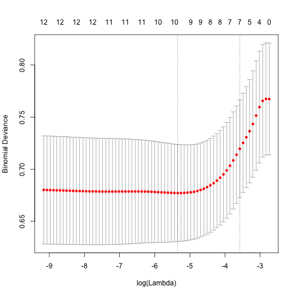

# Jak regularyzować modele regresyjne?

Jak widzieliśmy w rozdziale [Wybór modelu](http://pbiecek.github.io/Przewodnik/Predykcja/wybor_modelu.html), gdy liczba zmiennych w modelu jest duża (p >> n) należy spodziewać się przeuczenia modelu. 

Przeuczenie w terminologii statystycznej oznacza dużą wariancję estymatora przy małym błędzie na zbiorze uczącym.

Co zrobić by się nie przeuczać? Standardowo dla modeli regresyjnych stosuje się trzy strategie:

1. Wybór zmiennych (subset selection), np. z użyciem kryteriów AIC/BIC/jednowymiarowe filtrowanie. 
2. Stosowanie regularyzacji opartej o karę za wielkość współczynników w modelu,
3. Redukcja wymiaru zmiennych predykcyjnych przez zastosowanie techniki PCA/PCR.

Poniżej omówimy te strategie jedna po drugiej.

## Wybór podzbioru zmiennych

Jednym ze sposobów zmniejszenia wariancji modelu regresyjnego jest budowanie go na mniejszej liczbie zmiennych.

Jak wyznaczyć tę mniejszą liczbę zmiennych?

1. Można wybrać model o najniższej wartości kryterium AIC
2. Można wybrać model o najniższej wartości kryterium BIC
3. Można wybrać model tylko ze zmiennymi o zależności o istotności niższej niż $\alpha$.


```r
load(url("https://github.com/pbiecek/StatystykaII/raw/master/MIMUW_2016/materialy/brca.rda"))
brcaSmall <- brca[,c(1, 5:10, 92:97)]
```

Pełny przegląd modeli. Dla każdego modelu wyznaczamy AIC i BIC.


```r
library("e1071")
library("ggplot2")
comb <- bincombinations(ncol(brcaSmall)-1)[-1,]
crit <- matrix(0, nrow(comb), 3)

for (i in 1:nrow(comb)) {
  vnames <- colnames(brcaSmall)[which(comb[i,]==1)]
  form <- paste0("outcome~", paste0(vnames, collapse="+"))
  model <- glm(as.formula(form), data=brcaSmall, family="binomial")
  crit[i,1] <- AIC(model)
  crit[i,2] <- BIC(model)
  crit[i,3] <- sum(comb[i,]==1)
}
colnames(crit) <- c("AIC", "BIC","p")
crit <- data.frame(crit)
```

Porównujemy wszystkie modele z modelem wybranym przez funkcję `step()`. 

Czerwona kropka to model optymalny, zielona to model wybrany przez funkcję `step()`.


```r
bestStepBIC <- step(glm(outcome~., data=brcaSmall, family="binomial"), trace = 0, k = log(nrow(brcaSmall)))

ggplot(crit, aes(p,BIC)) + 
  geom_point() +
  geom_point(data=crit[which.min(crit$BIC),], color="red", size=5) +
  geom_point(data=crit[crit$BIC == BIC(bestStepBIC) &
                         crit$p == length(bestStepBIC$coefficients)-1,], color="green3", size=3) + scale_x_continuous(breaks = 1:12) + ggtitle("Najlepszy model względem BIC")
```


Porównujemy wszystkie modele z modelem wybranym przez funkcję `step()`.

Czerwona kropka to model optymalny, zielona to model wybrany przez funkcję `step()`.


```r
tmpFun = function(fit, aic) {
  list(size = length(fit$coefficients), aic = AIC(fit))
}

bestStepAIC <- step(glm(outcome~., data=brcaSmall, family="binomial"),keep=tmpFun,  trace = 0)

pathDF <- data.frame(size = unlist(bestStepAIC$keep[1,]),
            aic = unlist(bestStepAIC$keep[2,]))

ggplot(crit, aes(p,AIC)) + 
  geom_point() +
  geom_point(data=crit[which.min(crit$AIC),], color="red", size=5) +
  geom_point(data=crit[crit$AIC == AIC(bestStepAIC) &
                         crit$p == length(bestStepAIC$coefficients)-1,], color="green3", size=3) + 
    geom_line(data=pathDF, aes(size-1, aic), color="blue") + 
  scale_x_continuous(breaks = 1:12) + ggtitle("Najlepszy model względem AIC")
```


## Regularyzacja

Innym sposobem ograniczenia wariancji modelu regresyjnego jest ograniczenie wartości współczynników tego modelu.

Ograniczać można normę $L_2$ wektora współczynników (rozwiązanie znane pod nazwą regresja grzbietowa) lub normę $L_1$ wektora współczynników (rozwiązanie znane pod nazwą LASSO) lub mieszaninę tych norm (rozwiązanie znane pod nazwą sieci elastycznych).

### Lasso

Dla normy $L_1$ wyznacza się estymator $\hat\beta$ ograniczony przez wartość $s$

$$
\hat\beta_{lasso} = {\arg\min}_{||\beta||_1 < s} l(y, \beta_0 + X \beta)
$$

Równoważnie można ten estymator wyznaczyć przez minimalizację funkcji log wiarogodności z dodaną karą za wielkość współczynników.

$$
\hat\beta_{lasso} = {\arg \min}_{(\beta_0, \beta) \in \mathbb{R}^{p+1}} l(y, \beta_0 + X \beta) + \alpha||\beta||_1
$$

Pomiędzy parametrami $\alpha$ i $s$ istnieje zależność 1-1.

Uwaga 1:

Współczynniki $\hat\beta_{lasso}$ mogą przyjmować wartość 0.


### Regresja grzbietowa

Dla regresji grzbietowej wzór na estymator współczynników ma postać

$$
\hat\beta_{ridge} = {\arg \min}_{(\beta_0, \beta) \in \mathbb{R}^{p+1}} l(y, \beta_0 + X \beta) + \alpha||\beta||_2
$$
W modelu gaussowskim funkcja log-wiarogodności jest proporcjonalna do RSS, mamy więc

$$
\hat\beta_{ridge} = {\arg \min}_{(\beta_0, \beta) \in \mathbb{R}^{p+1}} (\beta_0 + X \beta - y)^T(\beta_0 + X \beta - y) + \lambda \beta^T\beta
$$

Ten estymator można wyznaczyć w sposób analityczny
$$
\hat\beta_{ridge} = \left(X^TX + \lambda I\right)^{-1} X^T y
$$


### Elastic net

Dla metody elastic net, kara ma dwie składowe oparte o metrykę $L_1$ i $L_2$.

$$
{\arg \min}_{(\beta_0, \beta) \in \mathbb{R}^{p+1}} l(y, \beta_0 + X \beta) + \lambda \left[ (1-\alpha)||\beta||_2^2/2 + \alpha||\beta||_1\right].
$$

Uwaga 1:

Aby współczynniki $\beta$ można było wspólnie ograniczać, trzeba wcześniej standaryzować macierz $X$.

### Jak to zrobić w R?


```r
library("glmnet")
X <- as.matrix(brcaSmall[,-1])
X <- scale(X)

model <- glmnet(x = X, y = brcaSmall$outcome == "death in 3 years", alpha=0, family="binomial")
plot(model, xvar = "lambda", label = TRUE)
```


```r
model <- glmnet(x = X, y = brcaSmall$outcome == "death in 3 years", alpha=1, family="binomial")
plot(model, xvar = "lambda", label = TRUE)
```


```r
cvfit = cv.glmnet(x = X, y = brcaSmall$outcome == "death in 3 years", alpha=1, family="binomial")
plot(cvfit)
```



```r
coef(cvfit, s = "lambda.min")
```

```
## 13 x 1 sparse Matrix of class "dgCMatrix"
##                      1
## (Intercept) -2.3729979
## ADAM29      -0.3949962
## ALKBH1      -0.5321730
## CLIC6       -0.5376637
## CTSO        -0.2010128
## EIF2B3       0.1044512
## ENTPD1      -0.6195229
## ICAM3       -0.3564298
## LRP2         0.0257873
## FCGR1B       .        
## ABI3BP       .        
## LOC284837    0.1829642
## EMR3        -0.0820637
```

Więcej instrukcji na stronie https://web.stanford.edu/~hastie/glmnet/glmnet_alpha.html

## PCR - Principal component regression

Metoda PCR to złożenie regresji i metody PCA.

W pierwszym kroku redukuje się wymiar - liczbę zmiennych przez wykonanie PCA (Principal component analysis). 

Następnie buduje się model regresyjny na nowych zmiennych.

W programie R można tę regresję przeprowadzić funkcją `pcr{pls}`.

