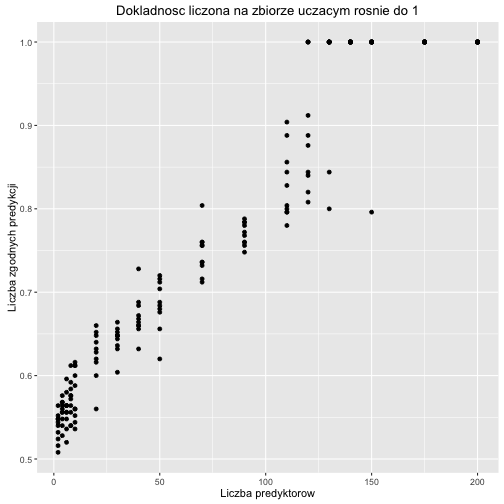

# Ocena jakości predykcji

W rym rozdziale przedyskutujemy różne podejścia do oceny jakości modelu i wyboru modelu.

Przyświecać będą nam dwa cele.

- Aby wybrać regułę predykcyjną. Jeżeli mamy kilka różnych podejść do klasyfikacji. Możemy zobaczyć jak dobre są różne podejścia i wybrać to, które jest najlepsze.

- Aby wybrać listę istotnych zmiennych. Jeżeli mamy kilka modeli, różniących się zmiennymi, które są włączone do modelu, możemy użyć oceny jakości predykcji aby wybrać najlepszy podzbiór zmiennych.

- Aby ocenić jakość predykcji. Jeżeli już zbudowaliśmy regułę decyzyjną, chcielibyśmy wiedzieć jak dobra jest ta reguła i jakich dokładności predykcji powinniśmy się spodziewać.


## Kryteria oparte o na pod próbie danych

Na potrzeby dalszych rozważań, przyjmijmy, że mamy $n$ obserwacji o indeksach ze zbioru $I$.

Dla każdej obserwacji mamy parę $(y, X)$, gdzie $y$ to zmienna, którą chcemy opisać a $X$ to wektor zmiennych opisujących. 

Na zmiennych $X$ będziemy budować regułę mówiącą coś o zmiennej $y$.

### Zbiór uczący - zbiór testowy

Zbiór $n$ obserwacji jest dzielony na dwa rozłączne podzbiory, uczący i testowy, $U$ i $T$ obserwacji. Gdzie $U \cup T = I$.

Na zbiorze uczącym $U$ obserwacji zbudowana zostanie reguła decyzyjna. Następnie zostanie zastosowana na zbiorze testowym $T$ obserwacji, w wyniku czego otrzymamy szacunki zmiennej $\tilde y_t$.

Porównując na zbiorze testowym prawdziwe $y$ i przewidywane $\tilde y$ możemy ocenić jak dobra jest prognoza. 

Dla zmiennych jakościowych można wyznaczyć np. błąd klasyfikacji a dla zmiennych ilościowych np. średni bezwzględny błąd prognozy.

Jak dobrać $n_u$ i $n_t$? Zależy to od wielu czynników w tym wielkości wyjściowego zbioru $n$ i złożoności problemu. Często stosowanym wyborem jest podział w proporcjach $3/1$ lub $2/1$ lub $1/1$ (uczący / testowy).

Zalety: Metoda prosta do realizacji

Wady: Słabe wykorzystanie danych, metoda uczenia reguły decyzyjnej wykorzystuje tylko $n_u$ danych.


### k-krotna walidacja krzyżowa (k-fold cross validation)

Zbiór $n$ obserwacji jest dzielony na $k$ (często $k=10$) rozłącznych równolicznych podzbiorów o indeksach $F_i$.

Następnie dla każdego z tych $k$ podzbiorów wykonujemy następujące kroki:

- na wszystkich danych poza podzbiorem $F_i$ budowana jest reguła decyzyjna (w sumie na $(k-1)/k$ obserwacji)
- na podzbiorze $F_i$ wyznaczana jest prognoza $\tilde y$.

Powtarzając te kroki dla wszystkich $k$ podzbiorów uzyskujemy prognozy dla wszystkich $n$ obserwacji.
Porównując prawdziwe $y$ i przewidywane $\tilde y$ możemy ocenić jak dobra jest prognoza. 


Zalety: Efektywne wykorzystanie danych, wszystkie obserwacje trafiają do $k-1$ reguł decyzyjnych, wszystkie też są wykorzystywane do prognozy.

Wady: Wyniki mogą zależeć od podziału na $k$ podzbiorów.

Odmianą tej techniki jest tzw. one-leave-out, gdzie $k=n$, czyli w każdym kroku uczymy regułę na wszystkich obserwacjach poza jedną - tą na której robimy predykcję.

### k-krotna powtórzona walidacja krzyżowa

Wadą powyżej przedstawionej techniki była losowość wynikająca z podziału na $k$ grup.

W metodzie *k-fold repeated cross validation* dokonujemy kilku lub kilkudziesięciu powtórzeń techniki *k-fold cross validation* dla różnych, losowych podziałów na $k$ foldów.

### Techniki oparte  o bootstrap

Wadą powyżej opisanych technik jest to, że reguła decyzyjna jest trenowana na zbiorze mniejszym niż wyjściowy $n$ elementowy zbiór. Alternatywą jest następująca procedura:

- Wylosuj próbę bootstrapową z wyjściowego zbioru danych (losowanie ze zwracaniem $n$ wierszy).
- Na obserwacjach z wyjściowego zbioru, których nie ma w próbie bootstrapowej wyznacz predykcje $\tilde y$. Porównaj $\tilde y$ i $y$.
(tych obserwacji będzie około 1/e).


## Kryteria oparte na całej próbie danych

W przypadku pracy z modelami regresyjnymi, bardzo często wykorzystywane są kryteria informacyjne.

### BIC (Bayesian information criterion)

Nazywane też kryterium Schwarza. 

Motywacja jest następująca: Mamy $M$ modeli $\mathcal M_m$, każdy parametryzowany wektorem $\theta_m$ (potencjalnie o różnych długościach). 
Chcemy wybrać model najlepszy (tutaj w sensie maksymalnego prawdopodobieństwa a posteriori).

Prawdopodobieństwo a posteriori z twierdzenia Bayesa jest proporcjonalne do

$$
P(M_m | y, X) \propto P(M_m) P(y, X | M_m) 
$$
Do wyboru najlepszego modelu wystarczy nam znajomość prawdopodobieństwa a posteriori z dokładnością do stałej. 
Wystarczy bowiem, by dla dowolnych dwóch modeli wyznaczyć iloraz prawdopodobieństw a posteriori
$$
\frac{P(M_m|y,X)}{P(M_l|y,X)}
$$
A przy założeniu, że modele są tak samo prawdopodobne ten iloraz redukuje się do tzw. Bayes Factor
$$
BF_{m,l} = \frac{P(y,X|M_m)}{P(y,X|M_l)}
$$
tyle, że nie znamy $P(y,X|M_m)$ ponieważ nie znamy $\theta_m$, musimy więc wycałkować po tym rozkładzie
$$
P(y, X | M_m)  = \int P(y, X | \theta_m, M_m) P(\theta_m | M_m) d\theta_m
$$
Zamiast całkować, możemy skorzystać z aproksymacji Laplace'a ([tutaj dobre wyprowadzenie](http://www.inference.phy.cam.ac.uk/mackay/itprnn/ps/341.342.pdf) [lub tutaj](http://www.stats.ox.ac.uk/~steffen/teaching/bs2HT9/laplace.pdf))
$$
\log P(y, X | M_m) = \log P(y, X | \hat\theta_m, M_m) - \frac{k}{2} \log n + O(1) 
$$
gdzie $k$ to liczba parametrów w modelu $M_m$ a $\hat\theta_m$ to estymator największej wiarogodności w modelu $M_m$ a pierwszy człon prawej strony to wartość funkcji wiarogodności w estymatorze największej wiarogodności.

Jeżeli wymnożymy obie strony przez -2, to otrzymamy kryterium BIC

$$
BIC = - 2 L_{max} + k \log (n)
$$

Wybór modelu minimalizującego kryterium BIC odpowiada wyborowi modelu o najwyższym prawdopodobieństwie a posteriori.

### AIC (Akaike information criterion)

Kryterium AIC jest związane z inną logiką postępowania. Model, który wybieramy to model najbliższy rozkładowi generującemu dane. Najbliższy w sensie odległości [Kullbacka–Leiblera](https://en.wikipedia.org/wiki/Kullback%E2%80%93Leibler_divergence) (nie jest to prawdziwa odległość, nie jest symetryczna).

$$
K(m) = \int P(y|X) \log \frac{P(y|X)}{P_{M_m}(y|X)} dy
$$
Minimalizacja tej odległości sprowadza się do maksymalizacji 
$$
\int P(y|X) \log P_{M_m}(y|X) dy
$$
Naturalne oszacowanie sprowadzałoby się do 
$$
E[\log P_{M_m}(y|X)]
$$
ale ten estymator jest obciążony (te same dane używane są do oszacowania $\hat\theta_m$ i do oszacowania $K$). Akaike wyznaczył to obciążenie [tutaj więcej informacji](http://www.stat.cmu.edu/~larry/=stat705/Lecture16.pdf) i nieobciążony szacunek wynosi


$$
\frac 1n \sum_{i=1}^n \log P_{M_m}(y|X,\hat\theta_m) - \frac kn  
$$
a pierwszy człon to wartość funkcji wiarogodności w maksimum
$$
\frac {\mathcal l(M_m, \hat\theta_m)}n  - \frac kn  
$$

A więc maksymalizacja tego członu jest równoważna z minimalizacją kryterium

$$
AIC_m = - 2 l(M_m, \hat\theta_m) + 2 k 
$$


### GIC (Generalised information criterion)

Zauważmy że oba kryteria AIC i BIC mają podobną strukturę. Można więc wprowadzić uogólnione kryterium oparte o funkcję

$$
GIC = - 2 L_{max} + k f(n)
$$
które każdy dodatkowy parametr modelu każe z siłą $f(n)$. W tej rodzinie mieści się wiele znanych kryteriów, np. Hannan–Quinn information criterion

$$
HQC = - 2 L_{max} + 2 k \ln(\ln (n))
$$

Warto w tym miejscu zaznaczyć, że AIC wybiera modele większe, takie które odtwarzają prawdziwy rozkład $P(y|X)$, przez co ma spodziewane lepsze właściwości prognostyczne. BIC jest kryterium zgodnym, w dla dużych prób będzie wybierało prawdziwy model (jeżeli jest na liście rozważanych modeli).

### Dla modelu liniowego

Warto pamiętać, że dla modelu liniowego

$$
- 2 \log P(y, M | \hat\theta_m, M_m) \propto RSS/\sigma^2 
$$

## Funkcja straty

Oceniając jakość predykcji możemy przyjmować różne funkcje straty. Dla regresji dwie najpopularniejsze to kwadratowa funkcja straty i funkcja straty oparta o moduł.

$$
L(y, f(X)) = (y - f(X))^2
$$
$$
L(y, f(X)) = |y - f(X)|
$$


## Bias - variance tradeoff

Wybierając model chcielibyśmy mieć jak najniższy błąd predykcji. Ten błąd jest jednak ograniczony od dołu przez sumę kilku czynników. Pokażemy je na przykładzie (patrz EoSL rozdział 7.3).

Rozważmy prosty model $y = f(X) + \varepsilon$, gdzie $E (\varepsilon) = 0$ i $Var (\varepsilon) = \sigma_\varepsilon^2$.

Dla zadanej reguły $\hat f(X)$, wyznaczonej na bazie zbioru danych $x_0$, średniokwadratowy błąd predykcji wynosi
$$
E[(y - \hat f(X))^2|X=x_0]
$$
po rozpisaniu otrzymujemy
$$
\sigma_\varepsilon^2 + [E \hat f(x_0) - f(x_0)]^2 + E [ \hat f(x_0) - E \hat f(x_0) ]^2
$$
Kolejne elementy tej sumy to: 

- wariancja szumu losowego charakterystycznego dla prawdziwego modelu (nie redukowalna), 
- kwadrat obciążenia $\hat f(x_0)$,
- wariancję oceny $\hat f(x_0)$.

Zazwyczaj wybieranie modeli, które redukują obciążenie kończy się zwiększaniem wariancji i vice versa. W określonych sytuacjach korzystne może być wprowadzenie obciążenia do modelu gdy w wyniku niego otrzymujemy mniejszą wariancję (patrz LASSO lub inna regularyzacja).


## Miej znaczy więcej, czyli dlaczego musimy wybierać model?

Poniższy wykres pokazuje jak rośnie dokładność predykcji dla regresji logistycznej gdy dodajemy nowe, całkowicie losowe regresory.

Wydawałoby się, że im więcej regresorów tym lepiej. 
Tak oczywiście nie jest, tutaj dokładność rośnie wyłącznie dlatego, że jest źle mierzona i mamy do czynienia z przeuczonym modelem.

W rzeczywistości, na zbiorze testowym, dodawanie zbędnych predyktorów jedynie zwiększa wariancje predykcji. 


```r
library(ggplot2)
NN <- rep(c(2, 4, 6, 8, 10,20,30,40,50,70,90,110,120,130,140,150,175,200), each=10)
n <- 250
szumy <- sapply(NN, function(N){
  szum <- as.data.frame(matrix(runif(N * n), nrow = n, ncol = N))
  colnames(szum) <- paste0("zm", 1:N)
  szum$outcome <- factor(rep(LETTERS[1:2], each=n/2))
  
  nb <- glm(outcome~., data=szum, family="binomial")
  pred <- predict(nb, szum, type = "response") > .5
  tab <- table(pred, szum$outcome)
  sum(diag(tab))/sum(tab)
})

df <- data.frame(NN, szumy)
ggplot(df, aes(NN, szumy)) + 
  geom_point() + ylab("Liczba zgodnych predykcji") + xlab("Liczba predyktorow") + ggtitle("Dokladnosc liczona na zbiorze uczacym rosnie do 1")
```




## Jak to zrobić w pakiecie R?

Zacznijmy od wyznaczenia modelu.


```r
library("Przewodnik")
model4 <- glm(Survived~Sex+Pclass+Age+Fare, data=titanic, family = "binomial")
model3 <- glm(Survived~Sex+Pclass+Age, data=titanic, family = "binomial")
```

Funkcje `AIC()` i `BIC()` wyznaczają wartości kryteriów AIC i BIC dla obu modeli. W obu przypadkach model 3 jest lepszy.


```r
AIC(model3)
```

```
## [1] 657.2831
```

```r
AIC(model4)
```

```
## [1] 659.2292
```

```r
BIC(model3)
```

```
## [1] 680.1375
```

```r
BIC(model4)
```

```
## [1] 686.6545
```

Gdybyśmy chcieli dzielić zbiór danych na uczący i testowy to wygodnie jest użyć poniższych funkcji.


```r
library("caret")
set.seed(1313)
# prosty podział na zbiór uczący i testowy
str(createDataPartition(titanic$Survived, times=2, p = 0.75))
```

```
## List of 2
##  $ Resample1: int [1:669] 1 2 3 4 5 6 7 8 9 11 ...
##  $ Resample2: int [1:669] 1 3 4 7 8 9 10 11 12 13 ...
```

```r
# technika k-fold CV
str(createFolds(titanic$Survived, k = 5))
```

```
## List of 5
##  $ Fold1: int [1:179] 1 6 7 14 16 22 30 33 44 45 ...
##  $ Fold2: int [1:177] 3 4 8 10 11 20 21 23 24 39 ...
##  $ Fold3: int [1:178] 5 13 28 29 32 34 35 37 43 51 ...
##  $ Fold4: int [1:178] 9 12 18 19 27 36 40 48 55 58 ...
##  $ Fold5: int [1:179] 2 15 17 25 26 31 38 47 61 62 ...
```

```r
# technika k-fold repeated CV
str(createMultiFolds(titanic$Survived, k = 5, times = 2))
```

```
## List of 10
##  $ Fold1.Rep1: int [1:714] 1 3 5 6 7 9 10 11 12 13 ...
##  $ Fold2.Rep1: int [1:712] 2 4 6 7 8 9 10 11 13 15 ...
##  $ Fold3.Rep1: int [1:712] 1 2 3 4 5 6 7 8 10 11 ...
##  $ Fold4.Rep1: int [1:713] 1 2 3 4 5 7 8 9 11 12 ...
##  $ Fold5.Rep1: int [1:713] 1 2 3 4 5 6 8 9 10 12 ...
##  $ Fold1.Rep2: int [1:712] 3 4 5 6 7 8 11 12 13 14 ...
##  $ Fold2.Rep2: int [1:714] 1 2 4 5 6 7 8 9 10 11 ...
##  $ Fold3.Rep2: int [1:713] 1 2 3 4 6 9 10 11 14 15 ...
##  $ Fold4.Rep2: int [1:713] 1 2 3 4 5 6 7 8 9 10 ...
##  $ Fold5.Rep2: int [1:712] 1 2 3 5 7 8 9 10 11 12 ...
```

```r
# technika bootstrap
str(createResample(titanic$Survived, times = 2))
```

```
## List of 2
##  $ Resample1: int [1:891] 1 3 4 5 5 6 7 7 8 9 ...
##  $ Resample2: int [1:891] 2 2 2 3 3 4 4 5 6 9 ...
```

Przykładowo wykorzystanie techniki k-fold dla danych z regresji logistycznej, mogłoby wyglądać tak:


```r
set.seed(1313)
foldy <- createFolds(titanic$Survived, k = 10)
errors <- lapply(foldy, function(ind) {
  model <- glm(Survived~Sex+Pclass+Age, data=titanic[ind,], family = "binomial")
  predict(model, newdata=titanic[-ind,], "response") - (titanic[-ind,"Survived"] == "1")
})
hist(unlist(errors), 100, col="grey")
```


