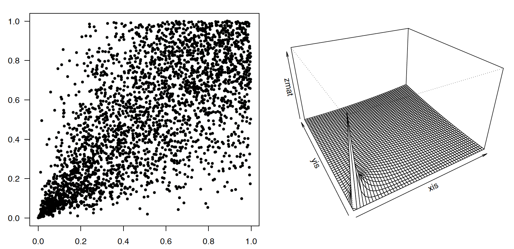

## Kopule/funkcje łączące

Angielskie słowo copula, używane w kontekście generowania wielowymiarowych zmiennych zależnych, najczęściej tłumaczone jest niepoprawnie na polskie słowo kopuła. Odpowiedniejszym tłumaczeniem jest polskie słowo pochodzenia łacińskiego kopula oznaczające łącznik w znaczeniu formy czasownika być łączącej podmiot i orzeczenie. Możemy też używać określenia funkcja łącząca. Warto dodać, że wikipedia dopuszcza nawet pisownię copula traktując to słowo jako już polskie, słownik PWN jest bardziej konserwatywny.

Powyżej opisaliśmy jak generować zależne zmienne losowe o łącznym rozkładzie normalnym. W wielu zastosowaniach przydatna jest możliwość generowania zmiennych o zadanej strukturze zależności i o dowolnych rozkładach brzegowych. Do tego celu można wykorzystać kopule, czyli funkcje łączące.
Za tym narzędziem stoi bardzo ciekawa teoria, jak również wiele zastosowań, szczególnie w finansach i ubezpieczeniach. Poniżej przedstawimy kilka przykładów użycia kopuli do generowania zależnych zmiennych.

Kopula to wielowymiarowy rozkład określony na kostce $$[0,1]^n$$, taki, że rozkłady brzegowe dla każdej współrzędnej są jednostajne na odcinku $$[0,1]$$. Poniżej przez $$C(u):[0,1]^n\rightarrow [0,1]$$ będziemy oznaczać dystrybuantę tego rozkładu. 
Poniższe twierdzenie wyjaśnia dlaczego kopule są ciekawe.

**Twierdzenie Sklara**

*Dla zadanego rozkładu $$H$$ określonego na $$p$$ wymiarowej przestrzeni i odpowiadających mu rozkładów brzegowych $$F_1, ..., F_p$$ istnieje kopula $$C$$, taka że $$C(F_1, ..., F_p) = H$$. Oznacza to, że każdy rodzaj zależności można opisać pewną kopulą.*

Rozważmy przypadek dwuwymiarowy. Dla zmiennej dwuwymiarowej o rozkładzie $$H$$ o brzegowych rozkładach $$F_1, F_2$$ istnieje kopula $$C$$ taka, że 
$$
H(x, y) = C\left(F_1(x), F_2(y)\right).
$$
Co więcej, jeżeli brzegowe dystrybuanty są ciągłe, to $$C$$ jest wyznaczona jednoznacznie.

Jeżeli chcemy generować obserwacje z rozkładu $$H$$, to wystarczy, że potrafimy generować obserwacje z kopuli $$C$$ i znamy rozkłady $$F_1$$, $$F_2$$. Wszystkich możliwych kopuli jest nieskończenie wiele, ale w zastosowaniach najczęściej pojawiają się następujące klasy kopul. 

* Kopula Gaussowska. W przypadku dwuwymiarowym kopuła Gaussowska wyrażona jest następującym wzorem
$$
C_\rho (u, v) = \Phi_\rho\left(\Phi^{-1}(u), \Phi^{-1}(v)\right),
$$
gdzie $$\rho$$ jest parametrem. Ta kopula odpowiada zależności pomiędzy zmiennymi o łącznym rozkładzie normalnym z korelacją $$\rho$$. Podobnie definiuje się kopule Gausowskie dla wyższych wymiarów.

* Kopula Archimedesowska. Dla $$p$$ wymiarów kopuła Archimedesowska wyraża się wzorem
$$
C(x_1, x_2, ..., x_p)=\Psi^{-1}\left(\sum_{i=1}^n \Psi\left(F_i\left(x_i\right)\right) \right),
$$
gdzie $$\Psi$$ to tzw. funkcja generująca, spełniająca warunki: (1) $$\Psi(1) = 0$$, \linebrak(2) $$\lim_{x\rightarrow 0}\Psi(x) = \infty$$,  (3)  $$\Psi'(x) < 0$$ i (4) $$\Psi''(x) > 0$$.
Wybierając odpowiednie funkcje generujące, otrzymujemy następujące podklasy kopuli.

  * Kopula produktowa, w tym przypadku funkcja generująca zadana jest wzorem
$$
\begin{array}{rcl}
\Psi(x)&=&-\log(x),\\
H(x,y)&=&F_1(x)F_2(y).
\end{array}
$$
  * Kopula Claytona, w tym przypadku funkcja generująca zadana jest wzorem
$$
\begin{array}{rcl}
\Psi(x)&=&x^\theta-1,\\
H(x,y)&=&\left(F_1(x)^\theta + F_2(y)^\theta -1\right)^{1/\theta}.
\end{array}
$$
  * Kopula Gumbela, w tym przypadku funkcja generująca zadana jest wzorem
$$
\begin{array}{rcl}
\Psi(x)&=&\left(-\log(x)\right)^\alpha.
\end{array}
$$
  * Kopula Franka, w tym przypadku funkcja generująca zadana jest wzorem
$$
\begin{array}{rcl}
\Psi(x)&=&\displaystyle \log\frac{\exp(\alpha x)-1}{\exp(\alpha)-1},\\
H(x,y)&=&F_1(x)F_2(y).
\end{array}
$$

W pakiecie `copula` do operacji na kopulach służą funkcje:

*`dcopula(copula,u)`, wylicza gęstość kopuli `copula` w punkcie `u`,
* `pcopula(copula,u)`, wylicza dystrybuantę kopuli w punkcie `u`,
* `rcopula(copula,n)`, generuje `n` wartości z kopuli `copula`.

Pierwszym argumentem tych funkcji jest obiekt klasy `copula`, opisujący wielowymiarowy rozkład na kostce jednostkowej. Taki obiekt możemy zainicjować używając jednej z funkcji wymienionych w kolejnej tabeli.  Gęstości i przykładowe próby wylosowane z wybranych kopuli przedstawione są na kolejnym rysunku.

Zobaczmy jak w programie R zainicjować obiekt typu `copula` i wygenerować wektor zmiennych o zadanej strukturze zależności.

```{r}
library(copula)
(norm.cop <- normalCopula(0.5))
```

Wewnątrz obiektu przechowywane są informacje o strukturze.

```{r}
str(norm.cop)
```

Używając funkcji rcopula generujemy 1000 obserwacji.

```{r}
x <- rcopula(norm.cop, 1000)
head(x)
```

Na poniższym przykładzie wygenerujemy 40 obserwacji z rozkładu, którego rozkładami brzegowymi są rozkłady wykładnicze o parametrze $$\lambda =2$$, a struktura zależności opisana jest kopulą Claytona.

Poniżej najpierw tworzymy obiekt z definicją kopuli Claytona, następnie generujemy 40 obserwacji z zadanej kopuli. Nakładamy na wygenerowane obserwacje odwrotne dystrybuanty, by otrzymać zmienne o żadnych rozkładach brzegowych, poniżej nałożono odwrotną dla rozkładu wykładniczego z `rate=2`.

```{r}
N <- 40
clayton.cop <- claytonCopula(1, dim = 2)
x <- rcopula(clayton.cop, N)
y <- cbind(qexp(x[,1],rate=2), qexp(x[,2],rate=2))
head(y)
```

Kopule stosowane są w wielu zagadnieniach. Poniżej przedstawimy przykład badania mocy dwóch testów korelacji, gdy dwuwymiarowa zmienna ma brzegowe rozkłady wykładnicze i zależność opisaną przez kopulę Claytona.

Porównajmy test dla współczynnika korelacji Pearsona i Spearmana. Pierwszy zakłada normalny rozkład obserwacji, zobaczymy jak niespełnienie tego założenia wpływa na moc.


Moc testu ocenimy na podstawie 1000 powtórzeń, testy pracują na poziomie istotności 0.05. 

```{r}
N <- 40
pv <- matrix(0, 2, 1000)
clayton.cop <- claytonCopula(1, dim = 2)
rownames(pv) <- c("Pearson", "Spearman")
```

Losujemy dwa wektory o zadanej strukturze zależności. Następnie dwoma testami wyznaczamy p-wartość dla hipotezy zerowej o braku korelacji.

```{r}
for (i in 1:1000) {
       x <- rcopula(clayton.cop, N)
       y <- cbind(qexp(x[,1],2), qexp(x[,2],2))
       pv[1, i] <- cor.test(y[,1], y[,2], method="pearson")$p.value
       pv[2, i] <- cor.test(y[,1], y[,2], method="spearman")$p.value
}
```

Liczymy moc, czyli jak często p-wartość jest poniżej ustalonego progu. Tutaj 0.05. Gdy spojrzymy na wyniki, zauważymy, że test Spearmana ma tutaj prawie dwukrotnie wyższą moc!

```{r}
rowMeans(pv < 0.05)
```

W zagadnieniach praktycznych, często nie wiemy z jakiej rodziny wybrać rozkłady brzegowe. W takich sytuacjach dobrym pomysłem jest użycie empirycznej dystrybuanty. Funkcję odwrotną do dystrybuanty empirycznej (która nie jest monotoniczna, ale to tzw. szczegół techniczny) jest funkcja `quantile()`. 


**Kopula Gaussowska rho=0.5. Przykładowa 200 elementowa próba przedstawiona jest po lewej stronie, po prawej stronie przedstawiana jest gęstość**



**Kopula Claytona z parametrem 2**


**Kopula Franka z parametrem 5**


**Kopula Gumbela z parametrem 2. Struktura zależności jest niesymetryczna ale inna niż w przypadku kopuli Claytona**


**Wykresy konturowe dla gęstości różnych kopuli**


**Funkcje tworzące kopule poszczególnych klas**

