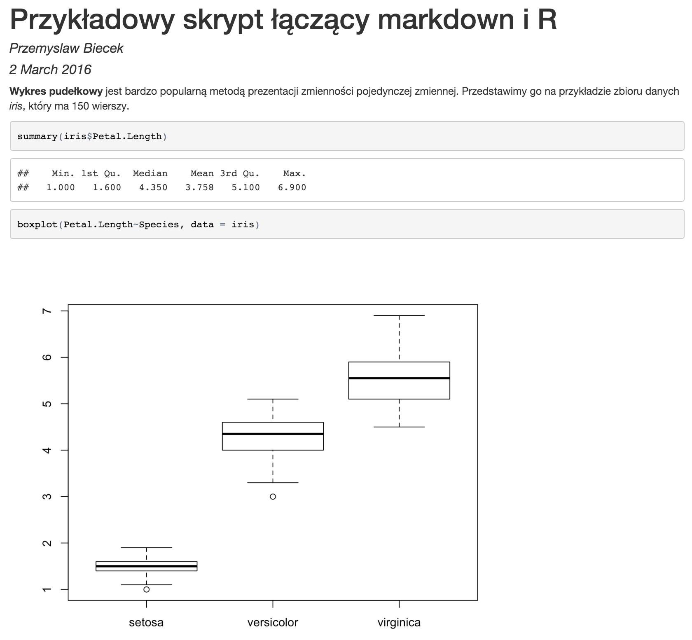
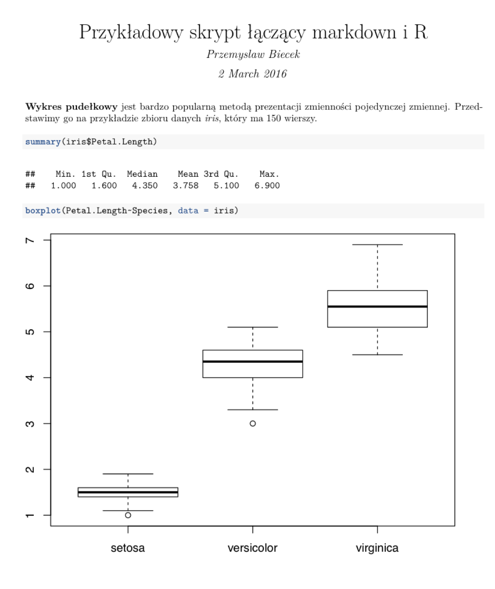

# Jak tworzyć raporty z pakietem `knitr`? 

Pakiet `knitr` można traktowac jako prostszą w użyciu wersję pakietu `Sweave`. Pierwszy oparty jest o łatwy w użyciu język [Markdown](https://pl.wikipedia.org/wiki/Markdown), drugi bazuje na bardziej złożonym, ale dającym też szersze możliwości języku [LaTeX](https://pl.wikipedia.org/wiki/LaTeX). Logika stojąca za oboma pakietami jest taka sama, więc poniżej omówimy tylko pierwszy.

Filozofia stojąca za tymi pakietami określana jest terminem *literate programing*, który poniżej jest  przetłumaczony jako *programowanie objaśniające*. Został on zaproponowany przez Donalda Knutha, autora między innymi języka TeX. Za tym terminem kryje się idea, którą można opisać w trzech punktach:

* programy są bezużyteczne bez opisów/dokumentacji,
* opisy powinny wyjaśniać program, zwykłe komentarze w kodzie nie są wystarczające,
* przykładowe kody wykorzystane w opisach powinny być wykonywalne i kompletne.

Potrzebne jest więc narzędzie, które pozwala na proste łączenie kodów R oraz ich opisów. Takie połączenie może być wykorzystane zarówno do dokumentowania kodu, do zapewnienia powtarzalności analiz jak i do automatycznego generowania raportów. Takim narzędziem są pakiety `knitr` i `Sweave`.

## Pierwszy raport

Przedstawmy je na przykładzie pliku `raport.Rmd`. Rozszerzenie `Rmd` jest potrzebne i oznacza połaczenie kodu R i jezyka markdown.
Zawartość pliku `raport.Rmd` wygląda następująco.

```
---
title: "Przykładowy skrypt łączący markdown i R"
author: "Przemyslaw Biecek"
date: "2 March 2016"
output: html_document
---

**Wykres pudełkowy** jest bardzo popularną metodą prezentacji 
zmienności pojedynczej zmiennej. Przedstawimy go na przykładzie 
zbioru danych _iris_, który ma `r nrow(iris)` wierszy.

 ```{r fig.width=7, fig.height=6}
 summary(iris$Petal.Length)
 boxplot(Petal.Length~Species, data = iris)
 ```
```

Taki raport możemy przetworzyć na dwa sposoby

* Jeżeli używamy programu RStudio, to należy otworzyć w edytorze plik `raport.Rmd`. Nad nim pojawi się opcja `Knit HTML`. Po jej kliknięciu zostanie wygrnerowany raport HTML.
* Druga opcja to użycie polecenia `knit("raport.Rmd")` w linii poleceń. 
Przetwarzanie pliku `Rmd` składa się z dwóch etapów. W pierwszym `knitr` uruchamia kod R umieszczony we fragmentach oznaczonych potrójnym apostrofem. Kody wejściowe i ich wynik są umieszczane w pliku o rozszerzeniu `md`. W drugim etapie program [pandoc](http://pandoc.org/) przetwarza plik w formacie `markdown` na format `html`, `pdf`, `doc` lub inny wskazany.

Dla powyższego przykładu, po pierwszym przykłądzie powstaje plik `raport.md` o poniższej zawartości.

```
 ---
 title: "Przykładowy skrypt łączący markdown i R"
 author: "Przemyslaw Biecek"
 date: "2 March 2016"
 output: html_document
 ---

 **Wykres pudełkowy** jest bardzo popularną metodą prezentacji 
 zmienności pojedynczej zmiennej. Przedstawimy go na przykładzie 
 zbioru danych _iris_, który ma 150 wierszy.

 ```r
 summary(iris$Petal.Length)
 ```

 ```
 ##    Min. 1st Qu.  Median    Mean 3rd Qu.    Max. 
 ##   1.000   1.600   4.350   3.758   5.100   6.900
 ```

 ```r
 boxplot(Petal.Length~Species, data = iris)
 ```

 
```

Jak widzimy, w plik `md` znajdują się dodatkowo wyniki kodu R.
W kolejnym roku, ten plik jest konwertowany do pliku `html`, który wygląda następująco.



## Inne formaty

Powyżej przedstawiony plik rozpoczyna się od nagłówka w formacie YAML ([YAML Ain't Markup Language](https://pl.wikipedia.org/wiki/YAML)) określającym konfiguracje procesu konwersji. Pierwsze linie opisują autora, tytuł i datę. 

Kolejna opisuje format, w tym przypadku jest to `output: html_document`, dlatego plik został przekonwertowany do pliku `html`. 
Jeżeli go zmienimy na `output: pdf_document` to przycisk `Knit HTML` zamini się na `Knit PDF` a w wyniku kompilacji otrzymamy plik `pdf` 




