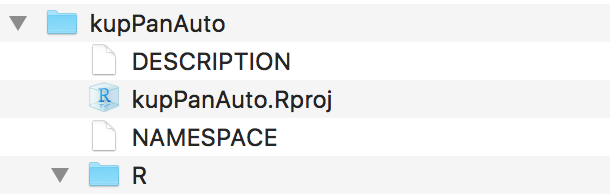

# Jak stworzyć nowy pakiet?

Nowy pakiet najwygodniej budować używając funkcji `create()` z pakietu `devtools`.

Na potrzeby tego rozdziału stworzymy nowy pakiet `kupPanAuto`. Aby stworzyć pusty pakiet o takiej nazwie potrzebne jest wywołanie.

```
library(devtools)
create("kupPanAuto")
```

Pierwszym argumentem funkcji `check()` jest ścieżka, w której należy stworzyć nowy pakiet. Ostatni element tej ścieżki (tutaj jedyny) to nazwa pakietu. Powyższa instrukcja w aktualnym katalogu stworzy podkatalog o nazwie `kupPanAuto` z minimalną liczbą niezbędnych plików.




