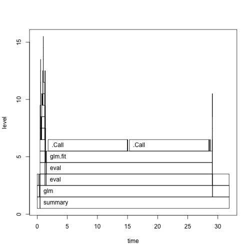
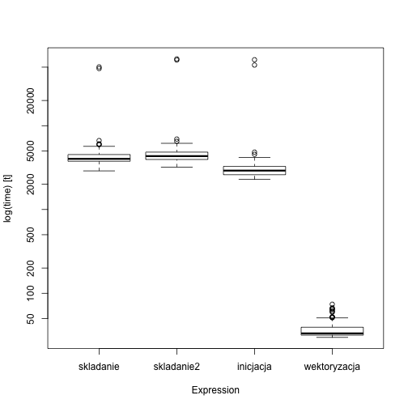

# Jak analizować czas działania kodu R? 

Skrypty R działają za wolno?

To z pewnością wina tych leniwych twórców R, którzy coś źle zrobili!

...

A może nie?

A może to nasz kod jest nieefektywnie napisany?

Jeżeli dopuszczasz taką możliwość to przydadzą Ci się narzędzia do analizy czasu działania kodu R.


# Czas działania zbioru instrukcji

Funkcja `system.time()` zlicza jak długo (w sekundach) wykonuje się określony zbiór instrukcji.
Raportowane są trzy liczby, `elapsed` - czyli ile czasu minęło, `user` - ile czasu procesora zużył R, `system` - ile czasu procesora zużyły w tym czasie procesy poza R.

Stwórzmy dużą ramkę danych i zobaczmy jak długo trwa policzenie na niej regresji liniowej.


```r
system.time({
  N <- 2000
  df <- as.data.frame(matrix(runif(2*N*N), 2*N, N))
  tmp <- summary(lm(V1~., data=df))
})
```

```
##    user  system elapsed 
##  13.353   0.280  13.646
```

Kilkanaście sekund! 

# Profiler

Mierzenie całkowitego czasu działania może być przydatne, choć często chcielibyśmy czegoś więcej. Wiadomo, że funkcja `lm()` wywołuje pod funkcje. Która z nich zabiera lwią część czasu działania?

Aby to sprawdzić można wykorzystać funkcję `Rprof()`.
Uaktywnia ona profiler, który do określony czas (argument `interval`, domyślnie 0.02 sek) sprawdza jak wygląda stos wywołań R. Informacje o tym stosie wywołań są zapisywane w pliku wskazanym przez argument `filename`, domyślnie w pliku `Rprof.out`.


```r
Rprof("profiler.out", interval = 0.01, memory.profiling=TRUE)
  N <- 2000
  df <- as.data.frame(matrix(runif(2*N*N), 2*N, N))
  tmp <- summary(lm(V1~., data=df))
Rprof()
```

Fragment pliku `Rprof.out` jest przedstawiony poniżej. Pierwsze kolumny opisują zajętość pamięci, ostatnia wymienia funkcje, które aktualnie znajdują się na stosie wywołania.

```
memory profiling: sample.interval=10000
:2707201:50881097:139412560:121:"runif" "matrix" "as.data.frame" 
:2707201:50881097:139412560:0:"runif" "matrix" "as.data.frame" 
:2707201:50881097:139412560:0:"runif" "matrix" "as.data.frame" 
:2707201:50881097:139412560:0:"runif" "matrix" "as.data.frame" 
:2707206:58881410:139413624:0:"matrix" "as.data.frame" 
:2707206:58881410:139413624:0:"matrix" "as.data.frame" 
:2707206:58881410:139413624:0:"matrix" "as.data.frame" 
:2707206:58881410:139413624:0:"matrix" "as.data.frame" 
:2708210:64700854:140252056:0:"as.vector" "as.data.frame.matrix" "as.data.frame" 
```

Analiza bezpośrednia pliku `Rprof.out` nie jest łatwa, ponieważ ten plik trzeba odpowiednio przetworzyć aby wyliczyć, która funkcja jak długo działania. 

To przetworzenie jest wykonywane funkcją `summaryRprof()`. Zwraca ona listę z czterema elementami:

* `by.self` informacja, która funkcja jak długo działała, uporządkowana zgodnie z czasem działania wyłącznie danej funkcji bez podfunkcji.
* `by.total` informacja, która funkcja jak długo działała wliczając czas działania podfunkcji,
* `sample.interval`, częstość próbkowania kodu,
* `sampling.time`, czas trwania całego analizowanego kodu.

Poniżej przedstawiamy przykład działania


```r
summaryRprof("profiler.out")$by.self
```

```
##                           self.time self.pct total.time total.pct
## "lm.fit"                      10.84    73.05      10.84     73.05
## "chol2inv"                     2.58    17.39       2.58     17.39
## "as.vector"                    0.25     1.68       0.25      1.68
## "summary.lm"                   0.19     1.28       2.77     18.67
## "runif"                        0.17     1.15       0.17      1.15
## "makepredictcall.default"      0.12     0.81       0.12      0.81
## "matrix"                       0.11     0.74       0.28      1.89
## "na.omit.data.frame"           0.10     0.67       0.26      1.75
## ".External2"                   0.07     0.47       0.37      2.49
## "[.data.frame"                 0.07     0.47       0.09      0.61
## "is.na"                        0.07     0.47       0.07      0.47
## ".External"                    0.06     0.40       0.06      0.40
## "na.omit"                      0.04     0.27       0.30      2.02
## "deparse"                      0.04     0.27       0.07      0.47
## "FUN"                          0.02     0.13       0.10      0.67
## ".subset2"                     0.02     0.13       0.02      0.13
## "paste"                        0.01     0.07       0.08      0.54
## "[["                           0.01     0.07       0.05      0.34
## "[[.data.frame"                0.01     0.07       0.04      0.27
## ".deparseOpts"                 0.01     0.07       0.02      0.13
## "%in%"                         0.01     0.07       0.02      0.13
## "match"                        0.01     0.07       0.02      0.13
## "all"                          0.01     0.07       0.01      0.07
## "list"                         0.01     0.07       0.01      0.07
## "pmatch"                       0.01     0.07       0.01      0.07
```

## Graficzne statystyki z pakietem profr

Funkcja `summaryRprof()` przedstawia statystyki działania w sposób tekstowy. Ale często dobrym uzupełnieniem takiej informacji jest wykres, pokazujący jak długo trwają które funkcje i podfunkcje.

Taką graficzną analizę kodu można wykonać pakietem `profr` (nie zgadniecie kto jest twórcą tego pakietu, tak Hadley Wickham). 

Pakiet ten wykorzystać można na dwa sposoby. Można funkcją `parse_rprof()` odczytać plik utworzony przez `Rprof()`. Lub (co jest zalecane) profilowanie można wykonać funkcją `profr()`, która zawiera dodatkowe informacje o czasie wykonania.

Poniżej te dodatkowe informacje są wypisywane, dodatkowo generyczna funkcja `plot()` przedstawia graficznie stos wywołań funkcji.


```r
library(profr)
pro <- profr({
  N <- 2000
  df <- as.data.frame(matrix(runif(2*N*N), 2*N, N))
  tmp <- summary(glm(V1~., data=df))
}, 0.01)
head(pro)
```

```
##    level g_id t_id                    f start   end n  leaf  time source
## 28     1    1    1        as.data.frame  0.00  0.47 1 FALSE  0.47   base
## 29     1    2    1              summary  0.47 31.88 1 FALSE 31.41   base
## 30     2    1    1               matrix  0.00  0.36 1 FALSE  0.36   base
## 31     2    2    1 as.data.frame.matrix  0.36  0.47 1 FALSE  0.11   base
## 32     2    3    1                  glm  0.47 29.10 1 FALSE 28.63  stats
## 33     2    4    2          summary.glm 29.11 31.88 1 FALSE  2.77  stats
```

```r
plot(pro)
```



Na bazie tego jednego wykresu łatwo zauważyć, że generowanie danych trwało chwilę, wywołanie `summary()` trwało trochę dłużej, a najwięcej czasu zabrała funkcja `glm()`

## Ale po co nam to?

Mierząc czas działania, możemy porównać kilka potencjalnych rozwiązań i wybrać lepsze.

Zobaczmy na przykład, w jaki sposób tworzyć wektor 100 000 losowych liczb z rozkładu jednostajnego. Porównamy cztery możliwe rozwiązania i zobaczymy które jest najszybsze.


```r
system.time({ x=NULL; for (i in 1:10^5) x =c(x, runif(1)) })
```

```
##    user  system elapsed 
##  19.649  18.181  41.137
```

```r
system.time({ x=NULL; for (i in 1:10^5) x[i] =runif(1) })
```

```
##    user  system elapsed 
##  12.525  17.224  31.844
```

```r
system.time({x=numeric(10^5); for(i in 1:10^5) x[i]=runif(1)})
```

```
##    user  system elapsed 
##   0.359   0.037   0.398
```

```r
system.time({ x=NULL; x = runif(10^5) })
```

```
##    user  system elapsed 
##   0.003   0.000   0.003
```

Pierwsze dwa dynamicznie rozciągają wektor, co w R oznacza kopiowanie w kółko całego wektora wyników. Trwa to długo. Inicjacja wektora pustymi wartościami powoduje że czas obliczeń skrócił się 30 razy. Wektoryzacja obliczeń skraca czas obliczeń o kolejne 10 razy.

## Z dokładnością do mikrosekundy

Jeżeli mierzenie czasu działania z dokładnością do sekundy nie jest wystarczające, to warto skorzystać z biblioteki `microbenchmark`. Nie dość, że powtarza ona określone instrukcje wiele razy (domyślnie 100), to jeszcze prezentuje graficznie i tekstowo rozkład czasów działania.

W poniższym przykładzie porónujemy ponownie cztery sposoby losowania wektora liczb.


```r
library(microbenchmark)
library(ggplot2)

pro <- microbenchmark(
  skladanie = { x=NULL; for (i in 1:10^3) x =c(x, runif(1)) },
  skladanie2 = { x=NULL; for (i in 1:10^3) x[i] =runif(1) },
  inicjacja = {x=numeric(10^3); for(i in 1:10^3) x[i]=runif(1)},
  wektoryzacja = { x=NULL; x = runif(10^3) })

boxplot(pro)
```



```r
autoplot(pro)
```


