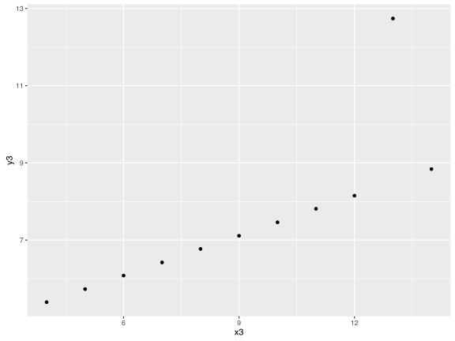
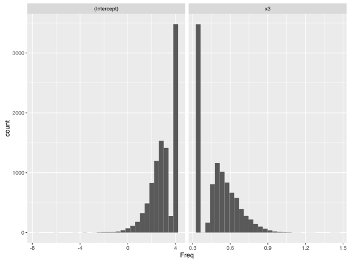

# Jak zrównoleglić obliczenia w R? 

Jeżeli mamy do wykonania obliczenia (np. symulacje), które trwałyby 10 dni, to mamy do wyboru trzy możliwości:

* poczekać 10 dni, w sumie to nie tak długo. Choć co jeżeli to 10 lat a nie  10 dni?
* poszukać szybszego komputera, jeżeli nasz nie jest najszybszy to może znajdziemy jakiś 2-3 razy szybszy. A może nawet 10 razy szybszy, dzięki czemu z 10 lat zrobi się *tyko* rok.
* Zrównoleglić kod i uruchomić go na 10 000 rdzeni. Jeżeli obliczenia można łatwo zrównoleglić, to z 10 lat zrobi się 8 godzin obliczeń.

Jak widzimy, w rzeczywistości nie mamy żadnego wyboru. Pozostaje więc pytanie, jak zrównoleglić obliczenia w R?

## Zrównoleglenie jawne / ukryte

Lista narzędzi do przyśpieszania i zrównoleglania obliczeń znajduje się na stronie https://cran.r-project.org/web/views/HighPerformanceComputing.html.

Narzędzia do zrównoleglania obliczeń podzielone są na dwie grupy: *Explicit parallelism* i *Implicit parallelism*. Pierwsze to narzędzia pozwalające na (większą lub mniejszą) kontrolę procesu tworzenia klastra obliczeniowego i zrównoleglania obliczeń. Drugie ukrywają proces zrównoleglania, tak że końcowy użytkownik może nawet tego zrównoleglenia nie być świadomy. Może zajmować się tym kompilator, sprzęt lub jakaś zewnętrzna biblioteka.

Jeżeli korzystamy z dobrych bibliotek, które są wymagające obliczeniowo (np. `caret` gdzie jest wiele metod z boostingiem), to jest możliwe, że te biblioteki we własnym zakresie zrównoleglają obliczenia.

Poniżej zajmiemy się tylko pakietami do jawnego zrównoleglania kodu.

## Ach ten Windows

Pakiety programu R pozwalające na zrównoleglanie obliczeń można z grubsza podzielić na dwie grupy:

* Te, które działają na każdym popularnym systemie operacyjnym,
* Te, które działają na każdym popularnym systemie operacyjnym poza Windows.

Ta druga grupa jest liczniejsza. Poniżej postaram się opisać rozwiązania zarówno z pierwszej jak i drugiej grupy.


# Biblioteka parallel

W programie R powstało wiele rozwiązań do przetwarzania równoległego. Z biegiem czasu, rozwiązania z dobrych i rozwiniętych pakietów takich jak `snow` i `multicore` trafiły do biblioteki `parallel`. I to tę bibliotekę poniżej omówimy.

## Rodzaje klastrów

Przetwarzanie równoległe przebiega zazwyczaj w następującej sekwencji.

1. Zbuduj klaster - zainicjuj proces R na różnych węzłach/procesorach/rdzeniach.
2. Wyślij dane/kod z węzła głównego na pozostałe węzły.
3. Wykonuj kod równolegle, z lub bez komunikacji pomiędzy węzłami (najlepiej bez komunikacji).
4. Zbierz wyniki.
5. Zwiń klaster, zwolnij zasoby.

To w jaki sposób zadania są przetwarzane i jak zbierane są wyniki zależy od typu klastra. Różnych typów jest wiele, ale wyróżnijmy trzy.

* *PSOCK (Parallel Socket Cluster)*, klaster oparty o gniazda. Można go budować na każdym systemie operacyjnym, też na systemie Windows. Tworząc klaster inicjujemy nowe procesy R. Procesy są normalnie inicjowane, będą więc miały pustą przestrzeń nazw. Wszystkie zmienne trzeba im przesłać osobno po zainicjowaniu. 
* FORK, klaster oparty o systemy Unixowe (czyli też OSX), w których procesy mogą się forkować, czyli tworzyć (szybko) swoje kopie. Forkowanie ma zalety (szybki start, procesy startują z dostępnymi wszystkimi zmiennymi, które były w procesie nadrzędnym). Wadą jest w sumie jedynie to, że nie działają na Windowsie.
* MPI, klaster oparty o protokół komunikacji MPI, *Message Passing Interface*. Zaletą jest to, że procesy mogą się komunikować w trakcie działania.

Poniżej omówimy zastosowania funkcji `parLapply()` mogącej pracować z klastrami PSOC, FORK i innymi oraz funkcji `mclapply()`, pracującej tylko z klastrami FORK, ale będącej idealnym zastępstwem dla funkcji `lapply()`.


## Funkcja parLapply

Nawet jeżeli pracujemy na małym komputerze, wciąż możemy wykorzystać wszystkie rdzenie, które w nim mamy. Wygodnie jest do tego wykorzystać bibliotekę `parallel`. 

Funkcją `detectCores()` sprawdźmy na początek ile mamy rdzeni w komputerze.


```r
library(parallel)
detectCores()
```

[1] 8

Na tym małym laptopie mamy tylko 8 rdzeni. Aby sensownie na nim pracować zajmiemy 7 rdzeni pozostawiając jeden na inne zadania.

Klaster można zbudować funkcją `makeCluster()`. Domyślnie tworzony jest klaster typu PSOC. Specyfikacja tego klastra (pierwszy argument) to  liczba węzłów, które mają być stworzone. 


```r
klaster <- makeCluster(detectCores()-1)
print(klaster)
```

socket cluster with 7 nodes on host 'localhost'

```r
N <- 10000
```

Mamy klaster, czas na nim coś ciekawego policzyć.

Stwórzmy funkcję `alm()`, która dla każdego uruchomienia, zbuduje próbę boostrapową zbioru `anscombe` i wyznaczy na niej współczynniki dla modelu `y3~x3`. 

Następnie używamy funkcji `parLapply()` aby wykonać tę funkcję 10 000 razy. 


```r
alm <- function(i) {
  tmp <- anscombe[sample(nrow(anscombe), replace = T),]
  lm(y3~x3, data=tmp)$coef
}

system.time(
  res <- parLapply(klaster, 1:N, alm)
)
```

   user  system elapsed 
  0.019   0.008   3.136 

Wynikiem funkcji `parLapply()` jest lista z wynikami poszczególnych wywołań funkcji `alm()`. Tak, w powyższym przypadku funkcja `alm()` przyjmuje jeden argument (ponieważ musi) ale z niego nie korzysta (ponieważ nie potrzebuje). Każda próba boostrapowa jest wyznaczana niezależnie.

Przekształćmy tę listę z wynikami do ramki danych. Używając biblioteki `ggplot2` pokażemy najpierw dane z których będziemy wyznaczać rozkład współczynników a następnie pokażmy wyznaczony metodą bootstrap rozkład współczynników w modelu regresji.


```r
wspolczynniki <- as.data.frame(as.table(simplify2array(res)))

library(ggplot2)
ggplot(anscombe, aes(x3, y3)) +
  geom_point()
```



```r
ggplot(wspolczynniki, aes(Freq)) + 
  geom_histogram() + facet_wrap(~Var1, scales = "free_x")
```



Funkcja `alm()` nie potrzebowała żadnych argumentów. Ale są funkcje, które potrzebują. Jak je przekazać?
Wszystkie dodatkowe argumenty można przekazać wewnątrz funkcji `parLapply()`. W poniższym przykładzie zbiór danych przesyłamy za pomocą argumenty `new_data`.


```r
alm <- function(i, new_data) {
  tmp <- new_data[sample(nrow(new_data), replace = T),]
  lm(y3~x3, data=tmp)$coef
}

system.time(
  res <- parLapply(klaster, 1:N, alm, new_data = anscombe)
)
```

   user  system elapsed 
  0.018   0.007   3.080 

Przekazywanie danych przez argumenty funkcji to spory narzut. Czasem wygodniej byłoby przekazać dane lub parametry w inny sposób. 
Można do tego celu wykorzystać funkcje `clusterExport()`.

Wskazaną zmienną wysyła do wszystkich węzłów klastra. W poniższym przykładzie, funkcja `alm()` korzysta ze zmiennej `new_data`, która została wcześniej rozesłana po węzłach klastra za pomocą funkcji `clusterExport()`.


```r
new_data <- anscombe
clusterExport(klaster, "new_data")

alm <- function(i) {
  tmp <- new_data[sample(nrow(new_data), replace = T),]
  lm(y3~x3, data=tmp)$coef
}

system.time(
  res <- parLapply(klaster, 1:N, alm)
)
```

   user  system elapsed 
  0.025   0.011   3.383 

Funkcja `parLapply()` jako wynik zwraca listę wartości. Listę tę można uprościć czasem do wektora czasem do macierzy używając funkcji `simplify2array()`. Aby nie kłopotać się tym dodatkowym wywołaniem, można zamiast `parLapply()` użyć `parSapply()`.


```r
res <- parSapply(klaster, 1:N, alm)
str(res)
```

 num [1:2, 1:10000] 3.242 0.491 3.381 0.468 4.006 ...
 - attr(*, "dimnames")=List of 2
  ..$ : chr [1:2] "(Intercept)" "x3"
  ..$ : NULL

Po zakończeniu obliczeń równoległych należy pozamykać wiszące i zużywające RAM procesy. Aby zwinąć klaster można wykorzystać funkcję `stopCluster()`.


```r
stopCluster(klaster)
```

## Funkcja mclapply

Jeżeli pracujemy na systemie Unix to możemy skorzystać z klastrów typu FORK. O nie oparta jest funkcja `mclapply()`, która tworzy kopie procesu R, kopia ma zainicjowane wszystkie zmienne. Na tych kopiach wykonywane są równolegle obliczenia a ich wyniki są na końcu zwijane do wyjściowego procesu.

Funkcja `mclapply()` wykorzystuje domyślnie liczbę rdzeni zdefiniowaną w opcji `mc.cores`. Sama inicjuje klaster, wykonuje obliczenia i zwija klaster.

Można ją stosować zamiennie z funkcją `lapply()`.


```r
alm <- function(i) {
  tmp <- new_data[sample(nrow(new_data), replace = T),]
  lm(y3~x3, data=tmp)$coef
}

getOption("mc.cores", 2)
```

[1] 8

```r
system.time(
  res <- mclapply(1:N, alm)
)
```

   user  system elapsed 
 24.923   3.819   4.715 

```r
str(simplify2array(res))
```

 num [1:2, 1:10000] 1.908 0.62 4 0.346 2.626 ...
 - attr(*, "dimnames")=List of 2
  ..$ : chr [1:2] "(Intercept)" "x3"
  ..$ : NULL

# Zadania

* Wybierz funkcję która krótko się liczy (np. model liniowy na 11 wierszach). Wykonaj ją tysiące razy i zobacz jak wygląda czas obliczeń jako funkcja liczby użytych rdzeni.
* Wybierz funkcję która długo się liczy (np. model liniowy na tysiącach kolumn). Wykonaj ją kilkadziesiąt razy i zobacz jak wygląda czas obliczeń jako funkcja liczby użytych rdzeni.

