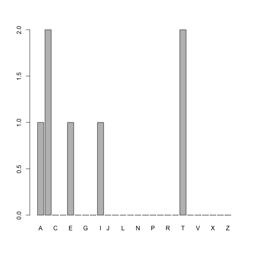
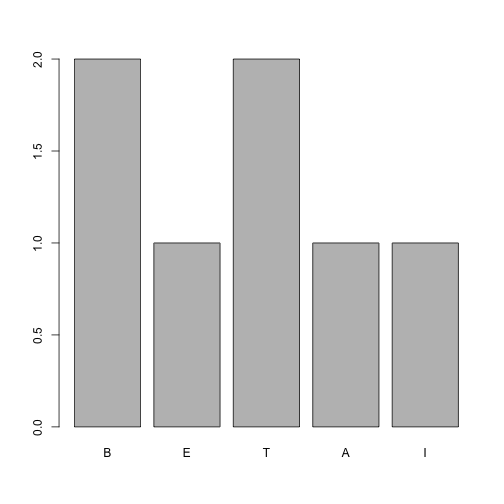
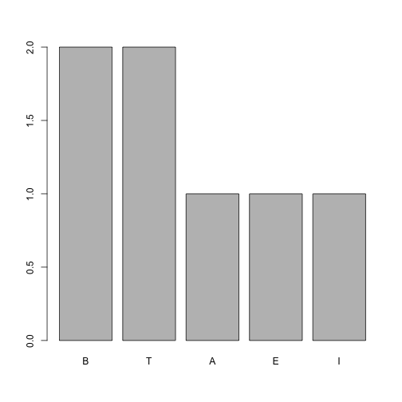

## Pakiet forcats, czyli jak pracować z czynnikami

### Tworzymy czynniki

Czynniki tworzy się funkcją `factor()`. Domyślnie poziomy określane są jako wartości występujące w wektorze uporządkowane w kolejności leksykograficznej.


```r
library(forcats)
library(readr)
(beta <- c("B", "E", "T", "A", "B", "I", "T"))
```

```
## [1] "B" "E" "T" "A" "B" "I" "T"
```

```r
factor(beta)
```

```
## [1] B E T A B I T
## Levels: A B E I T
```

Zarówno w funkcji `factor()` jak i `parse_factor()` można określić wektor wszystkich poziomów czynnika.


```r
(f <- factor(beta, levels = LETTERS))
```

```
## [1] B E T A B I T
## Levels: A B C D E F G H I J K L M N O P Q R S T U V W X Y Z
```

```r
(f <- parse_factor(beta, levels = LETTERS))
```

```
## [1] B E T A B I T
## Levels: A B C D E F G H I J K L M N O P Q R S T U V W X Y Z
```

### Zmiana kolejności poziomów czynnika

Funkcja `fct_inorder()` zmienia kolejność czynników tak by odpowiadały kolejności występowania w zbiorze danych.

Funkcja `fct_infreq()` zmienia kolejność by odpowiadała częstości występowania wartości w wektorze.


```r
(f2 <- fct_inorder(factor(beta)))
```

```
## [1] B E T A B I T
## Levels: B E T A I
```

```r
(f3 <- fct_infreq(factor(beta)))
```

```
## [1] B E T A B I T
## Levels: B T A E I
```

Po co zmieniać kolejność czynników? 
Najczęściej po to by wpłynąć na działanie funkcji `table()`, która pokazuje częstości występowania poziomów zmiennej lub by wpłynąć na kolejność występowania poziomów na wykresach.


```r
barplot(table(f))
```



```r
barplot(table(f2))
```



```r
barplot(table(f3))
```



### Kolejność poziomów c.d.

Kolejne przykłady przeprowadzimy na kolumnie `Marka` ze zbioru danych `auta2012`.


```r
library(Przewodnik)

head(auta2012$Marka)
```

```
## [1] Kia           Mitsubishi    Chevrolet     Volvo         Mercedes-Benz
## [6] Mercedes-Benz
## 106 Levels:  Acura Aixam AlfaRomeo Aro AstonMartin Audi Austin ... Zastawa
```

Funkcja `fct_infreq()` uporządkuje poziomy w kolejności częstości występowania.
Funkcja `fct_reorder()` uporządkuje poziomy w kolejności średnich wartości innej zmiennej (w przykładzie poniżej w kolejności średniej ceny aut danej marki).
Funkcja `fct_relevel()` zmienia kolejność poziomów, przesuwając wskazane poziomy na początek.
Funkcja `fct_rev()` odwraca kolejność czynników.


```r
head(fct_infreq(auta2012$Marka))
```

```
## [1] Kia           Mitsubishi    Chevrolet     Volvo         Mercedes-Benz
## [6] Mercedes-Benz
## 106 Levels: Volkswagen Opel Ford Renault Audi Mercedes-Benz BMW ... Zastawa
```

```r
head(fct_reorder(auta2012$Marka, auta2012$Cena.w.PLN, .desc = TRUE))
```

```
## [1] Kia           Mitsubishi    Chevrolet     Volvo         Mercedes-Benz
## [6] Mercedes-Benz
## 106 Levels: Bugatti Maybach Lamborghini AstonMartin Ferrari ... Yugo
```

```r
head(fct_relevel(auta2012$Marka, c("Volvo", "Fiat")))
```

```
## [1] Kia           Mitsubishi    Chevrolet     Volvo         Mercedes-Benz
## [6] Mercedes-Benz
## 106 Levels: Volvo Fiat  Acura Aixam AlfaRomeo Aro AstonMartin ... Zastawa
```

```r
head(fct_rev(auta2012$Marka))
```

```
## [1] Kia           Mitsubishi    Chevrolet     Volvo         Mercedes-Benz
## [6] Mercedes-Benz
## 106 Levels: Zastawa Yugo Wolga Wartburg Warszawa Volvo ...
```

### Zmiana poziomów

Funkcja `fct_recode()` pozwala na zamianę nazw poziomów.
Funkcja `fct_collapse()` pozwala na agregację wybranych poziomów w jeden.
Funkcja `fct_lump()` agreguje wszystkie rzadkie poziomy w jeden, pozostawiając jedynie określoną liczbę najczęstszych poziomów.


```r
head(fct_recode(auta2012$Marka, "Alfa-Romeo" = "AlfaRomeo", "Aston-Martin" = "AstonMartin"))
```

```
## [1] Kia           Mitsubishi    Chevrolet     Volvo         Mercedes-Benz
## [6] Mercedes-Benz
## 106 Levels:  Acura Aixam Alfa-Romeo Aro Aston-Martin Audi ... Zastawa
```

```r
auta2012$Marka %>%
  fct_collapse( "Niemieckie" = c("Audi", "Volkswagen", "BMW", "Opel", "Mercedes-Benz"),
                  "Francuskie" = c("Peugeot", "Citroen", "Renault"),
                  "Wloskie" = c("Fiat", "AlfaRomeo", "Ferrari")) %>%
  fct_infreq() %>%
  head()
```

```
## [1] Kia        Mitsubishi Chevrolet  Volvo      Niemieckie Niemieckie
## 98 Levels: Niemieckie Francuskie Ford Wloskie Skoda Toyota Seat ... Zastawa
```

```r
auta2012$Marka %>%
  fct_lump(5) %>%
  head()
```

```
## [1] Other Other Other Other Other Other
## Levels: Audi Ford Opel Renault Volkswagen Other
```

### Więcej informacji 

[R for Data Science](http://r4ds.had.co.nz/factors.html)

