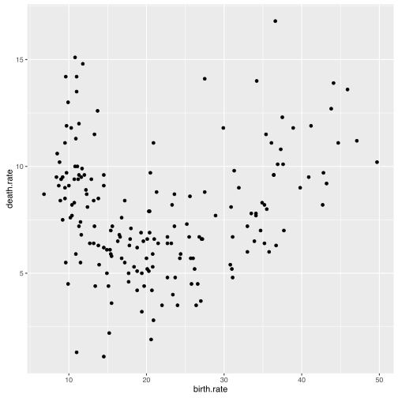

# Jak zrobić pierwszy wykres?

Minimalna definicja wykresu w pakiecie `ggplot2` składa się przynajmniej z trzech elementów. 

* Funkcja `ggplot()` tworzy zrąb wykresu. W tym miejscu deklaruje się parametry wspólne dla pozostałych elementów wykresu. Deklaracja może być pusta, ale zazwyczaj wskazuje się tutaj zbiór danych (poniżej `countries`) i mapowania (poniżej funkcja `aes()`).
* Funkcje `geom_`/`stat_` tworzą kolejne warstwy prezentacji danych, nazywane dalej geometriami. Poniżej wykorzystywana jest funkcja `geom_point()` tworząca warstwę z punktami. 
* Operator `+` łączy opisy kolejnych elementów wykresu.

Zbudujmy wykres, przedstawiający za pomocą punktów informacje o częstości narodzin i zgonów dla różnych krajów.


```r
library(ggplot2)
library(SmarterPoland)

ggplot(countries, aes(x=birth.rate, y=death.rate)) + geom_point()
```



Gramatyka zaimplementowana w pakiecie `ggplot2` pozwala na budowę wykresów o strukturze przedstawionej na poniższej grafice. 
Składa się na z wielu elementów.
Omówimy je jeden po drugim.


