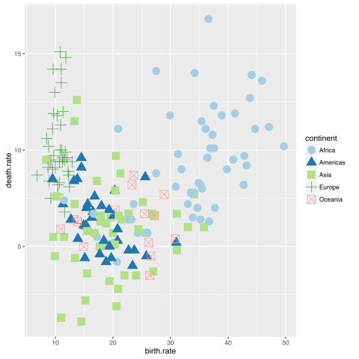
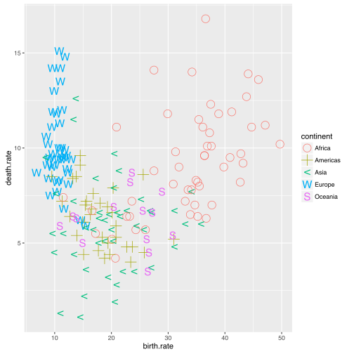
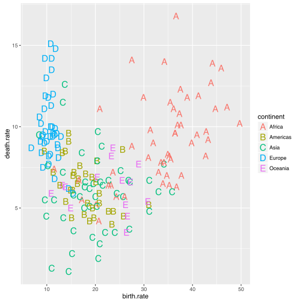

# Jak modyfikować skale?

Opisując mechanizm mapowania napisaliśmy, że wystarczy określić jaka zmienna ma być zamapowana na jaki atrybut i pakiet `ggplot2` już będzie wiedział jak dobrać kolory / kształty.

Co jednak zrobić jeżeli nie podoba nam się zaproponowana skala kolorów / kształtów? Rozwiązaniem może być nadpisanie skali dla mapowania.

Funkcje z klasy `sale_atrybut_wartosc` pozwalają na określenie jak ma wyglądać mapowanie na określony atrybut. Możemy ręcznie wskazać kształty / koloru lub możemy wskazać funkcję, która za nas wyznaczy kolory / kształty. 

Poniżej przedstawiamy trzy przykłady skali dla kształtów i kolorów. Pierwsza to domyślna skala, druga jest wybierana zgodnie z określonym schematem a trzecia określa wprost jakie wartości mają odpowiadać kolejnym kontynentom.


```r
library(ggplot2)
library(SmarterPoland)
library(ggthemes)

pl <- ggplot(na.omit(countries), aes(x = birth.rate, y = death.rate, shape=continent, color=continent)) +
  geom_point(size=5) 

pl
```


```r
pl + scale_color_brewer(type="qual", palette = 3)
```



```r
pl + scale_color_manual(values = c("red4", "red1", "green4", "green1", "grey"))
```


```r
pl + scale_shape_cleveland()
```



```r
pl + scale_shape_manual(values=LETTERS) 
```


