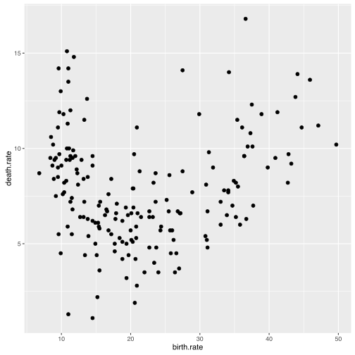
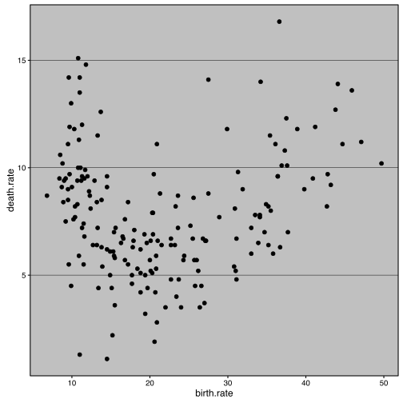
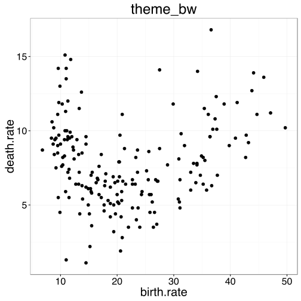

# Jak modyfikować styl wykresu?

Poza elementami związanymi z danymi, wykres zawiera również wiele elementów graficznych, które z danymi nie są zwiazane ale są ważne. Np. tytuł wykresu, wielkość opisów osi, położenie legendy, kolor linii pomocnicznych itp.

W pakiecie `ggplot2` można takie elementy dookreślać na dwa sposoby. Można skorzystać z gotowego zestawu ustawień graficznych, swoistej skórki. Takie skórki są dostępne przez funkcje `theme_`. 

Na poniższym przykładzie, dodanie do wykresu funkcji `theme_excel()` powoduje, że wykres wygląda jak z pakietu Excel.

Druga możliwość to zmiana poszczególnych elementów przez funkcję `theme()`. W ten sposób można przesunąć legendę, zmienić kolory osi, zwiększyć opisy osi i zmodyfikować podobne elementy wykresu.

Poniżej przedstawiamy ten sam wykres z zastosowaniem czterech różnych zestawów parametrów graficznych.


```r
library(ggplot2)
library(SmarterPoland)

pl <- ggplot(na.omit(countries), aes(x = birth.rate, y = death.rate)) +
  geom_point(size=2, color="black") 

pl
```



```r
pl + theme_excel()
```

```
## Error in eval(expr, envir, enclos): could not find function "theme_excel"
```

```r
pl + theme_bw() +  theme(legend.position="none") +
  theme(text=element_text(size=20)) + ggtitle("theme_bw")
```



```r
pl + theme_classic() +  theme(legend.position="none") +
  theme(text=element_text(size=20)) + ggtitle("theme_classic")
```



## I co dalej?

* Przegląd kilkunastu interesujących skórek znajduje się na stronie  https://cran.r-project.org/web/packages/ggthemes/vignettes/ggthemes.html

