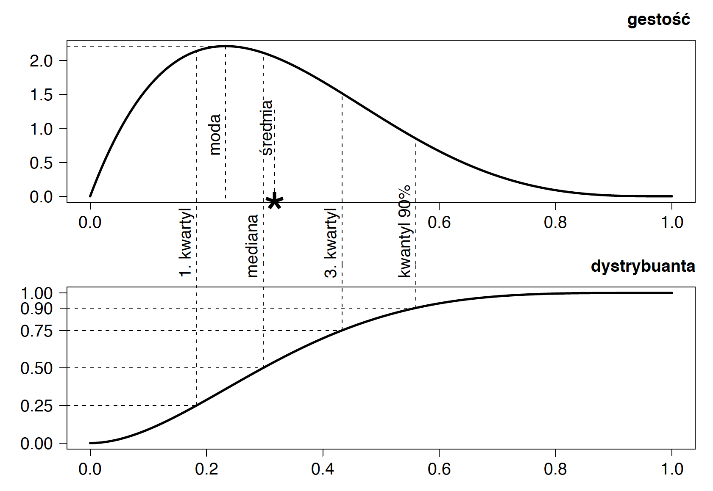

## Wybrane metody generowania zmiennych losowych

Poniżej przedstawimy algorytmy losowania zmiennych losowych z różnych popularnych i przydatnych rozkładów, których nie omówiliśmy w poprzednim rozdziale.

### Proces Poissona

Jednorodny proces Poissona $$\{N(t), t \geq 0\}$$ z częstością $$\lambda$$, to proces zliczający z niezależnymi przyrostami, spełniający warunki:
$$
\begin{array}{rcl}
N(0)&=&0,\\
P\left(N(s+t) -N(s) = n\right)& = & \frac{e^{\lambda t}(\lambda t)^n}{n!},\ \ \ \ \  n \geq 0, t, s >0.\\
\end{array}
$$
Czas oczekiwania $$T_i$$ pomiędzy kolejnymi skokami procesu Poissona ma rozkład wykładniczy $$ E(\lambda)$$.

Do generowania trajektorii jednorodnego procesu Poissona często wykorzystuje się jeden z poniższych sposobów. Każdy wykorzystuje inną właściwość procesu Poissona.


**Sposób 1**

* Losujemy wektor czasów oczekiwania na kolejne zdarzenie $$T_i$$ z rozkładu wykładniczego.
* Wyznaczamy czasy pojawiania się kolejnych skoków procesu, jako kumulowane sumy $$T_i$$ 
$$S_k = \sum_{i=1}^k T_i.$$
* Wyznaczamy liczbę skoków do czasu $$t$$
$$
N(t) = \#\{k : S_k \leq t\}.
$$

**Sposób 2**

* Losujemy liczbę skoków procesu do czasu $$t$$, liczba skoków ma rozkład Poissona z parametrem $$\lambda t$$
$$
N(t) = Poiss(\lambda t).
$$
* Na odcinku $$[0,t]$$ losujemy $$N(t)$$ skoków z rozkładu jednostajnego
$$
S'_i =  U[0,t], \ \ \ \ \ \ \ \ i\leq N(t).
$$

Drugi sposób jest szybszy, ponieważ po pierwszym losowaniu wiemy już ile wartości z rozkładu jednostajnego musimy wylosować. Losowanie z rozkładu jednostajnego jest też szybsze niż losowanie z rozkładu wykładniczego. Poniżej przedstawimy przykładową implementację drugiego sposobu.

```{r}
rPoisProcess <- function (T=1, lambda=1) {
    N <- rpois(1, T*lambda)
    sort(runif(N,0,T))
}
```

Przykładowe wywołanie powyższej funkcji.

```{r}
set.seed(1313)

rPoisProcess(T=10, lambda=0.2)
```

W podobny sposób możemy generować zmienne z jednorodnego pola losowego, czyli z dwuwymiarowego procesu Poissona.

Polem losowym Poissona nazwiemy proces zliczający $$N$$ z niezależnymi przyrostami, określony na płaszczyźnie, spełniający warunek:
$$
P\left(N(s_1+t_1,s_2+t_2) -N(s_1,s_2) = n\right) = \frac{e^{\lambda t_1 t_2}(\lambda t_1 t_2)^n}{n!}.
$$
Liczba zdarzeń w prostokącie o polu $$S$$ ma rozkład Poissona o częstości $$\lambda S$$.
Punkty skoków takiego procesu możemy wyznaczyć następująco

* Losujemy liczbę skoków procesu na prostokącie $$[0,t_1] \times [0, t_2]$$
$$
N(t_1, t_2) = Poiss(\lambda t_1 t_2).
$$
* Na prostokącie $$[0,t_1] \times [0, t_2]$$ generujemy $$N(t_1, t_2)$$ punktów z rozkładu jednostajnego.


I implementacja tego algorytmu w programie R.

```{r}
rRandomField <- function (T1=1, T2=1, lambda=1) {
     N = rpois(1, T1*T2*lambda)
     data.frame(x=runif(N,0,T1), y=runif(N,0,T2))
}
```

Przykładowe wywołanie powyższej funkcji.

```{r}
rRandomField(T1=10, T2=10, lambda=0.02)
```

Rozważmy teraz proces Poissona, którego częstość skoków nie jest stała, ale wynosi $$\lambda(t)$$. Taki proces nazywamy niejednorodnym procesem Poissona. Jest to bardzo często wykorzystywany proces w modelowaniu liczby szkód, częstość występowania szkód najczęściej zmienia się z czasem (liczba oszustw bankomatowych zależy od liczby bankomatów i najczęściej rośnie z czasem, liczba szkód OC zależy od liczby ubezpieczonych samochodów i od szkodowości, oba parametry zmieniają się w czasie itp.).

Załóżmy, że istnieje jakieś maksymalne $$\lambda_{max}$$, takie że $$\forall_t \lambda(t) \leq \lambda_{max}$$. W takim przypadku trajektorie procesu jednorodnego można przetransformować w trajektorie procesu niejednorodnego.

Taką transformację można wykonać na dwa sposoby.

**Sposób 1**

* Wygenerować jednorodny proces Poissona $$N_1$$ o częstości $$\lambda_{max}$$.
* Każdy punkt $$S_i$$ skoku procesu $$N_1$$ z prawdopodobieństwem $$\lambda(S_i)/\lambda_{max}$$ uznać za punkt skoku procesu $$N_2$$. Czyli dla każdego punktu z wyjściowego procesu losuje się z prawdopodobieństwem  $$\lambda(S_i)/\lambda_{max}$$ czy pozostawić ten punkt w nowym procesie. Metoda ta nosi nazwę metody odsiewania. Odrzucając/odsiewając niektóre punkty skoków redukujemy częstość procesu jednorodnego do niejednorodnego.

**Sposób 2**

* Wygenerować jednorodny proces Poissona $$N_1$$ o częstości $$\lambda_0$$.
* Przekształcić czasy skoków $$S_k$$ procesu $$N_1$$ na czasy $$S_k'$$ procesu $$N_2$$ tak by 
$$\int_0^{S'_k} \lambda(t)dt = \int_0^{S_k} \lambda_0 dt, $$
czyli $$S'_k = \Lambda^{-1}(\lambda_0 S_k)$$, gdzie $$\Lambda(x) = \int_0^x \lambda(t)dt$$. Ta metoda nazywana jest metodą zmiany czasu.


### Wielowymiarowy rozkład normalny 

Gęstość wielowymiarowego rozkładu normalnego $$ N_d(\mu, \Sigma)$$ jest postaci
$$
f(x) = \frac{1}{ (2\pi)^{k/2}|\Sigma|^{1/2} }
             \exp\Big( {-\tfrac{1}{2}}(x-\mu)'\Sigma^{-1}(x-\mu) \Big),
$$
gdzie $$\Sigma$$ to macierz kowariancji, symetryczna dodatnio określona o wymiarach $$d \times d$$ a $$\mu$$ to wektor średnich o długości $$d$$.

Zmienne z rozkładu wielowymiarowego normalnego generuje się w dwóch krokach

* W pierwszym kroku generuje się $$d$$ niezależnych zmiennych o rozkładzie normalnym,
* W drugim kroku przekształca się te zmienne by otrzymać średnią $$\mu$$ i macierz kowariancji $$\Sigma$$. Korzysta się z faktu, że jeżeli $$Z\sim  N(0, I)$$, to
$$
C Z + \mu =  N_d(\mu, CC^T).
$$





W takim razie aby wylosować pożądane zmienne wystarczy wylosować wektor niezależnych zmiennych $$Z$$ z następnie przekształcić je liniowo $$X = C Z + \mu$$. W tym celu macierz $$\Sigma$$ musimy rozłożyć na iloczyn $$CC^T$$. Można to zrobić używając różnych faktoryzacji macierzy $$\Sigma$$. Wymieńmy trzy

* Dekompozycja spektralna
$$
C = \Sigma^{1/2} = P \Gamma^{1/2}P^{-1},
$$
gdzie $$\Gamma$$ to macierz diagonalna wartości własnych na przekątnej a $$P$$ to macierz wektorów własnych $$P^{-1}=P^T$$. Macierze $$P$$ i $$\Gamma$$ dla macierzy $$\Sigma$$ można znaleźć z użyciem funkcji `eigen()`.

* Dekompozycja SVD, czyli uogólnienie dekompozycji spektralnej na macierze prostokątne,

Jeżeli $$\Sigma$$ jest symetryczna i dodatnio określona, to $$U=V=P$$, więc 
$$
C = \Sigma^{1/2} = U D^{1/2} V^T,
$$
Funkcje fortranowe dla bibliotek LAPACK pozwalają na uwzględnienie faktu, że rozkładana macierz jest symetryczna i dodatnio określona, ale wrappery R już tego nie uwzględniają, więc ta transformacja jest mniej efektywna. Macierze $$U$$, $$V$$ i $$D$$ dla macierzy $$\Sigma$$ można znaleźć z użyciem funkcji `svd()`.

* Dekompozycja Choleskiego, tzw. pierwiastek Choleskiego, 
$$
\Sigma = Q^T Q,
$$
gdzie $$Q$$ to macierz górna trójkątna. Macierz $$Q$$ dla macierzy $$\Sigma$$ można znaleźć z użyciem funkcji `chol()`.

Który z tych algorytmów najlepiej wybrać? Szybszy i numerycznie bardziej stabilny! Porównajmy czasy działania różnych faktoryzacji.

* Faktoryzacja (rozkład) Choleskiego.

```{r}
n <- 200; d <- 100; N <- 10000
Sigma <- cov(matrix(rnorm(n*d),n,d))
X <- matrix(rnorm(n*d),n,d)
system.time(replicate(N, {Q <- chol(Sigma)
      X %*%  Q} ))
```

* Faktoryzacja  SVD

```{r}
system.time(replicate(N, {tmp <- svd(Sigma)
      X %*% (tmp$u %*% diag(sqrt(tmp$d)) %*% t(tmp$v))}))
```

* Rozkład spektralny / na wartości własne.

```{r}
system.time(replicate(N, {tmp <- eigen(Sigma, symmetric=T)
      X %*% (tmp$vectors %*% diag(sqrt(tmp$values)) %*% t(tmp$vectors))
			}))
```

Powyższe czasy zostały policzone dla pewnych przykładowych danych i mogą różnić się w zależności od zainstalowanych bibliotek. Ogólnie jednak najszybszą procedurą jest faktoryzacja Choleskiego i to ona najczęściej jest wykorzystywana do generowania zmiennych o wielowymiarowym rozkładzie normalnym. 

W programie R nie musimy do generacji zmiennych z rozkładu normalnego wielowymiarowego ręcznie wykonywać dekompozycji macierzy $$\Sigma$$, wystarczy użyć funkcji `rmvnorm(mvtnorm)`. Pozwala ona wskazać metodę faktoryzacji argumentem `method=c("eigen", "svd", "chol")`. Domyślnie wykorzystywana jest dekompozycja na wartości spektralne (na wypadek gdyby macierz $$\Sigma$$ była niepełnego rzędu), ale jeżeli zależy nam na szybkości i mamy pewność że macierz $$\Sigma$$ jest dodatnio określona to lepiej użyć pierwiastka Choleskiego.

