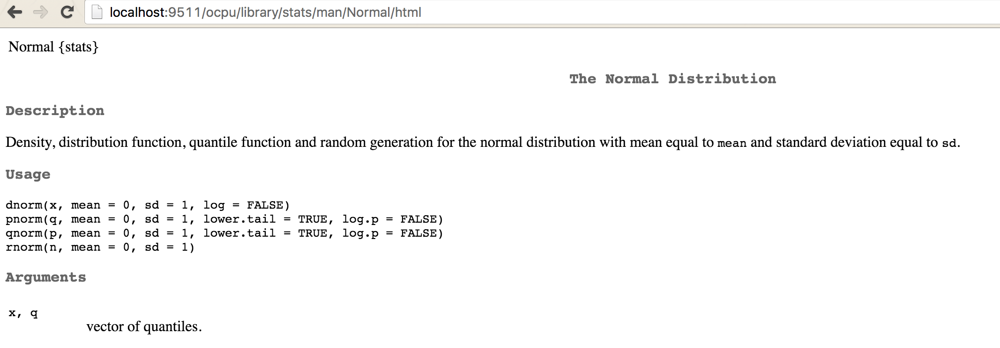

# Jak pracować z opencpu?

Po uruchomieniu serwera można przez zapytania GET/POST wykonywać różne akcje. 

* Przez uchwyt `http://localhost:4348/ocpu/library/stats/` można sprawdzać obiekty udostępnia określony pakiet.
* Przez uchwyt `http://localhost:4348/ocpu/library/stats/R` można sprawdzać jakie funkcje udostępnia pakiet.
* Przez uchwyt `http://localhost:4348/ocpu/library/stats/data` można sprawdzać jakie zbiory danych udostępnia pakiet.

Poniżej prezentujemy wynik otwarcia pierwszego z tych uchwytów w oknie przeglądarki. Odpowiedzią serwera jest strona z listą obiektów w pakiecie `stats`.


Komunikację z serwerem `opencpu` można przeprowadzić na wiele sposobów. Dla nas najciekawsze są trzy opcje.

* z użyciem przeglądarki internetowej (np. przez podane testowe API), 
* używając programu `curl` z linii poleceń, wywołując np. polecenie 
`curl http://localhost:4348/ocpu/library/stats/data/`
* używając R i np. funkcji `GET()` i `POST()` z pakietu `httr`

Ta ostatnia opcja pozwala nam tworzyć zarówno klienta jak i serwer w programie R.

Poniższy przykład wykorzystuje funkcję `httr::GET` aby sprawdzić listę dostępnych danych i a następnie pobrać źródło funkcji zainstalowanych na serwerze.

```r
library(httr)
httr::GET("http://localhost:4348/ocpu/library/stats/data")
```
```
Response [http://localhost:9511/ocpu/library/stats/data/]
  Date: 2016-05-06 20:40
  Status: 200
  Content-Type: text/plain; charset=utf-8
  Size: 1.16 kB
ability.cov
airmiles
AirPassengers
airquality
anscombe
attenu
attitude
austres
beaver1 (beavers)
beaver2 (beavers)
...
```

Co się wyświetli jeżeli uchwytem wskażemy funkcję?

```r
httr::GET("http://localhost:4348/ocpu/library/proton/R/dcode")
```
```
Response [http://localhost:9511/ocpu/library/proton/R/dcode/print]
  Date: 2016-05-06 20:41
  Status: 200
  Content-Type: text/plain; charset=utf-8
  Size: 320 B
function (tex) 
{
    tmp1 <- c(LETTERS, letters)
    tmp2 <- setdiff(unique(unlist(strsplit(tex, split = ""))), 
        tmp1)
    let <- c(tmp1, tmp2)
    names(let) <- c(rev(tmp1), tmp2)
    sapply(strsplit(tex, split = ""), function(x) {
        paste(let[x], collapse = "")
    })
...
```

## Formatowanie danych

Wyniki zdalnych wywołań mogą być obiektami różnych typów.  Server `opencpu` automatycznie konwertuje wynik na różne formaty, w zależności od wskazanego sufixu.

Przykładowy zbiór danych o kotach i ptakach z pakietu `PogromcyDanych`  można przekonwertować na format json lub csv lub binarny rda korzystając z następujących uchwytów.

Wszystkie te uchwyty reagują na metodę GET.

* `http://localhost:4348/ocpu/library/PogromcyDanych/data/koty_ptaki/print`
* `http://localhost:4348/ocpu/library/PogromcyDanych/data/koty_ptaki/json`
* `http://localhost:4348/ocpu/library/PogromcyDanych/data/koty_ptaki/csv`
* `http://localhost:4348/ocpu/library/PogromcyDanych/data/koty_ptaki/rda`

Na poniższych ilustracjach przedstawiamy wynik pierwszych dwóch z powyższych uchwytów.


## Formatowanie funkcji

Dla funkcji można w podobny sposób odpytać dokumentacje funkcji lub pobrać ciało funkcji. Poniższe uchwyty reagują na metodę GET.

* `http://localhost:4348/ocpu/library/stats/R/rnorm`
* `http://localhost:4348/ocpu/library/stats/man/rnorm/`
* `http://localhost:4348/ocpu/library/stats/man/rnorm/text`
* `http://localhost:4348/ocpu/library/stats/man/rnorm/html`
* `http://localhost:4348/ocpu/library/stats/man/rnorm/pdf`

Poniżej przedstawiamy wyniki trzech z tych uchwytów.




